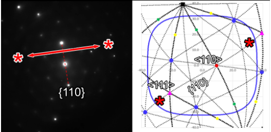
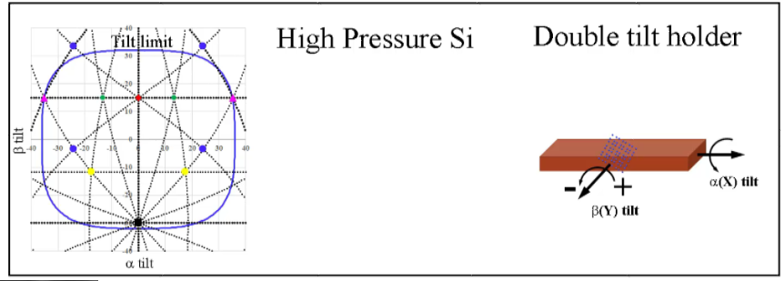

In order to most accurately utilize the TEM for crystallographic
analysis it is first necessary to be able to express any crystal system
as a geometrical concept. This approach serves to deconvolute the motion
of a crystal as a solid object from the concepts of the crystal in
reciprocal space, diffraction, or the physics of the electron beam
interaction. These physics-based approaches are most often utilized in
teaching materials science analysis using the TEM, but this adds
additional complexity too early. By first treating any sample (which may
or may not contain crystallographic material) as a solid
three-dimensional object and how it can be manipulated using a double
tilt stage, the additional concepts of diffraction and other electron
beam interactions eventually becomes more intuitive.

Before any notion involving the addition of atomic positions to the
discussion of crystallography and materials science, a general treatment
of planes, plane normals, and other basic geometric constructs need be
introduced and understood. This is necessary for a variety of reasons,
most importantly of which is that it will provide a more solid
foundation for both tilting throughout crystallographic space, as well
as in general lay a solid groundwork for explaining Miller indices,
Bravais lattices, and other such constructs. The extent of this
discussion on geometry, while basic on some level is necessary to
further build upon the knowledge base of crystallographic analysis.

The simplest geometrical concept in crystallography is the cube due to
its high level of symmetry and uniformity. All three unit vectors
\[u,v,w\] can be oriented along the \[x,y,z\] axes, respectively, and
any combination of vectors can be constructed. The mathematics of a cube
are dependent upon each of the three axes being of equal length and
mutually orthogonal to one another. The angle between any two vectors
can be described by the dot product, and the normal of any two vectors
can be calculated through the cross product.

### Unit Vectors – Real Space Map

The ability to travel through any crystal system is dependent upon
understanding basic geometric principles of planes and directions. For
example, the angle between the two cubic vectors \[001\] and \[010\] is
90°, between the \[001\] and the \[011\] is 45°, and lastly between the
\[001\] and the \[112\] is 35.3°. These are all common low index (high
symmetry poles) within any number of cubic crystals, and the
understanding of how to move between these poles can be critical in
proper microstructural analysis. Unit vectors are the fundamental
descriptors of the cube and describe how to follow planes in the crystal
to arrive at another location in the crystal. In this sense, the unit
vectors function as the equivalent of roads on a map of a regularly laid
out dense urban area.

Since there are six other crystallographic families by which atoms can
be arranged, the importance of being able to travel between poles within
each system is paramount to performing highly accurate crystallographic
analysis. Similar vector notation can be used to describe any direction
(i.e., vector) within each system (e.g., the \[111\] of a monoclinic
crystal), yet the mathematical derivation of the angle between vectors
or calculation of normal vectors is not as straight forward as applying
the dot and cross-products due to either biases on the unit vectors or
unit vectors not being orthogonal (or sometimes both depending on the
crystal family).  provides a simple example illustrating
how a naïve analysis fails to accurately predict the measured angle
owing to the bias of one axis. By stacking two cubes on top of one
another to create a tetragonal unit cell, the z-axis can be described as
having a bias (in  is it biased by 2). In the schematic,
the coordinate system is labeled in terms of what unit cell is being
considered, either the biased cell or the cubic cell, and hence biased
vectors in the tetragonal reference (or native format) are listed as
\[0,0,1\] and \[1,1,1\], whereas in in the cubic reference they would be
\[0,0,1\] and \[1,1,2\]. Calculating the angle between these vectors in
both the biased and the cubic coordinates (through the dot product), it
can be shown that the answers differ by 19.4°, with the calculations for
the biased system being incorrect (as it will be shown later on in the
paper, 54.7° is a common angle in the cubic system because it is the
angle between the \[001\] and \[111\] poles). Only when the native
vectors are converted to the cubic form is the correct answer, 35.3º,
obtained. A demonstration of this conversion in a more complex,
hexagonal system is provide in ***Figure S1***.

:::{figure} ./images/image2.tiff
:name: fig1
Schematic illustrating how a bias on one of the
axes (e.g., a tetragonal system) does not provide the correct angle
between vectors. The bias of the z-axis being doubled incorrectly
predicts the angle between the vectors. Note the positions are being
listed in parenthesis and do not denote crystallographic planes.
:::

The importance of vector nomenclature as compared to the vector
calculations can be further elucidated by comparing a single crystal
system (e.g., hexagonal) where the ratio of the unit vectors are varied
(). Native vectors for hexagonal crystals with c/a ratios
of 2.72 and 1.63 are described in the identical manner owing to the fact
they are the same crystal system, but when converted to the cubic form
the vectors are now noticeably different. Since the vectors within the
basal plane (e.g., \[100\] and \[110\]) are not affected by the change
in c/a ratio, the angle between the vectors does not change, but
comparing the angle between the \[001\] and the \[111\] it can quickly
be demonstrated that in the cubic system the \[111\] vector becomes
\[0.2 0.3 1\] and \[0.3 0.5 1\] for the hexagonal crystals with c/a
ratios of 2.72 and 1.63, respectively. Performing the dot product on the
respective vectors illustrates how the angle between the \[001\] and
\[111\] vectors can change by \~10.4° with a change \~66.8% c/a ratio
(note that for ease of comparison to the cubic system, the three index
notation is used for the hexagonal system). The ability to derive a
conversion matrix for any given crystal system is necessary to perform
these operations.

:::{figure} ./images/image3.tiff
:name: fig2
Comparison of vector nomenclature in the native hexagonal
system as compared to the cubic formulation.
:::

In order to travel about any of the other seven crystal systems (e.g.,
between poles) is it necessary to understand how to convert the axial
and non-orthogonal biases into cubic/Cartesian form (note that for ease
of comparison in the field of materials science, the term cubic will be
utilized in the remainder of the paper). For the other orthogonal
systems, the only consideration is the length of the bias, whereas for
the remaining non-orthogonal systems there are angular dependencies on
the axes in addition to length bias. In the overwhelming majority of
materials science and electron microscopy textbooks, similar
calculations are performed and presented as conversion formulas for each
system. Again, these formulas are usually confined to describing angle
between planes, and do not explicitly describe how to calculate the
plane normals. This is typically performed because of the need to
calculate the angle between diffracting planes and overlooks how to
calculate the normals, which are needed to predict how to travel around
each crystal system. The foundation for deriving all relevant
crystallographic properties become available through the understanding
of the pure geometric conversion of each crystallographic system to the
cubic system. As an alternative formulation of this problem, these types
of crystallographic computations can be calculated through the use of
the metric tensor, as detailed by De Graef and McHenry (De Graef and
McHenry, 2012) . While both approaches are mathematically correct, this
work has chosen to preserve the intuitive sense of angles and distance
in the cubic system, albeit with the requirement of a conversion matrix
for non-cubic systems that will be described next.

The conversion of any non-cubic system (abc) to that of a cubic one
(xyz) uses a conversion matrix (M) . A schematic of illustrating
the two systems is shown in  along with the conversion
matrix with the full derivation of this conversion matrix is provided in
the Supplemental (Conversion to cubic in ***Figures S1*** and ***S2***).
Later, when discussing the microscope setup in more detail, the z-axis
will be chosen to align with the electron beam. Consequently, we have
chosen to align the c axis of the crystal that is to be converted with
the z-axis for conceptual simplicity. This is certainly not the only
choice, and the following derivations could be followed with a different
convention, such as the one used by International Tables of
Crystallography (Aroyo, 2016). However, the essence of the method is
unchanged regardless of the specific convention used.

:::{figure} ./images/image4.tiff
:name: fig3

Schematic illustrating how to convert any non-cubic
vector coordinate system into a cubic system and the conversion matrix
(M).
:::

The derivation of the conversion matrix , which includes the
angle δ , can be calculated from the principal axis angles
(α,β,γ). The conversion matrix operates by setting one axis in the
system to be converted equal to one axis in the cubic system (e.g., the
c axis is first set commensurate with the z-axis in ).
This is then followed by setting a second axis in the system to be
converted and binding it within two of the axes in the cubic system
(e.g., the a axis is restricted to the xz plane). The a axis can then be
decomposed into the x and z components (i.e., there is no y component)
through sine and cosine functions of the angle β, respectively. Lastly,
the final axis of the system to be converted to the cubic system (in
this case b to y) must be decomposed into all three axes of the cubic
system (a full explanation is provided Supplemental). The introduction
of a third angle, delta (δ)  must be employed to account for the
less symmetric crystals such as the monoclinic and triclinic where the
angle γ is not 90°. The conversion of any crystallographic vector in any
crystal system can then be calculated by multiplying the vector by the
conversion matrix .

Taking into consideration the \[111\] vector in the tetragonal unit cell
as exhibited in , when converted to the cubic system it
can be described as a \[0.5 0.5 1\] (or \[112\]) vector, which is 35.3°
from the \[001\] in the tetragonal system (the \[001\] converted by  remains the \[001\]). These equations can then be utilized for any of
the seven crystal systems for which the angle between vectors (i.e.,
poles) can be calculated with the understanding that the vectors are
described in their native form but are calculated in the cubic form (an
example of a hexagonal system conversion if presented in ***Figure S3***). As such, all the remaining operations will be performed on cubic
systems with the understanding that it can be generalized to any crystal
system using the appropriate conversion matrix, or it's inverse.

$$
\label{eq1}
\begin{matrix}
M = \ \begin{bmatrix}
a\sin\beta & b\sin\alpha\cos\delta & 0 \\
0 & b\sin\alpha\sin\delta & 0 \\
a\cos\beta & b\cos\alpha & c \\
\end{bmatrix} \\
\end{matrix}$$

$$\label{eq2}\begin{matrix}
\delta = \cos^{- 1}\left( \frac{\cos\gamma - \cos\alpha\cos\beta}{\sin\alpha\sin\beta} \right) \\
\end{matrix}$$

$$\label{eq3}\begin{matrix}
Converted\ Vector = M*\begin{bmatrix}
u \\
v \\
w \\
\end{bmatrix} = \begin{bmatrix}
ua\sin{\beta + vb\sin\alpha\cos\delta} \\
vb\sin\alpha\sin\delta \\
ua\cos{\beta + vb\cos\alpha} + wc \\
\end{bmatrix}\# \\
\end{matrix}$$

While it has been described as the ability to travel throughout a
crystal, a more elegant manner in which to describe these conversions is
to envision all possible vectors within a cube. The "movement" around
the system is the pathway between vectors. These pathways will
eventually be considered traces of planes, and hence how to travel along
these specific planes. The notion of predicting the location of all
poles is important because it will subsequently be demonstrated that
when considering electron beam interactions the structure factor will
simply act as a filter to determine which of these poles are ultimately
expressed for any given crystal.

### Stereographic Projections – Rotation Maps

The stereographic projection is most often utilized by microscopists to
navigate and understand crystalline sample orientations (). As illustrated in a the stereographic projection is
a calculation of the relative location of all vectors for a given
crystal provided a specific normal orientation (e.g., the \[001\] in
a). In the keeping with the context of this paper, the
utilization of the stereographic projection keeps with the notion of
first understanding the motion of the sample and crystal in real space
and does not consider reciprocal space (i.e., Kikuchi bands).

There are different conventions for stereographic projections, typically
whether the center of the sphere or the bottom of the sphere should be
located at the origin, but they all contain the same fundamental
information. Returning to the map analogy, this is analogous to
different map projections (e.g., Mercator vs. Robinson) (Lapon et al.,
2020). In this formulation, the sphere has a radius of 1 and is centered
at the origin. To compute the location of these poles, consider a cubic
crystal with one corner at the origin and \[100\] along the x-axis,
\[010\] along the y-axis, and \[001\] along the z-axis. The intersection
of the vector normal to a plane of atoms with the sphere and the top of
the sphere define a line, as seen in a. The intersection
of the line with the plane z = 0 defines the planar coordinates of the
projection. Mathematically, if a pole is at \[uvw\], then it is
normalized to have unit length  to find its intersection with
the unit sphere. When observed in two dimensions (b) the
relative position of each vector and the trace between the vectors can
be derived .

$$\label{eq4}\begin{matrix}
\begin{bmatrix}
\frac{u}{\sqrt{u^{2} + v^{2} + w^{2}}} \\
\frac{v}{\sqrt{u^{2} + v^{2} + w^{2}}} \\
\frac{w}{\sqrt{u^{2} + v^{2} + w^{2}}} \\
\end{bmatrix} \\
\end{matrix}$$

The line connecting the top of the sphere \[0, 0, 1\] and this point
will intersect the z = 0 plane at

$$\label{eq5}\begin{matrix}
\begin{bmatrix}
\frac{u}{\sqrt{u^{2} + v^{2} + w^{2}} - w} \\
\frac{v}{\sqrt{u^{2} + v^{2} + w^{2}} - w} \\
\end{bmatrix} \\
\end{matrix}$$

:::{figure} ./images/image5.tiff
:name: fig4
Geometric stereographic projection (in the \[001\]
direction) in three dimensions (a) and the corresponding two-dimensional
stereographic projection (b).
:::

It is important to note that when describing non-cubic pole figures, the
native description of each pole is utilized such that when analyzing and
reporting data there is an objective reference. Equally important to
introduce here is the notion of the freedom of rotation within a pole
figure. The stereographic projection can be considered as viewing a cube
down a specific orientation and then determining how far and in which
direction to rotate the crystal to align to another pole. The use of
stereographic projections is useful when examining three-dimensional
ball and stick models in computer programs designed to visualize
orientations of crystals. Most programs will allow for the input of
specific vectors, and it is worth pointing out that when a non-cubic
system is visualized the poles/vectors are listed in a native coordinate
system, but the mathematics are calculated by converting to a cubic
system as shown above in Eqns. [%s](#eq1)-[%s](#eq3). In the electron microscope, the use
of a double tilt stage adds an additional conversion that must be
applied in order to travel throughout any crystal due to the limitation
of the degrees of freedom.

### Double Tilt Holder Coordinates – Tip/Tilt Map

As has been demonstrated by numerous other researchers, understanding
the utilization of a double tilt stage in the analysis of solid
materials and crystals is extremely important for accurate and reliable
data collection (Cautaerts et al., 2018, Liu, 1994, Liu, 1995, Qing,
1989, Qing et al., 1989). While this has been reported on numerous
occasions, the following derivation will be presented in a manner by
which to convert three-dimensional rotations in simple geometric
constructs to the double tilt stage and then demonstrate how this
relates to reciprocal space and the physics of electron beam
interactions. Given that different manufacturers utilize different
terminology, as a matter of convention, the tilts of a double tilt stage
will be denoted as α,β, and will be equivalent to X, Y tilts,
respectively.

While stereographic projections are useful, they do not directly
translate to the sample in the microscope due to the restrictions of the
tip/tilt stage on which the sample is mounted. To accurately describe
the position in terms of a double tilt holder, a tip/tilt map must be
derived. This map plots the poles and planes of the crystal in terms of
the tip and tilt coordinates of the double tilt holder and allows the
prediction of all allowable poles within a specific orientation of a
given sample. It should be noted that the derivations for converting
from a stereographic projection to a tip/tilt map is reversible, and
hence the tilt coordinates could and have been utilized overlaid on top
of stereographic projections.

The importance of the motion of the double tilt holder as compared to a
stereographic projection is the freedom of rotation considered for both.
 provides the stereographic projection and tip/tilt map of
a cube in the \[001\] orientation. In a stereographic projection the
crystal can be rotated freely, hence oblique plane traces are straight
(when emanating from the origin), whereas in the double tilt holder
oblique plane traces will be curved (). This curvature, as
will be illustrated in the subsequent derivations, is a result of the β
tilt axis changing as a function of the α tilt, and hence S-type curves
are generated in a tip/tilt map. A trace of a single plane in the
tip/tilt map (red line, b) has been overlaid on the
stereographic projection (a) to illustrate the difference.
Additionally, when the position of three vector types (\<103\>, \<114\>,
and \<112\>) in the tip/tilt map are transposed onto a stereographic
projection, and it can be observed that the farther from the \[001\]
orientation the larger the misorientation (e.g., the \[114\] vectors are
located nearly in the same position, but the \[112\] are visibly
misoriented).

This is also the exact reason why obliquely oriented g-vectors collected
at high tilt angles in a double tilt stage (e.g., α,β:-25,-25) will
rotate slightly in plane with relation to those collected at α,β:0,0.
This is shown in the attached movie in c. Therefore, it is
necessary to be able to convert a stereographic projection to a tip/tilt
map for any given crystal system. This can be achieved through rotation
matrices.

:::{figure} ./images/image6.tiff
:name: fig5

Stereographic projection (a) versus a tip/tilt map (b) of
a cube oriented in the \[001\] orientation illustrating how the oblique
plane traces vary in path. A diffraction pattern collected along a {110}
g-vector (between red stars) in an FCC crystal (c) Movie showing the
tilt series along a {110} trace where the g-vector changes direction
correlating to the angle of the line in the tip/tilt map.
:::

### Rotation Matrices

While rudimentary, in terms of the overall development of the stage
motion the fundamental mathematical operation being utilized is the
rotation about a single axis. This rotation is typically described as a
rotation about any of the primary axes (x,y,z), but more generally, any
orientation can be described through successive rotations about these
three axes (Eqns. [%s](#eq6)-[%s](#eq8)). The rotation about any primary axis will be
defined by the right-hand rule so that rotation matrices about the x-,
y-, or z-axis through an angle θ are given by, respectively:

$$\label{eq6}\begin{matrix}
R_{\theta,x} = \begin{bmatrix}
1 & 0 & 0 \\
0 & \cos\theta & - \sin\theta \\
0 & \sin\theta & \cos\theta \\
\end{bmatrix} \\
\end{matrix}$$

$$\label{eq7}\begin{matrix}
R_{\theta,y} = \begin{bmatrix}
\cos\theta & 0 & \sin\theta \\
0 & 1 & 0 \\
 - \sin\theta & 0 & \cos\theta \\
\end{bmatrix} \\
\end{matrix}$$

$$\label{eq8}\begin{matrix}
R_{\theta,z} = \begin{bmatrix}
\cos\theta & - \sin\theta & 0 \\
\sin\theta & \cos\theta & 0 \\
0 & 0 & 1 \\
\end{bmatrix} \\
\end{matrix}$$

Note that for these rotation matrices they are defined by the angle of
rotation and the axis about which the rotation occurs. In addition to
rotations about a single axis (i.e., proper rotations), there are also
improper rotations (i.e., reflections about an axis) that describe
mirroring about a single axis (Eqns. [%s](#eq9)-[%s](#eq11)). These can be illustrated in
matrix form:

$$\label{eq9}\begin{matrix}
R_{- x} = \begin{bmatrix}
 - 1 & 0 & 0 \\
0 & 1 & 0 \\
0 & 0 & 1 \\
\end{bmatrix} \\
\end{matrix}$$

$$\label{eq10}\begin{matrix}
R_{- y} = \begin{bmatrix}
1 & 0 & 0 \\
0 & - 1 & 0 \\
0 & 0 & 1 \\
\end{bmatrix} \\
\end{matrix}$$

$$\label{eq11}\begin{matrix}
R_{- z} = \begin{bmatrix}
1 & 0 & 0 \\
0 & 1 & 0 \\
0 & 0 & - 1 \\
\end{bmatrix} \\
\end{matrix}$$

These are the *{u}`basic building blocks`* upon which more
general rotations can be built and will be referred to continuously when
performing matrix operations to rotate the crystal and orient the
sample. Whether rotating along a specific interface, tilting from pole
to pole, or re-loading a sample and converting prior tilt conditions,
these six formulae will be the basis set. In the following derivation of
the tip/tilt map the utilization of diffraction and crystallographic
terminology will be utilized but only as a frame of reference and not in
terms of the electron beam interaction (i.e., traces of planes and not g
vectors or Kikuchi bands).

In practice, the manner in which a microscopist interacts with a
crystalline sample is at the most basic level through diffraction spots
or Kikuchi lines. While the principle knowledge of what these optical
markers represent goes to a fundamental understanding of electron beam
interactions with samples, at the very core of electron microscopy as an
observational tool, the understanding of these as {u}`fiduciary markers` for roadmaps provides the basis for
nanocartography. That is to say, regardless of whether one understands
the physics of why a zone axis (ZA) appears, the observation and
acknowledgement of a zone axis as a combination of a series of
geometrically oriented Kikuchi lines (or order diffraction patterns) is
necessary to be utilized as a map.

These traces along with the knowledge of the double tilt stage can be
used to solve unknown crystals and also predict the motion of
interfaces. In the current context of deriving a tip/tilt map, the
knowledge of a specific pole type is assumed for the purpose of ease of
explanation. This assumption is made as an initial means to connect
vector motion to crystallographic analysis. For instance, as shown in
a, the six fold symmetry of the \[111\] in an FCC steel is
presented along with a tilt position (e.g., α,β : 5,10) in which this
orientation was discovered in the microscope (note that the correct
nomenclature should be \<111\> as it is a description of the family of
poles, but for ease of explanation a single vector will be used).

This "known pole" provides the first bit of knowledge as to a global
position with respect to the remainder of the crystal. This could also
be a diffraction pattern of the \[111\] pole, but for ease of
understanding a convergent beam electron diffraction pattern (CBED) is
presented. The in plane orientation of the crystal is described by the
angle ($\varphi_c$) that can be used to describe the rotation of the crystal
about the known pole. As will be subsequently described, the angle $\varphi_c$
can be used to freely rotate the crystal (b-d), or it can
be assigned as a specific fiducial marker (such as the (1-10) Kikuchi
line) with known relation to the calibration of the α tilt axis. The
tilt positions observed (e.g., α,β : 5,10) can then be used to mentally
envision the relationship of the found ZA to the tilt stage (b, where the stage has been returned to α,β:0,0). This crystal
rotation can best be considered by illustrating a vector in a cube
(e.g., \[111\] in ) in both the standard projection
(c) and a projection normal to the vector (d), and the $\varphi_c$ being the relative rotation by which the entire
cube rotates. Again, while the CBED pattern of the \[111\] is presented
it is only used to orient the practical aspect of the microscope to
developing a tip/tilt map. From these initial data, the tip/tilt map can
be derived as follows.

There are two orientations that will be considered: the orientation of
the crystal with respect to the probe, and the stage with respect to the
probe. The probe will be considered an objective frame of reference
oriented at \[001\]. The orientation of the sample can be described for
any crystallographic orientation within the sample, whether a single
grain or the orientation of two crystals across a boundary. b shows an observed pole (red and blue) for two grains, of which the
unit vectors for each crystal in black. The knowledge of the location of
the observed poles and the unit vectors will be important for obtaining
the most information from a sample (e.g., the local misorienation
between two grains).

In order to create a tip/tilt map, the known vector will be rotated
through a sequence of rotations to align it with the \[001\] probe
orientation, subsequently rotated with respect to the crystal
orientation ($\varphi_c$) using , and finally the stage will be tilted
from the probe position to the found conditions (observed tilts)
(e-g). The known pole will be utilized to derive the
entire rotation matrix representing the crystal orientation, and
subsequently any other possible vector can then be plotted accordingly
through that matrix.

:::{figure} ./images/image8.png
:name: fig6

Schematic and movies illustrating crystal rotation around
a single vector/pole in relation to the stage tilt axes and their
relationship to the rotation matrices detailed in the text. a) Kikuchi
pattern of a \[111\] pole at 𝜶,:5,10. b) Crystallographic orientations
of given grains (G1, G2) and angle of rotation $\varphi_c$ about each pole. c
and d) Rotation about an arbitrary vector through a given angle $\varphi_c$ in
two different projections. e) Matrix rotation R~loading~ that describes
sample rotation (𝝴)about the beam normal \[001\], and vertical and
horizontal flips about the 𝜶 and 𝜷 axes, respectively. f)Matrix rotation
R~crystal~ about a given angle ($\varphi_c$). g) Matrix rotation R{sub}`stage`
describing the found pole back to the stage tilts. h and i) Movies
showing stage motion.
:::

The mathematical derivations of the full rotation matrix are divided
into three steps. The first step, $R_{loading}$, represents the
orientation of the sample with respect to the holder as it is inserted
into the microscope (e). The second step, $R_{crystal}$,
aligns the mathematical description of the crystal with the one found in
the microscope (i.e., α,β of the known pole and rotation of the crystal
$\varphi_c$), but as shown in f it does not consider the tilt
conditions. The last step, $R_{stage}$, puts the pole at the location
corresponding to the known α,β coordinates observed (g).
Taken together, the multiplication of these matrices yields an overall
rotation matrix, $R_{total} = R_{stage}R_{crystal}R_{loading}$ that
contains all the orientation information about the crystal as it is
situated in the microscope. Again, it is important to note that the only
necessary functions are combinations of the rotations provided in Eqns.
6-11.

One of the major advantages of these derivations with regards to
previous calculations on stage motion ((Cautaerts et al., 2018, Klinger
and Jäger, 2015, Liu, 1994, Liu, 1995, Qing, 1989, Qing et al., 1989))
is in the power of creating a sample map which can be utilized in
subsequent analyses whether on the same microscope or at other
institutions. This allows for rapid re-analysis of samples without
losing previous crystallographic orientation data. Three terms are
required that will allow the sample to be reloaded into any microscope
in any orientation and convert any previously recorded tilt coordinates
to the current sample loading. The application of these matrices account
for the sample being flipped in the holder either horizontally
($R_{horz}$ , ) or vertically ($R_{vert}$ , ) to the long
axis of the holder, and as well if the sample had been rotated in-plane
by any angle $\varepsilon$ ($R_{{position}_{\varepsilon,z}}$ , )
(e).

The combination of these sample reloading matrices can be combined into
one matrix $R_{loading}$ as shown in . Note, the angle
$\varepsilon$ is measured and recorded through a global fiduciary marker
(e.g., the surface of a FIB lamella) during each analysis. In the
instance where there is no horizontal or vertical flip (i.e., the
initial analysis of the sample), then these matrices are be replaced
with the identity matrix (i.e., no rotation is applied).

$$\label{eq12}\begin{matrix}
R_{horz} = R_{- x}R_{- z} = \begin{bmatrix}
1 & 0 & 0 \\
0 & - 1 & 0 \\
0 & 0 & - 1 \\
\end{bmatrix} \\
\end{matrix}$$

$$\label{eq13}\begin{matrix}
R_{vert} = R_{- y}R_{- z} = \begin{bmatrix}
 - 1 & 0 & 0 \\
0 & 1 & 0 \\
0 & 0 & - 1 \\
\end{bmatrix} \\
\end{matrix}$$

$$\label{eq14}\begin{matrix}
R_{{position}_{\varepsilon,Z}} = \begin{bmatrix}
\cos\varepsilon & - \sin\varepsilon & 0 \\
\sin\varepsilon & \cos\varepsilon & 0 \\
0 & 0 & 1 \\
\end{bmatrix} \\
\end{matrix}$$

$$\label{eq15}\begin{matrix}
R_{loading} = \ R_{position}R_{horz}R_{vert} \\
\end{matrix}$$

Once the sample has been loaded into the microscope and a known pole has
been identified, the mathematical model of the orientation of the
crystal is matched to the orientation of the sample. The first step in
developing this correspondence is rotating a known vector (e.g., the
\[111\]) to the probe direction \[001\] through a rotation matrix
($R_{\widehat{r},\theta}$ f). It is important to note that
this is setting the orientation of the crystal to the probe, and thus
the tilt conditions of the stage are not considered. For ease of
explanation, the use of vector terminology instead of crystallographic
designations (such as ZA or crystal pole) will be utilized to describe
the motion of a crystal in a stage.

The rotation of this vector to the probe direction can be achieved
through a number of pathways (e.g., combination of rotation matrices),
but the most direct is a rotation about an arbitrary axis by an angle
(θ) (f). As the vector will always be rotated to the
\[001\] direction to be aligned with the probe, the axis of rotation
will always lie in the xy plane and will take the form of \[uv0\]
because it is calculated through the cross-product of the known vector
and \[001\] (see ***Figure S4***). It should be noted that this is
special to this case, and a more general formulation needs to be derived
for a general operation. This will be subsequently utilized to describe
the trace of planes.

The known pole need first be normalized to create a unit vector. The dot
product is used to compute the angle required to move this unit vector
in the direction of the pole from its standard orientation (i.e., at
$\frac{1}{\sqrt{u^{2} + v^{2} + w^{2}}}(u,\ v,\ w)$ in Cartesian
coordinates):

$$\label{eq16}\begin{matrix}
\theta = \cos^{- 1}\left( \frac{w}{\sqrt{u^{2} + v^{2} + w^{2}}} \right) \\
\end{matrix}$$

The axis of rotation is determined from the cross product of the
normalized known pole and the beam direction:

$$\label{eq17}\begin{matrix}
\widehat{\mathbf{r}} = \left| \begin{matrix}
\widehat{\mathbf{x}} & \widehat{\mathbf{y}} & \widehat{\mathbf{z}} \\
0 & 0 & 1 \\
\frac{u}{\sqrt{u^{2} + v^{2} + w^{2}}} & \frac{v}{\sqrt{u^{2} + v^{2} + w^{2}}} & \frac{w}{\sqrt{u^{2} + v^{2} + w^{2}}} \\
\end{matrix} \right| = - \frac{v}{\sqrt{u^{2} + v^{2} + w^{2}}}\widehat{\mathbf{x}} + \frac{u}{\sqrt{u^{2} + v^{2} + w^{2}}}\widehat{\mathbf{y}} \\
\end{matrix}$$

For these specific axes of rotation that have no z-component (i.e., in
the derivation of tip/tilt maps), and the general result simplifies to
(where *r{sub}`x`* and *r{sub}`y`* are derived from , and θ from ):

$$\label{eq18}\begin{matrix}
R_{\widehat{\mathbf{r}},\theta} = \begin{bmatrix}
r_{x}^{2} + r_{y}^{2}\cos\theta & r_{x}r_{y}\left( 1 - \cos\theta \right) & r_{y}\sin\theta \\
r_{x}r_{y}\left( 1 - \cos\theta \right) & r_{y}^{2} + r_{x}^{2}\cos\theta & - r_{x}\sin\theta \\
 - r_{y}\sin\theta & r_{x}\sin\theta & \left( r_{x}^{2} + r_{y}^{2} \right)\cos\theta \\
\end{bmatrix} \\
\end{matrix}$$

The mathematical derivation of the rotation matrix
($R_{\widehat{r},\theta}$) of an angle $\theta$ about an arbitrary axis
is presented in full in the Supplemental (***Figures S4-S5***). As an
aside, it should be noted that with respect to crystallographic tip/tilt
maps, the rotation about an arbitrary axis is not necessary. Two
rotations (and subsequent inverse rotations) can be utilized that will
accomplish the same rotation, but in subsequent utilization of these
derivations for calculation of the local misorientation angle and axis
between two adjacent grains there will arise a misalignment depending on
the order of rotation. This is discussed in further detail in the
Supplemental section (***Figure S5***).

As previously described, in order to orient the crystal with respect to
the known pole (a) an additional rotation is required.
Since the crystal has been rotated to the z-axis, the rotation of the
crystal through the angle $\varphi_{c}$ about the z-axis (,
$R_{\varphi_{c},z}$) will rotate the crystal about the known pole.
Combining the rotation of the known pole to, and about, the z-axis
provides the full definition of $R_{crystal}$.

$$\label{eq19}\begin{matrix}
R_{crystal} = R_{\varphi_{c,z}}R_{\widehat{\mathbf{r}},\theta} \\
\end{matrix}$$

Whereas the rotation of the known vector to the probe direction was
accomplished through a direct rotation from one position to another, the
majority of double tilt stages do not operate in this manner and are
performed through a two-step process with one axis beholden to the
other. As can be illustrated in ***Figure S4***, the order of rotation
in a two-step process can affect the outcome of the final position, and
hence order of tilt is a necessary consideration. The rotation of any
vector to the final tip/tilt location $\alpha$/$\beta$ is accomplished
by multiplication by $R_{\alpha,x}$ followed by $R_{\beta,y}$. This
combination is called the rotation matrix of the stage $R_{stage}$  where the tilt conditions for the known vector α,β are substituted
in to Eqns. [%s](#eq6) and [%s](#eq7), respectively.

$$\label{eq20}\begin{matrix}
R_{stage} = \ R_{\beta,y}R_{\alpha,x} \\
\end{matrix}$$

The order of these rotations is important in the sense that the tip/tilt
stage rotations are not interchangeable. Since the rotation of one
holder axis (α in this case) does not change the axis of rotation of the
second tilt (β), the first rotation is about the α axis. This allows the
use of an active rotation framework presented above without difficulty
where the axes are considered fixed. While a passive rotation
formulation would be logically equivalent, mixing the two would lead to
incorrect results. The most striking example of the fact that the order
of rotation matters is that the tip/tilt diagram is not symmetric in the
location of poles as previously illustrated in the stereographic
projection as compared to the tip/tilt map ().

To summarize this set of operations, the action of all these rotations
in concert can be summarized in the total rotation matrix:

$$\label{eq21}\begin{matrix}
R_{total} = \ R_{stage}R_{crystal}R_{loading} \\
\end{matrix}$$

Finally, it is important to understand that this matrix operation
provides the Cartesian coordinates of the poles (i.e., a 3x1 matrix),
and hence these final values must be converted to $\alpha$/$\beta$
coordinates. An intuitive way to understand this conversion is to
consider the rotation of a vector from (0, 0, 1) to (X, Y, Z) in
Cartesian coordinates, where $X^{2} + Y^{2} + Z^{2} = 1$. This
conversion amounts to solving for the angles $\alpha$/$\beta$ that
satisfy:

$$\label{eq22}\begin{matrix}
\begin{bmatrix}
\cos\beta & 0 & \sin\beta \\
0 & 1 & 0 \\
 - \sin\beta & 0 & \cos\beta \\
\end{bmatrix}\ \begin{bmatrix}
1 & 0 & 0 \\
0 & \cos\alpha & - \sin\alpha \\
0 & \sin\alpha & \cos\alpha \\
\end{bmatrix}\begin{bmatrix}
0 \\
0 \\
1 \\
\end{bmatrix} = \begin{bmatrix}
X \\
Y \\
Z \\
\end{bmatrix} \\
\end{matrix}$$

After multiplying and solving the individual equations, the final tilt
angles are:

$$\label{eq23}\begin{matrix}
\alpha = \tan^{- 1}\left( - \frac{Y}{\sqrt{X^{2} + Z^{2}}} \right)\  \\
\end{matrix}$$

$$\label{eq24}\begin{matrix}
\beta = \tan^{- 1}\left( \frac{X}{Z} \right)\  \\
\end{matrix}$$

The X,Y,Z terms are not the vector describing the known vector or any
starting vectors, but the final converted vectors through $R_{total}$
(e.g., if the known vector was \[111\], XYZ would not be defined by
\[111\]). Note that these can be expressed in terms of other
trigonometric functions that are equivalent mathematically, but it is
most convenient to use the inverse tangent function in practice because
it accepts signed inputs for both its inputs which allows angles to
range anywhere from –π to π. This removes the requirement to adjust the
quadrant of $\alpha$/$\beta$ explicitly. Once $\alpha$/$\beta$ have been
computed for every pole of interest, then the poles can be plotted as a
function of $\alpha$/$\beta$ to create the tip/tilt diagram detailed
above. A demonstration of stage movement is shown in  h and i that shows simple sample tilt in beta (h)
as well as with a representative BCC Si phase ball and stick model to
illustrate how the crystal would rotate with the stage (i).

Examples of plotting of various poles and tilt conditions is shown in
for both cubic and hexagonal systems. Cubic vectors \[001\] and \[111\]
oriented at the (α,β:0,0) condition with a variety of other vectors are
shown (a and b, respectively). The asymmetry of the double
tilt stage movement presented in  and again in a becomes apparent, with the \[112\] not being located at equal α,β
conditions when the (-110) is oriented 45° to the α tilt axis (it is
observed at (α,β:24.1,26.6)). This is due to the β tilt dependency on
the initial α tilt. Subsequent analysis of directions between poles will
elucidate this in greater detail.

The vectors presented in these representations are arbitrarily based on
what would represent lower index crystallographic poles, and as it were,
any vector could be plotted. The plot of the \[110\] (c)
at tilts (α,β:10,20) is shown to illustrate how a discovered pole at a
non α,β:0,0 tilt condition would appear to provide a more representative
scenario of what would be observed in the microscope. In this
orientation the \<111\>, \<100\>, and \<112\> low index poles are in the
field of view. Additionally, the bounds of the tilt stage limits can be
overlaid upon these maps to further discriminate the allowable poles
within a specific grain.

In order to demonstrate how the conversion of non-cubic systems are
handled, hexagonal plots are presented (d-e). These
figures illustrate a hexagonal system with a c/a ratio of 1.63 in both
the basal \[001\] and primary prism \[210\] orientations at tilts
(α,β:0,0). In the basal \[001\] orientation the \[111\] pyramidal poles
are plotted, and in the primary prism \[210\] the secondary prism
\[100\] are observed at (30,0) and (-30,0). As a demonstration of how
the vector projections change with a change in c/a ratio, the \[001\]
projection at (α,β:0,0) for a hexagonal system with a c/a ratio of 2.72
is presented in f. The elongation of the c axis draws the
\[111\] type vectors closer towards the (0,0) tilt position and as well
the \[1-11\] type vectors are now within the applicable 40° tilt range.
This change in c/a ratio can also be observed in .
Additionally, with the change in c/a ratio it is also noted that the
angle between the primary and secondary prism poles do not change
because they are orthogonal to the c axis, and hence are unaffected. The
reader is guided to the online code (insert inline documentation here)
to create basic tip/tilt maps for any system at their leisure.

Systems that are more complex could also be illustrated (see
Supplemental ***Figure S6*** for examples), but it should again be
mentioned that a) that while the vectors are described in their native
format, the math is done in a cubic form, and b) any vector possible may
be plotted because these are vector representations. The plots in
 represent generic crystals/maps for the given crystal
system (i.e., cubic and hexagonal), and do not represent real crystals.
The presentation of these maps are solely meant to illustrate the tilt
parameters for solid objects in real space. This sets the basis for the
derivation of crystals in reciprocal space to explain the travel of
planes of atoms within a crystal.

:::{figure} ./images/image14.tiff
:name: fig7

Tip/Tilt plots of the cubic system with \[001\],\[111\] at
the α,β:0,0 (a and b, respectively) and the \[110\] at α,β:20,10 (c),
and the hexagonal unit cell (d-f) with c/a ratios of 1.63 (d,e) and 2.72
(f) with either the \[001\] (d,f) or \[100\] (e) at α,β:0,0
:::

### Calculation of Planes in a Tip Tilt Map

The development of a tip/tilt map for any given crystal system provided
a manner in which to predict the tilt motion of any possible vector
within each system. These tip/tilt maps are most relevant to
stereographic projections or poles figures that indicate the motion
between poles within a freely rotating system. In order to make a more
complete comparison, it is necessary to add a description of the travel
between poles. This will also facilitate the transition from real space
to reciprocal space when discussing crystallographic planes. The
understanding of the real space calculations is not only imperative for
crystallographic motion, but as will be demonstrated, the identical
formulations can be utilized to define the pathways of other physical
constructs, such as interfaces and free surfaces within the sample.

This discussion must be prefaced with the explicit understanding of
these motions with respect to crystallographic terminology as to not
further confound the already difficult task of differentiating real
space and reciprocal space. Kikuchi lines are a representation of
inelastic scattering that diffracts from crystallographic planes at the
Bragg angle, and while the derivation and presence of allowed
diffracting planes will be considered in subsequent sections, their
introduction here is used as a manner by which to suggest that just as
plotted poles can be represented as in both stereographic projections
and tip/tilt maps, so too can the travel between any of these poles be
calculated or mapped. Again, the presentation of these will be discussed
in simple geometric terms and then later elaborated upon in terms of
crystallography and electron beam interaction.

Concerning plotting actual Kikuchi lines as compared to plotting the
tilt coordinates between various poles, a standard convention must be
adopted. While Kikuchi lines are formed in pairs corresponding to both
the positive and negative g vectors, within the accuracy of any double
tilt stage given possible errors such as motor backlash and machining
tolerance it is more convenient to plot a single set of directions for
the trace of any given plane whose vector has been normalized (i.e., the
normal of the (222) can be described as \[111\]). This is not to say
that the mathematics could not be derived for the exact tilt coordinates
for each specific allowed plane for any crystal, but in terms of
practical analysis, the normalized vector for each family will be
considered. ***Figure S7*** illustrates a tilt map for an FCC austenitic
stainless steel (unit cell \~3.86 Å) oriented in the \[111\] orientation
with the {440} planes expressed, and a CBED pattern in the same
orientation. These Kikuchi bands represent a major plane that would be
expected to be oriented farther out within k-space, and still the tilt
angle is \~1°. Therefore, the proposed method is a conversion of a
stereographic projection into tip/tilt space more than it is a
conversion of a crystalline stereographic projection.

To plot the trace of any given crystallographic plane, especially for
non-cubic systems, the normal to the plane must first be calculated and
the subsequently converted to the cubic form. This formulation is
modulated by the crystal structure and structure factor that is
discussed in detail in the subsequent section. Only the cubic form will
be discussed herein since the description of the normal to the plane is
the same as the plane itself. The trace of the plane can be considered
as the plot of all possible vectors within the plane, and therefore a
rotation matrix with the plane normal substituting for the arbitrary
axis of rotation is necessary (see ). As will be shown, this
rotation matrix is nearly identical to the rotation about an arbitrary
axis ($R_{\widehat{r},\theta}$) derived in  with the caveat that
a more generic derivation can be developed that is not required to tilt
to the beam direction.

:::{figure} ./images/image15.tiff
:name: fig8

Schematic illustrating the derivation of traces of
vectors along a crystallographic plane (green arrows) given the plane
normal (red arrow). a) \[111\] vector and (111) plane. b) Plotting
vectors along the (111) plane rotating about the \[111\] vector.
:::

The rotation matrix can be calculated by first determining any normal
vector (green arrows b) to the plane normal (red arrow
a,b), where this vector lies in the desired
crystallographic plane. This truly arbitrary rotation matrix is found by
evaluating  with the arbitrary axis of rotation being the plane
normal and the angle of rotation becoming the desired step size of the
line to be plotted. A set of vectors is created by applying the rotation
matrix to one of the poles repeatedly until it returns to its original
location (in the case of 1-degree steps this will yield 360 total
vectors). Because these vectors are in standard orientation, they must
be rotated as the poles were above through the multiplication of
$R_{tot}$ . This will yield the Cartesian vector sequence which
then is required to be converted to $\alpha$/$\beta$ coordinates using
Eqns. [%s](#eq22)-[%s](#eq24). Computing these sequences for various low index planes of
interest yields in each system the complete tip/tilt diagram that can be
seen in . The attached python module allows the reader to
create tip/tilt diagrams for generic cubic and hexagonal constructs.
Variation of crystal parameters, starting poles, tilt conditions, and
stage limits are allowable. Whereas the normals can be described by the
Miller indices in the cubic system, for the hexagonal planes the plane
normal first needed to be calculated, subsequently converted to cubic,
and then plotted. As has been previously mentioned (), due
to the motion of the double tilt stage the traces of the planes can
exhibit S-curves and are not always straight. This motion is exactly how
the planes of atoms within the microscope behave across the entire tilt
space, and the *{u}`reason why g-vectors in diffraction patterns collected at different ZA can appear to rotate in relation to one another`*. The calculation of the vector normal, or
g-vector, to these hexagonal planes will be discussed in the next
section.

:::{figure} ./images/image16.tiff
:name: fig9

Tip/tilt maps of cubic and hexagonal crystals oriented at
with the \[001\] and \[001\](a and b, respectively) at the (α,β:0,0)
positions.
:::

These derivations combine many different aspects of previously published
research but have been presented in the manner of simple geometric
considerations for the purpose of deconvoluting the physical nature of
electron microscopy samples from the physics of electron beam
interaction. The ability to understand the motion of and samples within
a double tilt stage is imperative, *{u}`and`* then subsequently
being able to connect that knowledge to the physics of electron beam
interaction can elevate any research whether the crystal structure of
the desired sample is known, or more importantly *{u}`if it is not`*. As an example, the description of interface motion
can be modeled after the motion of the trace of crystallographic planes,
thus allowing for the microscopist to orient crystals and physical
objects such as grain boundaries or surfaces.

### Reciprocal Lattice Vectors – Reciprocal Space Maps

The study of nanoscale electron beam interactions with solid materials
(most importantly crystals) in the electron microscope has been a
hallmark of the technique and has drastically expanded any number of
scientific fields. The previous sections treated samples only as
geometric objects in order to more easily orient the reader as to how
vector and matrix mathematics can be utilized to travel through a
sample. This knowledge is extremely useful even when the material is
unknown. When crystalline orientations are known, this information can
then be mapped onto the strict geometrical derivations previously
discussed. While there are countless topics (over a century's worth of
research) surrounding electron beam interactions with crystals, this
paper will concentrate solely on the structure factor due to its role in
which planes of atoms (and hence poles) are exhibited for any given
crystal. It is beyond the scope of the work to go beyond this, and with
respects to the topic of nanocartography it would not be relevant.

With the considerations of any crystal as a simple geometric construct
or unit cell (e.g., a cube or hexagon), the introduction of the atomic
packing within these cells will dictate when a crystallographic plane
will be expressed via diffraction. By first illustrating how any
infinite number of planes or vectors can be plotted and manipulated, the
discussion of which planes can be observed for a given crystallographic
sample becomes clearer than first introducing reciprocal space and then
demonstrating how it can be manipulated through three-dimensional space.

The description of the travel between poles has been previously
demonstrated, and these derivations can also be considered to travel
along a specific plane within that body. In the derivation, the tilt
coordinates for every normal to a desired pole were calculated, hence
forming the directions along the plane. In order to relate these
derivations to electron beam diffraction it is necessary to convert the
crystal to reciprocal space and determine the normal of any plane.

It should be noted that this is slightly different than how this topic
is typically presented with the angle between planes being derived for
each crystallographic system in addition to the d-spacing within a
crystal (Carter et al., 1996). While this is important for the analysis
of diffraction patterns, it does not account for calculating the normal
for any plane within any crystal. It is well known (and is often the
basis of materials science education) that the description of the normal
to a plane of atoms in a cubic crystal is the same description as the
plane (i.e., \[uvw\] = (hkl)). While the mathematical analysis of the
angle between poles is straightforward, more often than not when the
discussion of non-cubic systems is broached the introduction of the
angle between planes is introduced without further explanation (e.g.,
hexagonal systems).

The conversion of any pole within any crystal was demonstrated in Eqns.
[%s](#eq1)-[%s](#eq3), but this was considered in the realm of real space.
Crystallographic analysis with regards to diffraction is always
considered in reciprocal space, and hence the derivation of the normal
to any crystallographic plane is necessary. The unit vectors in
reciprocal space must be derived by first considering the unit vectors
in real space (i.e., the \[100\], \[010\] and \[001\]) (Eqns. [%s](#eq25)-[%s](#eq27)).
For a cubic system this simply becomes \[a00\], \[0b0\], and \[00c\]
because the orthogonal nature of the crystal precludes any of the
trigonometric operators in the conversion matrix from being anything
other than 1 or 0. As shown in , introducing the unit cell
bias of a tetragonal system where a equals b but does not equal c, the
unit vectors are still the similar description as the cubic system
because of the orthogonality of α, β, and γ, save for the magnitude of
c. When these three angles are not mutually orthogonal, the length of
the unit vectors is a combination of the lengths of the unit cell and
angles describing the cell as calculated by the conversion matrix
 multiplied by the unit axes vectors:

$$\label{eq25}\begin{matrix}
M\begin{bmatrix}
1 \\
0 \\
0 \\
\end{bmatrix} = \widehat{a} = \begin{bmatrix}
a\sin\beta \\
0 \\
a\cos\beta \\
\end{bmatrix} \\
\end{matrix}$$

$$\label{eq26}\begin{matrix}
\ M\begin{bmatrix}
0 \\
1 \\
0 \\
\end{bmatrix} = \widehat{b} = \begin{bmatrix}
b\sin\alpha\cos\delta \\
b\sin\alpha\sin\delta \\
b\cos\alpha \\
\end{bmatrix} \\
\end{matrix}$$

$$\label{eq27}\begin{matrix}
M\begin{bmatrix}
0 \\
0 \\
1 \\
\end{bmatrix} = \widehat{c} = \begin{bmatrix}
0 \\
0 \\
c \\
\end{bmatrix} \\
\end{matrix}$$

Once the unit vectors in real space have been derived, the unit vectors
in reciprocal space are then formulated by crossing the opposite unit
vectors in real space and then dividing by the volume of the cell  to gain the lengths of the unit vectors in reciprocal space (Eqns.
[%s](#eq29)-[%s](#eq31)). The volume of any parallelepiped can be calculated by taking the
cross product of two of the unit vectors dotted by the third. In
condensed form it appears in .

$$\label{eq28}\begin{matrix}
V = (axb) \bullet c = abc\sqrt{1 - {\cos\alpha}^{2} - {\cos\beta}^{2} - {\cos\gamma}^{2} + 2\cos\alpha\cos\beta\cos\gamma} \\
\end{matrix}$$

$$\label{eq29}\begin{matrix}
\underline{a} = \frac{\widehat{b}\  \times \ \widehat{c}}{V} = \begin{bmatrix}
\frac{bc\sin\alpha\sin\delta}{V} \\
\frac{- bc\sin\alpha\cos\delta}{V} \\
0 \\
\end{bmatrix} \\
\end{matrix}$$

$$\label{eq30}\begin{matrix}
\underline{b} = \frac{\ \widehat{c}\  \times \widehat{a}}{V} = \begin{bmatrix}
0 \\
\frac{ac\sin\beta}{V} \\
0 \\
\end{bmatrix} \\
\end{matrix}$$

$$\label{eq31}\begin{matrix}
\underline{c} = \frac{\widehat{a}\  \times \ \widehat{b}}{V} = \begin{bmatrix}
\frac{- ab\cos\beta\sin\delta}{V} \\
\frac{ab(\sin\alpha\cos{\beta\cos{\delta - \sin\beta\cos{\alpha)}}}}{V} \\
\frac{ab\sin\alpha\sin\beta\sin\delta}{V} \\
\end{bmatrix} \\
\end{matrix}$$

The cubic unit cell can then be calculated by combining the reciprocal
unit vectors (Eqns. [%s](#eq29)-[%s](#eq31)) into a 3x3 matrix which can then be used to
calculate the g-vector  in the cubic form for any plane.
Derivation of the inverse of this matrix multiplied by a given native
normal will provide the plane associated with that pole. It should be
noted that while the native description of the plane of atoms (hkl)
(e.g., (111) tetragonal c/a =2) is utilized for this calculation, the
resultant g-vector is in cubic form. As previously noted, the cubic form
is necessary to plot planes of atoms in a tip/tilt map, as well
calculate the angle between planes  and determine the d-spacing
of plane (, the distance between any plane is then is the length
of the normal vector in cubic form). It should be stressed that when
plotting or representing the planes, the nomenclature for the {u}`native planes` are still used. The description of the native
normals can also be calculated for demonstration purposes (Eqns. 35 and
36) by multiplying the cubic description of the normal by the inverse of
the conversion matrix (M{sup}`-1`). The initial example provided in this
article () utilized a tetragonal cell with a c/a ratio of
2 to demonstrate the calculation of the angle between two vectors. A
similar schematic illustrated in  for a similar
tetragonal crystal where the plane normals for (111) and (212) planes
are shown both in their native and cubic forms. Whereas in () the \[111\] native normal was listed, it does not describe the
normal for the (111) plane.  illustrates that the native
normal for the (111) is actually the \[441\] (which converts to \[221\]
in the cubic form).

$$\label{eq32}\begin{matrix}
g_{(hkl)} = \begin{bmatrix}
\frac{hbc\sin\alpha\sin\delta - lab\cos\beta\sin\delta}{V} \\
\frac{- hbc\sin\alpha\cos{\delta + kac\sin{\beta + l(\sin\alpha\cos{\beta\cos{\delta - \sin\beta\cos{\alpha)}}}}}}{V} \\
\frac{lab\sin\alpha\sin\beta\sin\delta}{V} \\
\end{bmatrix} \\
\end{matrix}$$

$$\label{eq33}\begin{matrix}
\cos{\theta = \frac{g_{(hkl),1}*g_{(hkl),2}}{\left| g_{(hkl),1} \right|*\left| g_{(hkl),2} \right|}} \\
\end{matrix}$$

$$\label{eq34}\begin{matrix}
d_{hkl} = \frac{1}{\sqrt{{g_{(hkl)}}^{2}}} \\
\end{matrix}$$

$$\label{eq35}\begin{matrix}
g_{native(hkl)} = M^{- 1}*g_{(hkl)} \\
\end{matrix}$$

$$\label{eq36}\begin{matrix}
M^{- 1} = \begin{bmatrix}
\frac{1}{a\sin\beta} & \frac{- \cos\delta}{a\sin\beta\sin\delta} & 0 \\
0 & \frac{1}{b\sin\alpha\sin\delta} & 0 \\
\frac{- \cos\beta}{c\sin\beta} & \frac{\cos\beta\sin\alpha\cos\delta - \sin\beta\cos\alpha}{c\sin\alpha\sin\beta\sin\delta} & \frac{1}{c} \\
\end{bmatrix} \\
\end{matrix}$$

:::{figure} ./images/image17.tiff
:name: fig10

Schematic of two planes in a tetragonal crystal showing
the relationship of the plane normal in the native and cubic form.
:::

### Structure Factor – Tip/Tilt Filter

The organization of this research was designed to begin in real space,
define how to take any solid geometrical object such as a cube or
hexagonal prism, and then rotate that object. Next, these Cartesian
coordinates were converted to double tilt stage coordinates and it was
demonstrated how confining the degrees of freedom required a second set
of coordinates. The conversion of real space into reciprocal space was
then examined in order to best introduce the idea of how the description
of real crystals could be mapped on top of the tip/tilt calculations.
Just as the real space calculations considered any pole/vector normal
possible, so did the description of crystals in reciprocal space provide
any possible set of poles/planes/vectors based on the simple geometry of
the crystal. The last portion of this discussion goes further into
examining real crystals and how they interact with an electron beam,
more specifically the structure factor and how it acts as a simple
filtering function for the aforementioned calculations. That is to say,
all possible combinations of vectors, crystal systems, planes, and
normals were provided, and the structure factor provides a way to
determine which of all of those combinations are exhibited in any
crystal.

As noted prior, countless other electron beam interactions relate to
diffraction and scattering contrast that could be discussed. In the
context of this paper the structure factor is most relevant, and even
then only a cursory explanation will be provided to illustrate the power
of understanding the connections between the real space and reciprocal
space in regards to materials analysis. More detailed descriptions of
the physics of these interactions can be found in any number of electron
microscopy texts (Carter et al., 1996, De Graef and McHenry, 2012,
Thomas, 1962).

The structure factor as it pertains to this discussion is a means to
determine which planes of atoms within any given crystal will diffract.
In terms of diffraction and the TEM, tallying the combinations of
allowable diffracted planes can then be used to create a list of
allowable expressed poles. The use of these lists can then be utilized
to create tip/tilt maps by which to travel throughout any crystal given
provided recognition of specific planes and poles is possible ().

:::{figure} ./images/image18.tiff
:name: fig11

Schematic showing the use of the structure factor as a
filter to determine which of the infinite number of vectors in real
space are expressed in reciprocal space (ZA).
:::

Whereas the conversion of crystal systems in real space into reciprocal
space considered all possible combinations within each structure, the
physics of real crystals are defined by the arrangement and packing of
any number of atoms within the unit cells of the 7 different crystal
systems. The complexity and variation of this packing is evidenced by
the 230 possible space groups within these systems, not to mention the
increased complexity of quasi-crystals and quasi-crystal approximants.
In order to distinguish which planes within each crystal will diffract,
the position and scattering power of each atom is considered. The
equation for the structure factor  is provided below for any
given plane of atoms described by (hkl), and depending on whether the
solution is 1 or 0 dictates whether or not the plane will diffract,
respectively. This can be further expanded to account for more complex
crystals with any number of atoms each at any position within the unit
cell. Note that since the atomic positions of each atom are used, there
need not be any conversion from non-cubic systems.

$$\label{eq37}\begin{matrix}
F_{hkl} = \sum_{j = 1}^{N}{\sum f_{j}}e^{\left\lbrack - 2\pi i\left( hx_{j} + ky_{j} + lz_{j} \right) \right\rbrack} \\
\end{matrix}$$

where f{sub}`j` is the scattering factor of the j-th atom, x{sub}`j`,y{sub}`j`, z{sub}`j`
are the atomic coordinates, and hkl defines a reciprocal lattice point
corresponding to real space planes defined by the Miller indices. After
a list of allowable planes is calculated, the trace of each of these
planes could be plotted in either a stereographic projection or tip/tilt
map, of which they would automatically intersect at the possible poles
expressed for each crystal. Moreover, a combination of allowable poles
could be derived by determining only those planes that satisfy the Weiss
Zone law . Depending on the definition of applicable poles
(i.e., which poles exhibited appreciable Bragg diffraction spots), the
positions of those poles could be calculated using  and plotted.

$$\label{eq38}\begin{matrix}
hu*kv*lw = 0\ given\ \lbrack uvw\rbrack\ and\ (hkl) \\
\end{matrix}$$

These tip/tilt maps of well-defined crystals are only a small part of
what can be accomplished utilizing the information contained herein.
