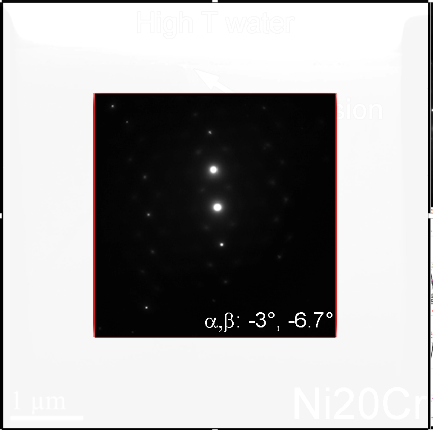

The methodologies and protocols derived subsequently in this paper build
off the derivations in section 2, and serve to better interface
crystallographic and stage motion in a practical manner. Transmission
and scanning transmission electron microscopy (S/TEM) data presented in
this paper were collected on an aberration, C{sub}`s` corrected JEOL ARM200CF
and include diffraction, convergent beam electron diffraction (CBED),
bright field (BF), and STEM high angle annular darkfield (HAADF). The
data are generic examples used for demonstration purposes to elucidate
various protocols and will not be described further than identification
of the imaging mode and/or base crystal type.

### K-space Calibration, Small Angle Tilting

In the pursuit of analyzing beam sensitive samples or smaller volumes
within a polycrystalline field it is often necessary to have a guide by
which to be able to blindly drive the stage while either blanking the
beam, lowering the magnification, or defocusing the beam (in STEM) such
that the area of interest is not accumulating dose or is lost amongst a
field of other adjacent crystals. The approaches provided in later
sections presupposes that one has some knowledge of the crystal, but
often if the sample is only tilted some observable distance from a
desired ZA or plane of atoms, it is not necessary to understand the
overall orientation, just that a specific ZA is within a small tiling
angle. Therefore, once the location of the α and β axes have been
identified, it is conceivable to create a small angle tilt template such
that if a sample is, for example, less than 5˚ off a ZA, one can rapidly
calculate the tilt coordinates without further observation of the sample
past the initial collection of the current pattern.

This is important for beam sensitive samples and small samples within a
polycrystalline matrix where either the beam can destroy the sample or
the non-eucentricity of the stage translates the sample away from the
field of view during tilting. In order to calibrate a tilt map, one of
two methodologies can be utilized depending on level of programing
expertise (for example in Gatan Microscopy Suite).

Calibration of the digital capture of k-space is first necessary such
that a subsequent point and click on the computer screen to tilt any
desired pole/plane to the center position could be accomplished
(). At any point within the double tilt stage the
immediate motion of the stage transverses in a linear fashion out to
\~7-10°, at which point due to the motion of the β tilt in relation to
the α any trace begins to rotate and nonlinear effects become
noticeable. Since most local digital fields of view illuminate \~5-6° of
tilt (\~90-100 mrad), the calibration will be considered linear. Only
the α need be considered, as the entire relationship of tip/tilt map can
be deduced from this measurement.

The calibration of the α tilt is required for the specific TEM approach
and should be performed with a crystalline sample with a ZA fiduciary
marker close to α,β: 0,0. The location of the probe (red dot/circle in
) or transmitted beam should first be identified
digitally (i.e., the pixel location on the screen, x/y, should be
correlated with the center of the beam) and noted as the origin
(x{sub}`0`,y{sub}`0`). Next, the crystal can be tilted in the pure negative or
positive α direction \~4-5° (or to the edge of the field of view) such
that the digital position (x{sub}`ref`,y{sub}`ref`) can be calibrated to the tilt
(green dot/circle in ). This position will be denoted as
the calibration, and a calibration vector can be produced by subtracting
the reference position from the origin. This vector, shown in ,
is normalized to produce a unit vector in the direction of α tilt. The
direction of β tilt is perpendicular to this, and the unit vector
$\widehat{y}$ is shown in .

$$\label{eq39}\overset{⃑}{x} = \begin{bmatrix}
x_{ref} - x_{0} \\
y_{ref} - y_{0} \\
\end{bmatrix}\ \ \overset{\ }{\Rightarrow}\widehat{x} = \frac{\overset{⃑}{x}}{\left| \overset{⃑}{x} \right|} = \frac{1}{\sqrt{\left( x_{ref} - x_{0} \right)^{2} + \left( y_{ref} - y_{0} \right)^{2}}}\begin{bmatrix}
x_{ref} - x_{0} \\
y_{ref} - y_{0} \\
\end{bmatrix}$$

$$\label{eq40}\widehat{y} = \frac{1}{\sqrt{\left( x_{ref} - x_{0} \right)^{2} + \left( y_{ref} - y_{0} \right)^{2}}}\begin{bmatrix}
{- (y}_{ref} - y_{0}) \\
x_{ref} - x_{0} \\
\end{bmatrix}$$

The tip/tilt coordinates for any position (x,y) in the field of view
(blue dot/circle in ) can be calculated to align the
feature of interest (e.g., zone axis) with the probe by decomposing this
location into components along $\widehat{x}$ and $\widehat{y}$. The
decomposition must be solved for the amount along $\widehat{x}$
($c_{1}$) and the amount along $\widehat{y}$ ($c_{2}$) in .

$$\label{eq41}c_{1}\widehat{x} + c_{2}\widehat{y} = \ \begin{bmatrix}
x - x_{0} \\
y - y_{0} \\
\end{bmatrix}\overset{\ }{\Rightarrow}\frac{c_{1}}{\sqrt{\left( x_{ref} - x_{0} \right)^{2} + \left( y_{ref} - y_{0} \right)^{2}}}\begin{bmatrix}
x_{ref} - x_{0} \\
y_{ref} - y_{0} \\
\end{bmatrix} + \frac{c_{2}}{\sqrt{\left( x_{ref} - x_{0} \right)^{2} + \left( y_{ref} - y_{0} \right)^{2}}}\begin{bmatrix}
{- (y}_{ref} - y_{0}) \\
x_{ref} - x_{0} \\
\end{bmatrix} = \begin{bmatrix}
x - x_{0} \\
y - y_{0} \\
\end{bmatrix}$$

Solving this system of equations for the weights yields:

$$\label{eq42}c_{1} = \frac{\left( x - x_{0} \right)\left( x_{ref} - x_{0} \right) + \left( y - y_{0} \right)\left( y_{ref} - y_{0} \right)}{\sqrt{\left( x_{ref} - x_{0} \right)^{2} + \left( y_{ref} - y_{0} \right)^{2}}}$$

$$\label{eq43}c_{2} = \frac{\left( y - y_{0} \right)\left( x_{ref} - x_{0} \right) - \left( x - x_{0} \right)\left( y_{ref} - y_{0} \right)}{\sqrt{\left( x_{ref} - x_{0} \right)^{2} + \left( y_{ref} - y_{0} \right)^{2}}}$$

:::{figure} ./images/image19.tiff
:name: fig12

Calibration of digital capture for precise, small angle sample tilting.
:::

Once the weights are known, they are converted to tip/tilt coordinates
using a scaling factor that was derived from the initial α calibration
tilt divided by the length of the vector. The equation for scaling
factor is:

$$\label{eq44}Scaling\ Factor = \frac{\alpha}{\sqrt{\left( x_{ref} - x_{0} \right)^{2} + \left( y_{ref} - y_{0} \right)^{2}}}$$

Utilization of these formulae allows for precise small angle tilting
using CBED or a Ronchigram where there could be a high density of
additional Kikuchi lines from adjacent, smaller crystals. More
importantly, if the sample is beam sensitive only a single image capture
need be collected to predict how to tilt within the field of view in
k-space.

### Center-beam Darkfield Tilting

Precise off axis tilting of the electron probe using the condenser lens
deflector coil system has long been utilized to examine the location of
specific diffracted beams (center beam darkfield (Carter et al., 1996))
and also to perform techniques such as hollow cone diffraction (Kondo et
al., 1984) and precession electron diffraction (PED) ((Vincent and
Midgley, 1994, Midgley and Eggeman, 2015)). Tilting the beam can be
considered a conjugate of tilting the sample, and hence the use of
digital capture can be utilized to dictate the tilt of the beam.

If the same mathematical calculations are completed with the tilt
conditions replaced with condenser lens deflector outputs, the precise
beam deflections can be utilized (Eqns. [%s](#eq39)-[%s](#eq44)). The difference is that
the beam deflections are most often read as hexadecimal, and therefore
the calculations need to utilize the hexadecimal outputs instead of
stage tilt positions.

This technique can be utilized in a wide variety of methods to examine
darkfield tilting and is important for analysis of beam sensitive
samples. Once a single diffraction pattern is collected, the beam can be
blanked by appropriate methods, and the beam tilt conditions can be
performed by pointing and clicking on the viewing screen to obtain the
correct deflections (e.g., a where the (-1-31) spot is
deflected to the central beam). Similarly, when there is no visible
diffraction spot but there is a crystalline phase suspected (or possibly
a weak superlattice reflection), digital alignment can be performed
blindly (white circle in a). Additionally, the beam could
be deflected in a circular manner by which to explore all possible
g-vectors in k-space during a long, darkfield exposure (b). This technique could then be utilized to program in all desired
g-vectors of a given crystal system at once and compare the resulting
image to a second set of deflections corresponding to a different
crystal (e.g., FCC versus BCC). It is beyond the scope of this paper to
go into more detail, but precise digital control of the beam deflectors
in TEM mode could be highly beneficial for a wide range of materials
analyses.

:::{figure} ./images/image20.tiff
:name: fig13

Example of digital capture darkfield tilting using a
diffraction pattern of an FCC crystal in the \[211\] orientation (a),
and a schematic illustrating a theoretical example of deflecting the
probe in a circular manner (b).
:::

### Image Montaging

Although not directly related to the stage tilt movement and additional
protocol that has been proven extremely productive in scanning electron
microscopy (SEM) is the notion of montaging images at a specific
magnification/resolution to create a larger image. The increased
resolution of the higher magnification maps provides for richer, more
meaningful data sets as compared to a single, low magnification overview
image. Although in principle an increased resolution could be used at
lower magnifications, there is a physical limit to the camera/detector
size that makes it prohibitive. Most often on the TEM montaging is
performed manually by the microscopist because a small number of maps
are required to cover an area of interest, and as well because of the
time prohibitive nature of limited scope availability. The ability to
automatically montage data has not been a necessary feature on most
microscopes, but with the coming age of automation, there will be a need
to perform overnight montaging of samples for data triaging in
subsequent sessions. As has been demonstrated throughout this work, the
ability to have a map or specific list of commands provides a sense of
direction for the microscopist. While a montage could be done manually,
gauging where the previous region of interest overlaps with the current
image, a table of stage tilts would be more beneficial to the user.
Given a desired distance, X, image dimension, Y, and necessary image
overlap (p, as a fraction) the number of maps necessary to create a
montaged image is given in . The table of stage positions can
then be calculated through  where the addition or subtraction of
the (X-Xp) or (Y-Yp) terms are a function of the numbering logic of the
stage and are added to the previous image coordinates (movie showing
montaging in ). This of course takes into account the
fact that the sample is flat, and a Z term has not been introduced. This
could be addressed for highly titled samples by observing the height at
either end of the desired montage range and scaling each position
accordingly. This also does not consider the movement of backlash within
the stage, and is only meant as a starting point for creating montaged
images.

$$\label{eq45}N_{maps} = \ \frac{(X - pY)}{(1 - p)Y}$$

$$\label{eq46}{Image}_{N + 1} = X_{0} \pm (X - Xp),Y_{0} \pm (Y - Yp)$$

:::{figure} ./images/image21.png
:name: fig14

Movie illustrating montaging of MoO{sub}`3` particles on a carbon
film.
:::

### Pure Tilt Between Tip/Tilt Conditions

It is often necessary to calculate the angle between specific tip/tilt
conditions, as will be demonstrated later when solving unknown crystal
structures. The derivation for computing the angle between stage tilt
coordinates (α,β) is based off of the tip/tilt convention, where the
stage tilt is first rotated about the α tilt axis  and then
subsequently about the β tilt axis  to the to the beam normal
\[001\] . That is, given a normalized vector at any tip/tilt
position (α,β) can be rotated to the \[001\] position .

$$\label{eq47}R_{- \alpha,x} = \begin{bmatrix}
1 & 0 & 0 \\
0 & \cos\alpha & \sin\alpha \\
0 & {- sin}\alpha & \cos\alpha \\
\end{bmatrix}$$

$$\label{eq48}R_{- \beta,y} = \begin{bmatrix}
\cos\beta & 0 & {- sin}\beta \\
0 & 1 & 0 \\
\sin\beta & 0 & \cos\beta \\
\end{bmatrix}$$

$$\label{eq49}R_{\theta,total} = R_{- \beta,y}R_{- \alpha,x} = \begin{bmatrix}
\cos\beta & 0 & {- sin}\beta \\
{\sin\alpha\sin}\beta & \cos\alpha & \sin{\alpha\cos\beta} \\
\cos\alpha\sin\beta & {- sin}\beta & \cos{\alpha\cos\beta} \\
\end{bmatrix}$$

$$\label{eq50}R_{\theta,total}\begin{bmatrix}
0 \\
0 \\
1 \\
\end{bmatrix} = \begin{bmatrix}
{- sin}\beta\cos\alpha \\
\sin\alpha \\
\cos{\alpha\cos\beta} \\
\end{bmatrix}$$

This rotation can be performed for any two sets of tilt conditions,
$(\alpha_{1},\ \beta_{1})$ and $(\alpha_{2},\ \beta_{2})$, and therefore
the dot product between two vectors  will provide the angle
between the two tip/tilt conditions . It should be again be
noted that the order of rotation, α then β, is important, and reversal
of the order will provide erroneous results.

$$\label{eq51}\cos\theta = {{\sin{\beta_{1}\sin\beta_{2}}\cos}\alpha_{1}\cos\alpha_{2} + sin}\alpha_{1}\sin\alpha_{2} + \cos\alpha_{1}\cos\alpha_{2}\cos\beta_{1}\cos\beta_{2}$$

$$\label{eq52}\theta = \cos^{- 1}\left( \sin\alpha_{1}\sin\alpha_{2} + \cos\alpha_{1}\cos\alpha_{2}\cos\left( \beta_{1} - \beta_{2} \right) \right)$$

### Grain Boundary Misorientation

Possessing the crystallographic solution for two adjacent crystals
(a and b) of the same crystal system provides additional
information, namely the grain boundary misorientation angle and axis of
rotation (Chesser et al., 2020). This ability to calculate and report
this additional sample descriptor can be a powerful tool where the only
additional analysis that must be performed is the calculation (i.e.,
only the two crystal orientations are necessary). There are a number of
methods by which to derive the local misorientation (Jeong et al., 2010,
Liu, 1994, Liu, 1995), but in all cases the crystal orientation of two
adjacent crystals are utilized to determine the directions of the unit
vectors (c). The comparison of the unit vectors of each
crystal are used to calculate the misorientation angle about a shared
misorientation axis (\[uvw\]) through a misorientation matrix (c). The first step in developing this matrix is to solve for the
location of each of the unit vectors in each crystal.

In , Crystals A (a) and B (b) are observed in a given
orientation, and the given tip/tilt positions of any three vectors
within each can be determined through the crystallographic solution
(e.g., Crystal A \[110\], \[111\] and \[201\], and Crystal B \[110\],
\[112\], and \[111\]). Note that the choice of these three is arbitrary,
but that they must be linearly independent and contain three distinct
directions (i.e., \[111\] and \[222\] would not be distinct directions).
These three vectors can be used to determine the location of their
respective unit vectors (d).

:::{figure} ./images/image22.tiff
:name: fig15

Schematic illustrating how the local misorientation
between two crystals is formulated. a and b) Crystals A and B in a given
orientation. c) Misorientation angle and axis between the two crystals.
d) Conversion to primary axes coordinate system.
:::

The development of a misorientation matrix will describe the pure angle
required to rotate the unit vectors of Crystal A to align with the unit
vectors of Crystal B (c) and the shared axis between the
two crystals about which this rotation can be accomplished. In Cartesian
space the orientation of the vectors can be utilized in developing this
matrix, but in the microscope the description of the vectors are defined
by the coordinates of the double tilt stage.

The three observed or known vectors for one crystal (e.g.,
\[u{sub}`A1`,v{sub}`A1`,w{sub}`A1`\]) are observed at a given tip/tilt position (e.g.,
α{sub}`A1`,β{sub}`A1`) (d). These tip/tilt positions need to be
converted into Cartesian space similar to the operation performed in
Eqns. [%s](#eq47)-[%s](#eq52) during the development of the angle between tilt positions
(e.g., \[x{sub}`A1`,y{sub}`A1`,z{sub}`A1`\]). In order to derive the Cartesian vector
form of the unit vectors (\[100\], \[010\], \[001\]) for the crystal,
the tilt position vector in Cartesian form (\[x{sub}`A1`,y{sub}`A1`,z{sub}`A1`\]) is
first required to have the same magnitude as the crystallographic
vectors (\[u{sub}`A1`,v{sub}`A1`,w{sub}`A1`\]). This can be accomplished by multiplying
the tilt vector by the length of the crystallographic vector .

$$\label{eq53}{\overrightarrow{x}}_{A1} = \begin{bmatrix}
x_{A1} \\
y_{A1} \\
z_{A1} \\
\end{bmatrix} = \ \sqrt{u_{A1}^{2} + v_{A1}^{2} + w_{A1}^{2}}\begin{bmatrix}
{- sin}\beta_{A1}\cos\alpha_{A1} \\
\sin\alpha_{A1} \\
\cos{\alpha_{A1}\cos\beta_{A1}} \\
\end{bmatrix}$$

Similar expressions for the other two poles can be calculated, where the
subscript 1 has been replaced with either 2 or 3. It is necessary to
find three Cartesian vectors which add up to the three known vectors
given the linear combination weights determined by the crystallographic
poles.

$$\label{eq54}\overrightarrow{p}\  = \begin{bmatrix}
p_{Ax} \\
p_{Ay} \\
p_{Az} \\
\end{bmatrix}\sim\lbrack 100\rbrack$$

$$\label{eq55}\overrightarrow{q}\  = \begin{bmatrix}
q_{Ax} \\
q_{Ay} \\
q_{Az} \\
\end{bmatrix}\sim\lbrack 010\rbrack$$

$$\label{eq56}\overrightarrow{t}\  = \begin{bmatrix}
t_{Ax} \\
t_{Ay} \\
t_{Az} \\
\end{bmatrix}\sim\lbrack 001\rbrack$$

These three unknown Cartesian vectors are the unit vectors that describe
the orientation of the crystal. In the microscope, regardless of the
sample orientation (e.g., \[111\] at α,β:5,10) the location of the unit
vectors (i.e., \[001\],\[010\] and \[100\]) are calculated. These
vectors are subsequently utilized to describe how to translate from one
crystal orientation to another (e.g., \[100\] of Crystal A to \[100\] of
Crystal B). The linear combinations that connect these sets of vectors
are:

$$\label{eq57}u_{A1}\overrightarrow{p} + v_{A1}\overrightarrow{q} + w_{A1}\overrightarrow{t} = {\overrightarrow{x}}_{A1}$$

$$\label{eq58}u_{A2}\overrightarrow{p} + v_{A2}\overrightarrow{q} + w_{A2}\overrightarrow{t} = {\overrightarrow{x}}_{A2}$$

$$\label{eq59}u_{A3}\overrightarrow{p} + v_{A3}\overrightarrow{q} + w_{A3}\overrightarrow{t} = {\overrightarrow{x}}_{A3}$$

These equations can be solved for the components of the vectors
$\overrightarrow{p}$, $\overrightarrow{q},$ and $\overrightarrow{t}$
since there nine equations and nine unknowns. The details of how these
equations are rearranged are in the Supplemental, but after gathering
like terms, it is equivalent to the augmented matrix:

$$\label{eq60}\left\lbrack \begin{matrix}
u_{A1} & v_{A1} & w_{A1} \\
u_{A2} & v_{A2} & w_{A2} \\
u_{A3} & v_{A3} & w_{A3} \\
\end{matrix} \middle| \begin{matrix}
x_{A1} & y_{A1} & z_{A1} \\
x_{A2} & y_{A2} & z_{A2} \\
x_{A3} & y_{A3} & z_{A3} \\
\end{matrix} \right\rbrack$$

After row reducing this augmented matrix to reduced row echelon form:

$$\label{eq61}\left\lbrack \begin{matrix}
1 & 0 & 0 \\
0 & 1 & 0 \\
0 & 0 & 1 \\
\end{matrix} \middle| \begin{matrix}
p_{Ax} & p_{Ay} & p_{Az} \\
q_{Ax} & q_{Ay} & q_{Az} \\
t_{Ax} & t_{Ay} & t_{Az} \\
\end{matrix} \right\rbrack$$

The right-hand side of the row reduced matrix produces the elements of
the vectors $\overrightarrow{p}$, $\overrightarrow{q},$ and
$\overrightarrow{t}$ that give the axes of the crystal in Cartesian
vector form. The reason these three vectors are necessary is because
they give the rotation matrix that describes the orientation of the
crystal from the standard orientation where the crystallographic axes
(\[100\], \[010\], \[001\]) align with the coordinate axes
($\widehat{x},\ \widehat{y},\widehat{z}$). This standard orientation
alignment is the common feature that connects any crystal orientation to
another. The rotation matrix is found from the transpose of the
right-hand side of the row reduced augmented matrix. This can also be
described as the unit vector matrix in that it can be used to describe
the location of the unit vectors for a specific crystal.

$$\label{eq62}R_{A} = \begin{bmatrix}
p_{Ax} & q_{Ax} & t_{Ax} \\
p_{Ay} & q_{Ay} & t_{Ay} \\
p_{Az} & q_{Az} & t_{Az} \\
\end{bmatrix}$$

The previous rotation matrix was derived for Crystal A , but
the exact procedure applies to Crystal B without any modifications
beyond the subscript, and is denoted by:

$$\label{eq63}R_{B} = \begin{bmatrix}
p_{Bx} & q_{Bx} & t_{Bx} \\
p_{By} & q_{By} & t_{By} \\
p_{Bz} & q_{Bz} & t_{Bz} \\
\end{bmatrix}$$

Both of these rotation matrices convert from the standard orientation to
the current rotation of their respective crystal. To get from one
orientation to the other requires going from the current orientation
back to the standard orientation and then to other crystal orientation.
Mathematically, this is done by using the inverse of the rotation matrix
to get back to the standard orientation.

$$\label{eq64}M_{A \rightarrow B} = R_{B}R_{A}^{- 1}$$

$$\label{eq65}M_{B \rightarrow A} = R_{A}R_{B}^{- 1}$$

These two overall rotation matrices are the misorientation matrices that
describe the relative orientation of one crystal to another. Most
frequently, the desired information is how far apart two crystals are
misaligned and about which axis they must be rotated so that they would
become aligned. This is called the axis-angle representation of the
rotation matrix. If the general form a misorientation matrix is:

$$\label{eq66}M = \begin{bmatrix}
M_{11} & M_{12} & M_{13} \\
M_{21} & M_{22} & M_{23} \\
M_{31} & M_{32} & M_{33} \\
\end{bmatrix}$$

Then the axis-angle representation is, where θ{sub}`M` is the misorientation
angle and ${\overrightarrow{r}}_{M}$ is the misorientation axis:

$$\label{eq67}\theta_{M} = \cos^{- 1}\left( \frac{M_{11} + M_{22} + M_{33} - 1}{2} \right)$$

$$\label{eq68}{\overrightarrow{r}}_{M} = \begin{bmatrix}
\frac{M_{32} - M_{23}}{2\sin\theta_{M}} \\
\frac{M_{13} - M_{31}}{2\sin\theta_{M}} \\
\frac{M_{21} - M_{12}}{2\sin\theta_{M}} \\
\end{bmatrix}$$

It should be noted that in that the relative orientation solution the
adjacent crystals is important in the calculation of the misorientation
angles depending on the crystal system chosen. This is especially true
for higher symmetry systems (e.g., cubic) where redundant vector normals
allow accurate prediction of tilting from one pole to another, but the
relative orientations will become important when performing mathematical
calculations such as the misorientation angle. It is beyond the scope of
this paper to include a full discussion of all of the possible
symmetrical operators, but the reader must be aware of this when
utilizing stage tilts in the TEM to perform these calculations.

Lastly, in order to complete the full description of the grain boundary,
the interface must be further characterized to describe the orientation
of the plane of atoms with respect to the boundary and the adjacent
grain. To access this data, the physical orientation of the grain
boundary as a physical plane with respect to the stage is required. Once
the tip/tilt conditions are determined, then these coordinates can be
used to calculate the description of the plane normals.

### Interface/Boundary Tilting

The ability to correctly and accurately predict the motion of crystals
in an electron microscope using a double tilt stage is crucial to
collecting the optimal data over a wide range of fields of study. In
section 2, a full explanation of how to derive these calculations was
conducted; first the crystal was treated as a physical object and then
subsequently a physics based filter was applied through the structure
factor. The advantage of this approach is that the motion of
non-crystalline samples can be treated in the same way as the derivation
of directions for planes or tilts between poles as interfaces are
physical planes. Therefore, the ability to identify the orientation of
the long axis with respect to the α tilt axis can be predicted similar
to identifying the orientation of a plane of atoms.

As will be demonstrated in subsequent sections, this can be further
utilized in a variety of techniques from creating oblique tilt series to
rapid analysis of grain boundaries edge on. More importantly, prediction
of the interface movement allows for more accurate data collection as it
can also be related to adjacent crystalline material. For instance, if
an edge on boundary condition is determined, then the boundary can be
subsequently tilted along its long axis to any tilt condition that may
be favorable to the adjacent crystal, such as a pole or specific plane
of atoms. Additionally, when the interface is edge on, the adjacent
crystallographic normal(s) can be calculated if the crystallographic
solution of the crystal(s) has been measured.

The approach for predicting interface motion is similar to that of
calculating planes of atoms, except that for planes of atoms there is an
explicit normal previously defined by the plane of atoms in question.
For an interface, the starting tip/tilt conditions are the only
information available (e.g., α,β:-5,10 in ) as well as
the measure of the long axis to the α tilt axis (e.g., θ in  of which the grain boundary is measured at \~75°). Note that the
sign of rotation of the boundary to the α tilt axis is reversed between
a and b because of the sign convention of how the α tilt
axis is calibrated. The relationship of the current tilt conditions to
the fiduciary angle to the α axis is important because, as was
demonstrated in the section 2 for planes of atoms, in the double tilt
stage linear features will rotate when tilted to higher angles. That is
to say, θ in a will vary slightly based on the given α,β
tilt conditions.

:::{figure} ./images/image23.tiff
:name: fig16

Plotting tip/tilt coordinates for interface analysis. A
TEM (BF) image of a grain boundary is shown in with the angle to the α
tilt axis (θ) highlighted (a). The trace of the boundary on a tip/tilt
diagram (b) illustrates the angular movement (φ) normal to the boundary
conditions shown in (a).
:::

As there is no crystallographic information utilized, the current tilt
position (e.g., α,β: -5,10 in a and b) is required to be
converted into a Cartesian vector similar to what was performed in the
calculation of the misorientation matrix. In order to calculate the
vectors parallel and perpendicular to the direction of the interface
Eqns. [%s](#eq69) and [%s](#eq70) need be derived, respectively. These two vectors lie in
the xy plane and are determined solely by the angle θ.

$$\label{eq69}{\widehat{a}}_{parallel} = \begin{bmatrix}
{\ cos}\theta \\
{\ sin}\theta \\
0 \\
\end{bmatrix}$$

$$\label{eq70}{\widehat{b}}_{perpendicular} = \begin{bmatrix}
{- sin}\theta \\
\cos\theta \\
0 \\
\end{bmatrix}$$

Section 2 details a rotation about an arbitrary axis (see Supplemental),
and this will be used to rotate about both the vectors
${\widehat{a}}_{parallel}$ and ${\widehat{b}}_{perpendicular}$ . The general formula for rotation of angle $\varphi$ about an axis
of rotation $\widehat{u}$ (with length equal to one) is:

$$\label{eq71}\begin{matrix}
R_{\widehat{u},\varphi} = \begin{bmatrix}
u_{x}^{2} + \left( u_{y}^{2} + u_{z}^{2} \right)\cos\varphi & u_{x}u_{y}\left( 1 - \cos\varphi \right) - u_{z}\sin\varphi & u_{x}u_{z}\left( 1 - \cos\varphi \right) + u_{y}\sin\varphi \\
u_{x}u_{y}\left( 1 - \cos\varphi \right) + u_{z}\sin\varphi & u_{y}^{2} + \left( u_{x}^{2} + u_{z}^{2} \right)\cos\varphi & u_{y}u_{z}\left( 1 - \cos\varphi \right) - u_{x}\sin\varphi \\
u_{x}u_{z}\left( 1 - \cos\varphi \right) - u_{y}\sin\varphi & u_{y}u_{z}\left( 1 - \cos\varphi \right) + u_{x}\sin\varphi & u_{z}^{2} + \left( u_{x}^{2} + u_{y}^{2} \right)\cos\varphi \\
\end{bmatrix} \\
\end{matrix}$$

In the case where ${\widehat{a}}_{parallel}$ is the axis of rotation,
the tilt series is perpendicular to the interface. Conversely, in the
case where ${\widehat{b}}_{perpendicular}$is the axis of rotation, the
tilt series is parallel to the interface. In either case, the angle of
rotation ($\varphi$) determines how many steps will be in the tilt
series (b). Typically for a full rotation
$\varphi = 1{^\circ}$, hence there will be 360 steps in the series
before returning to the original orientation. The simplified rotation
matrices are:

$$\label{eq72}\begin{matrix}
R_{\widehat{a},\varphi} = \begin{bmatrix}
\cos^{2}\theta + \sin^{2}\theta\cos\varphi & \cos\theta\sin\theta\left( 1 - \cos\varphi \right) & \sin\theta\sin\varphi \\
\cos\theta\sin\theta\left( 1 - \cos\varphi \right) & \sin^{2}\theta + \cos^{2}\theta\cos\varphi & - \cos\theta\sin\varphi \\
 - \sin\theta\sin\varphi & \cos\theta\sin\varphi & \left( \cos^{2}\theta + \sin^{2}\theta \right)\cos\varphi \\
\end{bmatrix} \\
\end{matrix}$$

$$\label{eq73}\begin{matrix}
R_{\widehat{b},\varphi} = \begin{bmatrix}
\sin^{2}\theta + \cos^{2}\theta\cos\varphi & - \sin\theta\cos\theta\left( 1 - \cos\varphi \right) & \cos\theta\sin\varphi \\
 - \sin\theta\cos\theta\left( 1 - \cos\varphi \right) & \cos^{2}\theta + \sin^{2}\theta\cos\varphi & \sin\theta\sin\varphi \\
 - \cos\theta\sin\varphi & - \sin\theta\sin\varphi & \left( \sin^{2}\theta + \cos^{2}\theta \right)\cos\varphi \\
\end{bmatrix} \\
\end{matrix}$$

As with all other tip/tilt conversions, the Cartesian vectors calculated
in Eqns. [%s](#eq72) and [%s](#eq73) need to be converted to tilts through Eqns. [%s](#eq74) and [%s](#eq75)
(note these are the same as Eqns. [%s](#eq23) and [%s](#eq24)). These derivations will
subsequently be utilized to create oblique tilt series and perform
precise interface orientation calculations.

$$\label{eq74}\alpha_{final} = \tan^{- 1}\left( - \frac{Y}{\sqrt{X^{2} + Z^{2}}} \right)$$

$$\label{eq75}\beta_{final} = \tan^{- 1}\left( \frac{X}{Z} \right)$$

### Calculating Interface Orientations/Rapid Grain Boundary Analysis

Before the advent of atom probe tomography (APT), TEM had long been the
most advanced technique for understanding materials properties at the
highest chemical resolution (Blavette et al., 1993, Carter et al.,
1996). Even with the ability to more precisely analyze interface
chemistry by APT, S/TEM still provides a manner by which to analyze
chemistry in addition to relating it to crystallography and other
microstructural features such as dislocations and defects. More
importantly, whereas the region of interest in APT is highly localized
and is dependent on precise sample preparation (i.e., it is possible
that only a small portion of an interface is captured within one tip),
S/TEM allows a more global perspective for any given sample. One sample
may contain tens of grain boundaries with lengths on the order of
micrometers, thereby allowing the user to probe and provide a more
representative analysis of the microstructure and microchemistry.

The ability to harness this much information for any given
microstructure/sample is predicated on the speed of analysis combined
with the correct orientation. In terms of interfaces, it is absolutely
necessary that a boundary be analyzed edge on in order to best assess
chemical gradients. For example, the depletion in sensitized stainless
steels due to irradiation can be measured (Simonen and Bruemmer, 1998)
and subsequently used to model the behavior of a material as a result of
various external stimuli (e.g., heating, irradiation, chemical
diffusion). Therefore, rapid and accurate alignment of interfaces on
edge (i.e., completely aligned with the electron beam direction) is
tantamount to performing the best possible analysis.

The utilization of a double tilt stage makes this entirely possible
based on a number of tilting techniques. First, each tilt axis can be
rocked independently in a positive and negative manner while the width
of the desired interface is minimized. This requires that the same
interface region be kept in the field of view during each tilting step.
If the boundary has any deviation along its long axis (e.g., grain
boundary curvature), determination of exactly when the boundary width is
minimized can be challenging. Even more difficult is the assessment of
the width of the boundary during tilting of the non-eucentric tilt axis
(β), as the sample location often drifts even in piezo controlled
stages. More importantly, as the length scale of the boundaries decrease
towards the sub micrometer level, tracking the exact position of the
boundary can be tedious and time consuming even on the eucentric tilt
axis (α). In order to minimize the difficulty of tilting on the
non-eucentric axis, a second method that can be employed is to measure
the rotation of the long axis of the interface to the α tilt axis,
remove the sample from the microscope, and then physically rotate the
sample to such that it can be tilted solely on the eucentric axis (i.e.,
the long axis of the boundary is physically aligned along the
non-eucentric axis so it can be tilted against the interface). The
problem with this method is the amount of time for each analysis and
lack of fidelity in physically rotating the sample. There do exist
double tilt rotate holders specifically for this type of alignment, but
they are most often not optimized for chemical analysis and are
typically not standard to most microscopes.

Using the tilt methodologies developed in previously, a grain boundary
in {u}`any orientation can be tilted on edge by collecting two tilt conditions` where an interface width is measured at each
tilt condition (provided reasonable assumptions of sample thickness and
tilt range of a given holder). When the boundary is tilted against its
long axis in a purely orthogonal manner in a known quantity (φ in
b) the geometry of an inclined sample can be measured to
determine not only the necessary tilt conditions to be aligned on edge,
but as well provide a reasonable measure of the sample thickness
().

For any given interface, the projected width (a, w{sub}`1`)
can be measured at the current tip/tilt conditions through the
difference in contrast where the interface intersects the top and bottom
of the foil. While initially unknown, the interface has an inclination
angle to the foil normal (, θ{sub}`1`). The projected width
(w{sub}`1`) can be related to the interface length (IL) by the cosine of the
inclination angle (θ{sub}`1`, ), and the foil width (FW) can be
calculated by the sine of the inclination angle . Additionally,
while the directionality of the boundary (top left to bottom right, or
top right to bottom left) is inherently unknown, the manner in which the
calculations are performed make this orientation irrelevant.

$$\label{eq76}{\cos\left( \theta_{1} \right)}{= \ \frac{w_{1}}{IL}}$$

The angle of the interface's long axis to the α axis can be measured
(i.e., θ in a) and using Eqns. [%s](#eq30)-[%s](#eq35), the tilt conditions
for a pure orthogonal tilt normal to the boundary can be calculated
(b and c, θ{sub}`2`). This angle is commensurate with φ in
b, and these tilt conditions can be either positive or
negative (b and c) based on the stage reference. For
example, at a starting condition of α,β:0,0 with the boundary at 45° to
the α axis and a tilt of 10° (θ{sub}`2` or φ) puts the tilt stage at
(α,β:-7.1, -7.1) or (α,β:7.1, 7.1).

At this tip/tilt condition, a second apparent grain boundary width
(w{sub}`2`) can be measured (b). Depending on magnitude of
w{sub}`2` as compared to w{sub}`1`, and knowing the foil width (FW), Eqns. [%s](#eq77)-[%s](#eq79)
can be used to calculate the angle necessary to tilt the boundary edge
on, θ{sub}`3`, of which can be derived in the following manner.

Once tilted, the projected width of the boundary (w{sub}`2`) can be related
to the angle necessary to tilt the interface on edge (θ{sub}`3`) using
trigonometry.

$$\label{eq77}{\sin\left( \theta_{3} \right)}{= \ \frac{w_{2}}{IL}}$$

The interface length (*IL*) is initially unknown, but is constant
between tilts and can be found using the Pythagorean Theorem once the
initial width (w{sub}`1`) and the foil width (FW) are known.

$$\label{eq78}{IL = \ }{\sqrt{FW^{2} + w_{1}^{2}}}$$

Substituting this above yields the final equation for $\theta_{3}$:

$$\label{eq79}\theta_{3}{= \arcsin\left( \frac{w_{2}}{\sqrt{FW^{2} + w_{1}^{2}}} \right)}$$

In a double tilt stage the trace of a plane (or boundary in this
instance) physically rotates due to the S-curve, and therefore there are
two manners in which to calculate the final tilt conditions where the
interface will be oriented edge on. These calculations consider the
measure of the long axis of the boundary to the α tilt axis (θ in
), and this angle will change depending on the current
tip/tilt conditions (i.e., in  θ at α,β:0,0 is 75°, but
at α,β:-10,30 it would be change by \~2° due to the S-curve). Therefore,
when performing the final tip/tilt calculations the choice of the
appropriate measure of θ is imperative. One can either re-measure the
angle of the boundary to the α tilt axis at the second tip/tilt
conditions, or utilize the starting tilt conditions (where w{sub}`1` was
measured) and the measure of the initial interface angle to the α tilt
axis. The pure tilt (whether θ{sub}`3` or the difference between θ{sub}`2` and
θ{sub}`3`) will depend on which conditions is chosen. Regardless, either can
be performed by using Eqns. [%s](#eq76)-[%s](#eq79) to tilt the sample in a positive or
negative fashion by θ{sub}`3`.

This can be visually demonstrated in a where a
theoretical grain boundary measured at 45° to the α tilt axis at
starting tilts α,β:0,0 is measured at 40 nm wide. A positive tilt of 25°
moves the stage to α,β:17.4,18.3 (along the black dotted line in
a) where the boundary is measured to be 60 nm wide (an
increase of 20 nm), meaning the boundary needs to be tilted -35.4° from
the starting tilt conditions (α,β:0,0) to a final tilt condition of
α,β:-24.2,-26.7. Under these conditions, the sample thickness would be
\~56 nm thick. If the final, edge on, tilt calculations were performed
from the second tilt condition (α,β:17.4,18.3, red dotted line in
a) without re-measuring the grain boundary angle to the α
tilt axis (which has rotated by \~2.5°) the final tilt conditions would
be (α,β:-26.1,25.0) which is \~2.4° from the correct position. While
still within the precision of most double tilt stages, it would not be
correct.

The initial input tilt (, θ{sub}`2`) will be dictated by the
initial interface width due to the possibility of the tilting the sample
through the edge on condition, thereby invalidating the calculations.
The wider the initial boundary width, the more the initial tilt can be
applied. To fully account for the possibility of tilting through the
edge on condition, a third tilt and a third width, w{sub}`3` would be
necessary, but by assessing the approximate width of the sample (e.g.,
\~100 nm) and the initial interface projected width (w{sub}`1`) a protocol
can be developed by which to determine the initial normal tilt (θ{sub}`2`).

b provides a calculated guide for applicable tilt angles
provided a starting apparent boundary width (w{sub}`1`) for a number of
approximate sample thicknesses as to not invalidate the calculations put
forward in Eqns. [%s](#eq76)-[%s](#eq79). In the theoretical example shown in a where the sample was on the order of \~56 nm thick and the
starting grain boundary width of 40 nm, from b the
starting tilt of 25° was appropriate. If the assumed starting thickness
of the sample was \~100 nm, 25° would not have guaranteed that this tilt
would not tilt past the edge on condition.

As illustrated in b, if the starting apparent interface
width is on the order of 10 nm, the boundary is nearly edge on already,
and a small angle calculation can be utilized (Eqns. [%s](#eq76)-[%s](#eq79)). Instead of
developing a tilt series, these equations can be utilized for small
angles (1-5°) to tilt a boundary or interface normal to its long
direction to close the apparent width of the boundary. The utilization
of this rapid interface calculation methodology allows for successive,
rapid analysis of any number of grain boundaries regardless of
orientation to one another. After one boundary has been tilted edge on,
an adjacent boundary width can be measured and then tilted edge on.

:::{figure} ./images/image24.tiff
:name: fig17

Schematics illustrating calculation of interface on edge
conditions and sample thickness. a) Sample in original tilt, b) sample
tilted negatively, and c) sample tilted positively.
:::

:::{figure} ./images/image25.tiff
:name: fig18

Tip/tilt map of a theoretical grain boundary tilted edge
on (a), and plot of normal tilt value versus initial projected interface
width (w{sub}`1`) for a number of sample thicknesses to gauge the applicable
normal tilt angle (θ{sub}`2`) without crossing over the edge on condition
(b).
:::

### Interface/Crystallographic Normals

Predicting and controlling the motion of crystals and interfaces is
important for grain boundary descriptions, determining growth directions
of oxides from surfaces, and orientations of facets. In describing the
relationship between two crystals, the first step is to determine the
misorientation angle and axis (Eqns. [%s](#eq67) and [%s](#eq68)). This data is
commensurate with what is collected in electron backscatter diffraction
(EBSD) in SEM, but TEM provides the advantage of further being able to
describe the grain boundary orientation *(Figure 19*). The inclination
of the grain boundary with respect to the stage, as shown in a for grain 1 (G1), is a known variable and can be solved to orient
the grain boundary edge on (Eqns. [%s](#eq76)-[%s](#eq79)), as shown in b.
Given these tilt conditions, the angle of the grain boundary to the α
axis (θ in a and b) and the crystallographic
solution of the two adjacent crystal(s), the crystallographic normals
and planes to the interface can be calculated (solid red arrow in
b).

:::{figure} ./images/image26.tiff
:name: fig19

Schematic illustrating a grain boundary between two
grains (G1 and G2) in a standard orientation (a) and with the boundary
oriented edge on to the electron beam (b) shown in both cross-section
and plan views.
:::

As has been demonstrated through Eqns. [%s](#eq53)-[%s](#eq62), provided three known
vectors with specific α,β coordinates the unit vectors for the crystal
(i.e., \[001\]) can be derived, and therefore the vector describing any
tip/tilt position (α,β coordinates) within that crystal can be described
(e.g., the blue arrow/dot in b for G1 in the edge on
condition). This vector can be calculated by multiplying the rotation
matrix of the given α,β conditions (Eqns. [%s](#eq47) and [%s](#eq48)) by the unit vector
matrix  to form a rotation matrix at that specific α,β tilt
condition . This in effect rotates the unit vector at that
specific tilt condition to the beam direction \[001\], and as such
multiplying the inverse of this matrix $M_{\alpha\beta}^{-1}$ by the beam direction
will provide the vector at the given tilt conditions .

The unit vector matrix, which describes the location of the unit cell
axes, can be subsequently utilized to calculate the vector normal
orientation of either crystal (red solid arrow in the cross-section view
of b) since the grain boundary plane edge on is
commensurate with the crystallographic plane. That is to say, along the
interface the grain boundary can be envisioned to have a corresponding
plane of atoms in a specific orientation with relationship to the
adjacent grain. The vector normal  to the long axis can be
calculated (dashed line in the plan view of b) and
multiplied by the inverse of the tilt condition matrix, $M_{\alpha\beta}^{-1}$. This
vector describes the current tilt conditions where the grain boundary is
observed edge on . Instead of calculating the vector parallel
with the beam direction (\[001\]) the vector normal is substituted
(\[-sinθ,cosθ,0\], ). This can be corroborated using a generic
cubic crystal with the \[001\] positioned at α,β:0,0 and with the
\[100\] oriented along the α tilt axis (such as in a) and
by subsequently inputting any α,β coordinates the listed vector/pole/ZA
will be returned (e.g., α,β:24.1,26.6 will be the \[112\]).

$$\label{eq80}M_{\alpha,\beta} = R_{- \beta,y}R_{- \alpha,x}R_{A}$$

$$\label{eq81}{\overset{⃑}{u}}_{\alpha\beta} = M_{\alpha\beta}^{- 1}\ \begin{bmatrix}
0 \\
0 \\
1 \\
\end{bmatrix}$$

$$\label{eq82}{\overset{⃑}{u}}_{\alpha\beta,\theta\ normal} = M_{\alpha\beta}^{- 1}\ \begin{bmatrix}
{- sin}\theta \\
\cos\theta \\
0 \\
\end{bmatrix}$$

These calculations can be visually corroborated through a tip/tilt map
of a basic FCC crystal with the \[110\] pole plotted at α,β:5,10
() with an representative interface observed edge on at
α,β:5,10 with the long axis measured 45° to the α tilt axis (blue line).
Expansion of the crystallographic tip/tilt plot to ±90° indicates that
90° from the edge on condition (α,β:5,10), the \[001\] is observed (red
circle) at α,β:44.8,-85. Using , the angle between (α,β:5,10) and
(α,β:44.8,-85) is 90°. If the interface were oriented 135° to the α tilt
axis, the \[-110\] at (α,β:-44.8,-75) would be the vector describing the
normal to the interface.

:::{figure} ./images/image27.tiff
:name: fig20

Plotting of a basic FCC crystal where the
crystallographic solution is provided and the edge on condition is
observed at α,β: 0,0 with the interface long axis 45° to the α tilt axis
(a). The pole normal to the interface is demonstrated to be the \[001\]
at α,β: 44.8, -85 (b).
:::

The mathematics utilized in these derivations are in the cubic or
Cartesian form, and therefore these vectors need to be converted to the
native form (for non-cubic systems) through multiplication with the
inverse conversion matrix that was derived in the Eqns. [%s](#eq1)-[%s](#eq3). In order to
calculate the plane of atoms in the native form, the reciprocal lattice
matrix  must be utilized. Note that this is derived from Eqns.
28-31, where Eqns. [%s](#eq29)-[%s](#eq31) provide the reciprocal unit vectors and 
is the volume of the cell. The calculation of the native plane of atoms
can be derived by multiplying the vector normal  by the inverse
of the reciprocal lattice matrix .

$$\label{eq83}M_{reciprocal\ lattice} = \begin{bmatrix}
\frac{bc\sin\alpha\sin\delta}{V} & 0 & \frac{- ab\cos\beta\sin\delta}{V} \\
\frac{- bc\sin\alpha\cos\delta}{V} & \frac{ac\sin\beta}{V} & \frac{ab(\sin\alpha\cos{\beta\cos{\delta - \sin\beta\cos{\alpha)}}}}{V} \\
0 & 0 & \frac{ab\sin\alpha\sin\beta\sin\delta}{V} \\
\end{bmatrix}$$

$$\label{eq84}{\overset{⃑}{u}}_{interface\ normal} = {\overset{⃑}{u}}_{\alpha\beta,\theta\ normal}M_{reciprocal\ lattice}^{- 1}$$

### Tilt Series

As previously described, the derivation of tilt motion of interfaces
leads to a number of applications in the microscope. Small angle
calculations (either normal or parallel with the long axis of the
interface) have already been described, and expanding upon these
calculations provides a methodology to perform oblique tilt series.
While each are simple consequences of the interface motion, a brief
discussion of each is necessary to build upon more complex protocols.
Electron tomography has matured into a powerful tool for a wide variety
of fields, from biology to materials science (Hayashida et al., 2019,
Hayashida and Malac, 2016, Lidke and Lidke, 2012). The high tilt
requirement often provides limiting factors for technique including
special holders, larger pole pieces, and narrow sample geometries. When
performed correctly, tomography can be a useful tool to circumvent the
projection issues of TEM, but at the cost of losing the relationship
with respect to the rest of the sample. This is considering small,
needle shape regions of interest being utilized for tomographic analysis
similar to APT analysis.

Tilt series for TEM foils can also be performed along a single
orthogonal axis (whether it be α or β) using a double tilt stage, but
there are limitations to this approach. Depending on the orientation of
objects within the TEM foil, especially when they are oriented obliquely
to the stage axes, single axis tilt series may not provide a clear
picture. For instance, when a grain boundary decorated with precipitates
is tilted in a non-logical manner (i.e., not against its long axis) it
is difficult to observe the full distribution of precipitates or voids
on the boundary (Badwe et al., 2018) (). Yet, when the
boundary is tilted against its long axis, the boundary moves in a
logical fashion, and the distribution can be readily observed. Equally,
if not more, important is the ability to create tilt series along
specific planes of atoms that can be beneficial to demonstrate
dislocation microstructures in three dimensions (Liu and Robertson,
2011, Hata et al., 2020, Yamasaki et al., 2015).

:::{figure} ./images/image28.png
:name: fig21

Tilt series collected across a Ag-Au grain boundary
exhibiting void evolution ahead of an stress corrosion cracking (SCC)
tip in the binary alloy (Badwe et al., 2018).
:::

Using both the interface calculations combined with the crystallographic
solution of any grain within the sample allows for rapid collection of
tilt series. The tilt series calculations are performed by adjusting the
tilt steps in the interface calculation (φ in b), and
most importantly since only small steps are being performed the lack of
eucentricity on the β is minimized.

The mathematical derivations (Eqns. [%s](#eq69)-[%s](#eq75)) for tilting along or against
the long axis of an interface at discrete angular steps regardless of
orientation (i.e., orthogonal or oblique to the major tilt axes)
provides the ability to correctly orient interfaces for spectral
analyses, and can also be utilized in combination with the solution of
adjacent crystals to create useful tilt series data.

### Kikuchi Bands and Diffraction Patterns

The ability to create tip/tilt maps of any crystal system is important
for nanocartography at any length scale. Given a known pole and in plane
orientation, microscopists can quickly and reproducibly tilt anywhere
within the stage tilt limits. In section 2 it was noted that tip/tilt
conjugates of crystalline stereographic projections (i.e., a
stereographic projection including Kikuchi bands) could also be produced
in a similar manner, except that the fidelity of such maps may not be
practical given the accuracy of many double tilt stages. That is to say,
only extremely small d-spacings would provide Kikuchi bands that could
be tilted between with precision. With advancing technology, there may
come a time when this could be possible, and therefore it will be
discussed herein. The derivation that allows Kikuchi lines to be plotted
can additionally be utilized to plot diffraction patterns as well.

Unlike a stereographic projection where free rotation is considered, the
axes of tip/tilt motion are beholden to one another in that the β axis
depends on the α rotation. Therefore, when plotting Kikuchi bands (which
can be considered mirror images of the plane) it is not appropriate to
calculate the scattering vector in order to map the Kikuchi band. The
reason being is that the traces of ± g-vectors will eventually converge
to a point, whereas the traces need be mirror images and not converge
(a). Within the first \~40° the two maps appear similar,
but out past this point plotting the g-vectors will converge. This is
because the trace of the plane normal to the g-vector will inevitably
intersect the trace of the original point (since the g-vectors will be
multiples of the trace of the plane). In order to plot Kikuchi lines
correctly in a tip/tilt map (b), g-vector calculations at
each point along the trace of the plane must be performed in the
following manner.

To be able to mirror the Kikuchi band, the specific orientation at the
given α,β needs to be rotated by the desired ± Bragg angle about an axis
 in the direction of the plane normal. In  the
trace of a (111) plane in a cubic system is illustrated. While the
remaining planes and poles are not shown, the crystal orientation is
commensurate with a where the \[001\] is plotted at
α,β:0,0, with the \[100\] aligned along the α tilt axis. At any given
point along this line a vector can be drawn that points directly to the
\[111\] pole (inset of a). Due to nature of the S-curve,
the directionality of the vector will change depending on the position
along the trace. As demonstrated in Eqns.80-82, the crystallographic
vector can be derived at every α,β condition along the trace (e.g., at
α,β:16.2,-33.1 the vector would be described as \[-0.52,-0.28, 0.80\]).
Given that a single Kikuchi line scatters at the Bragg angle and
**g**-vectors (diffraction spots) scatter at twice the Bragg angle, in
order to plot either, a rotation about an arbitrary axis normal to the
vector (, i.e., a vector along the trace of the plane as shown in
b) and the plane normal at the desired angle (θ or 2θ)
must be performed.

The arbitrary vector can be calculated by taking the cross of the normal
to the trace of the plane (e.g., the \[111\]) and the vector describing
the trace of the plane (e.g., \[-0.52,-0.28, 0.80\]). Using  with
this vector as the rotation axis (e.g., \[0.62,-0.77,0.14\]) the vector
describing the trace of the plane (red circle in ) can be
rotated about the desired multiple of plus or minus the Bragg angle
(green circles in c) to derive the position of the
Kikuchi band or diffraction spot (note the Bragg angle of 5º is
exaggerated for demonstration purposes). The trace of the Kikuchi line
will then be a line plotted through each point, hence mirroring the
trace of the plane.

:::{figure} ./images/image29.tiff
:name: fig22

Plotting Kikuchi lines as scattering vectors (a) as
compared to plotting the Bragg angle at each point of the trace of the
plane (b).
:::

:::{figure} ./images/image30.tiff
:name: fig23

Plots of a basic cubic crystal and the trace of the
(111) plane, and a Kikuchi bands at a Bragg angle of 5°.
:::

As Kickuchi bands represent dynamical diffraction from crystallographic
planes, so too can kinematical diffraction spots also be plotted in a
similar fashion, except that instead of plotting lines at the Bragg
angle, diffraction spots (±) could be plotted at twice the Bragg angle
at any given tilt position within tip/tilt map. The diffraction spots
will be dependent upon both the directionality of the plane normal  and the structure factor  as to whether the plane of atoms
is expressed. As demonstrated by Cautaerts et al., if the accuracy of a
double tilt stage is sufficient, tilting samples to a two beam condition
could be utilized in this manner (Cautaerts et al., 2018).

### Unknown Crystal Calculator

The development of crystalline stereographic projections, pole figures,
and pole figure tip/tilt maps for both general crystals (i.e., for basic
low index poles/planes and not derived from the structure factor) in
addition to specific crystals (e.g., where the structure factor has
filtered specific poles/planes) has been demonstrated to be a powerful
tool for studying crystalline materials using a double tilt stage (Duden
et al., 2009, Klinger and Jäger, 2015, Li, 2016, Liu, 1994, Liu, 1995,
Qing, 1989, Qing et al., 1989, Xie and Zhang, 2020). Yet, when the
crystal structure is unknown, especially for nanocrystalline materials,
these calculations are ineffective because the poles/planes discovered
can represent any particular crystal and many systems share similar
diffraction patterns among various poles/planes. Therefore, it is
necessary to develop a methodology to map unknown crystals using the
aforementioned protocols, specifically the interface calculator.

Just as the interface calculator was based off the prediction of planes
of atoms, so too can the inverse be applied for unknown crystals given
the knowledge of what diffraction patterns and Kikuchi bands represent.
Diffraction spots (g-vectors) and Kikuchi lines represent the
directionality of planes of atoms within a crystal, and therefore can be
treated as interfaces. The interface calculator was derived to predict
motion of the traces of interfaces, and therefore it can be extended to
unknowns. At first, the concept may seem trivial, but when extended to
tracing the motion of a single diffraction spot or Kikuchi band in
combination with the knowledge that planes of atoms intersect at
crystallographic poles, the complexity of the protocol becomes more
relevant (). Regardless of whether the g-vector of a
plane is deduced from an atomic column image/fast Fourier transform
(a) or a diffraction pattern (b), the
trace of the plane of atoms can be calculated with relation to the
calibrated α tilt axis (given that the plane of atoms is normal to the
g-vector) and the tilt conditions at which the g-vector was observed.
Similarly, using CBED or Ronchigram mode where a Kikuchi pattern can be
collected (c), the orientation of the trace of the plane
at the given tilt conditions can also be plotted.

:::{figure} ./images/image31.tiff
:name: fig24

Mapping crystallographic planes using (S)TEM images and
tilt conditions in a double tilt stage using either a) atomic columns,
b) diffraction patterns, c) Kikuchi lines.
:::

This technique can be utilized in a variety of manners to solve for
unknowns, from crystals on the order of tens of nanometers to single
crystals within a polycrystalline matrix. As a theoretical example,
given one g-vector at specific tip/tilt coordinates (red dot, α,β:5,10,
with the plane measured at 135° to the α tilt axis), the trace of that
plane of atoms within the tilt range of the stage can be calculated
(). This would be similar to tracing a plane of atoms by
any of the three means in . By tilting along that
g-vector, additional g-vectors associated with that crystal will
eventually come into a diffracting condition (e.g., blue dot,
α,β:-19.7,-25.2). Note that as this is a theoretical example, a random
point along the line was chosen.

At these new tip/tilt coordinates the directions for any additional
planes can be traced, thereby creating a map of that specific crystal
(blue dot, b, 90° at α,β:-19.7,-25.2). Once two poles
have been identified and mapped (second pole, green dot, at
α,β:-13.3,-23.5), the specific directions for at least one additional
pole will be provided through the intersection of the trace of the
planes of the individual poles. Without ever having tilted to that
position with the stage (third pole, pink spot, α,β:22.9,15.7), the
knowledge that there is a pole present provides assurance to the
microscopist that additional poles can be quickly determined. As
illustrated in b, the weight of each trace can be scaled
according to the apparent indexing of the planes (i.e., low index planes
will appear darker due to multiple planes expressed due to the structure
factor). This can further be used as a fingerprinting technique for
analyzing unknowns. To illustrate how this would work in practice, a
movie highlighting the identification of an austenitic stainless steel
grain is shown in c.

Lastly, once a number of poles have been identified and planes traced,
additional crystallographic information can be garnered from the map.
For example, the pure tilt angles between poles can be calculated , poles not attainable in the tilt stage will be apparent, and
finally symmetry of the system can be observed and tested. If a mirror
plane is suspected, tilting to specific angles to either side of the
plane can be performed to observe whether identical diffraction patterns
are exhibited. The collection of this data can then be used to identify
a large number of poles within a sample to compare to crystallographic
mapping programs such as Crystal Maker (Palmer, 2015) or JEMS
(Stadelmann, 1987).

:::{figure} ./images/image32.tiff
:name: fig25

Unknown calculator illustrating how to tilt along
g-vectors or Kikuchi lines to build unknown crystal maps using a) a
single line, b) additional lines. c) The provided movie shows how this
works in practice.
:::
