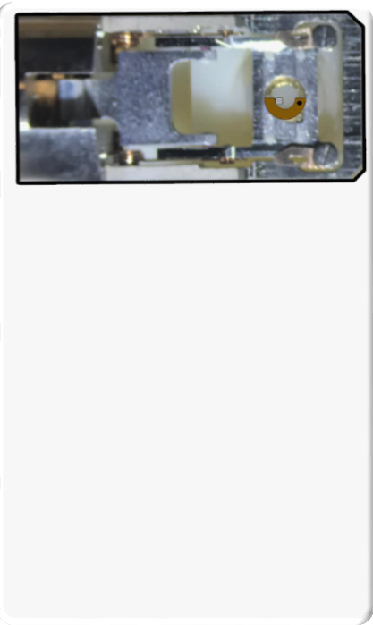

### Calibration of the Double Tilt Stage

The premise of utilizing nanocartography for electron microscopic
analysis centers on the knowledge of the α and β axes of a double tilt
stage (note: as described in section 2, the α,β convention is equivalent
to X and Y tilt axes). A similar procedure can be performed for a single
tilt stage, but it precludes much of the information that can be
collected (i.e., the ability to tilt within a crystal and stage motion
are limited to one axis). The power of utilizing these techniques is
that once the spatial relation of the α and β tilt axes are known for a
specific microscope (note that the β can be simply deduced as orthogonal
to the α once it is determined), any information gathered from a sample
can be translated in any fashion for use on another microscope as long
as the tilt axes have been similarly calibrated. This information allows
any microscopist to perform routine pre-screening of data regardless of
time or peripherals on any microscope before either reanalyzing the
sample in the same microscope, or transferring it to a different
facility or scope with more advanced capabilities.

The simplest manner in which to calibrate the α axis in imaging modes is
through the use of a carbon contaminated sample. Once loaded, a region
of interest that appears to be relatively uniform and flat should be
selected. Carbon mounds on both the top and the bottom of the sample can
be produced by condensing the beam to a fine point over the region
(). After a set amount of time, the probe can be
defocused to detect whether carbon mounds were produced. Once a
sufficient amount of cracked carbon has been deposited, an image at
α,β:0,0 can be collected for reference (a). The sample
should then be tilted approximately both positive and negative 10˚ in
the α, at which tilt point images should be collected. From the three
images collected, the circular projection of the carbon mound at α,β:0,0
should become elliptical at both positive and negative α tilts. The long
axis of the elongation is the α tilt axis. For the β axis, one can
either draw a line orthogonal to the α or repeat the procedure of
starting at α,β:0,0 and tilting to positive and negative 10˚ in the β to
ensure the correct location of the axis. The calibration of the α axis
needs to be performed at tilt condition α,β:0,0, from which the
subsequent calibration across tilt space can be applied (e.g., at tilt
conditions farther from 0,0 the actual α will be some mathematical
rotation from the calibration at 0,0 depending on location).

:::{figure} ./images/Figure 26.jpg
:name: fig26

TEM (BF) images showing carbon contamination (mounds)
deposited on a sample (a), followed by a pure α tilt to highlight
orientation of the α tilt axis (b). For all other tilt calculations in
TEM (BF) mode the angle to the α axis will be measured from this line.
:::

As previously demonstrated in section 3.1, the calibration of TEM
diffraction and STEM (Ronchigram) modes can be performed with any
crystalline sample, preferably one with larger, single crystals as the
calibration will be performed utilizing the position of diffraction
discs and Kikuchi lines emanating from a single source (). In either TEM diffraction mode or Ronchigram mode, a grain
should be selected that is relatively close to a zone axis (ZA) when the
stage is at α,β:0,0. The grain should be uniformly flat and set at the
eucentric height. This procedure works best if a grain oriented close to
a higher index ZA grain is selected since the systematic reflections
intersecting at the ZA will provide a good fiduciary marker (too low an
index could skew the visibility of the center of the ZA). Using a large
condenser aperture (preferably in CBED mode if the microscope allows
it), the probe should be condensed to a point followed by subsequent
analysis in diffraction mode. A center fiduciary image can then be taken
with the oriented ZA as the nominal zero position (a and
c). The sample should then be tilted approximately ±5˚ in the α at which
time an image should be taken (b and d). From each image
collected a trace of the center of the ZA can be drawn, hence providing
a measure of the α tilt axis. As with the calibration of the TEM bright
field and STEM imaging conditions, the β tilt can be ascertained as
orthogonal to the α tilt axis, or the aforementioned protocol can be
repeated using the β tilt in place of the pure α tilts.

Depending on the sample thickness, the observation of the Kikuchi lines
intersecting at a high index ZA are the easiest to observe. The same
procedure can be used in parallel beam diffraction mode, except the
center of the ZA needs to be identified by tracing a circle intersecting
the Ewald sphere and determining the center of the circle to pinpoint
the ZA. This approach can be more difficult and is less favorable than
using Kikuchi lines. In diffraction mode the orientation of the α tilt
axis can corroborated by defocusing the diffraction pattern either over
or under focus (e and f, respectively) to observe the
physical relation of the diffraction pattern to the sample.

Lastly, a large, relatively flat single crystal can be used to calibrate
the α tilt axis using two ZA and the methodology formulated to solve
unknown crystals.  illustrates selected area diffraction
(SAD) patterns of two ZA ((a)\<110\> and (b)\<112\>) of a CuNi alloy, of
which the details of the alloy are provided in subsequent sections and
in the Appendix. The tilt coordinates of each of the found ZA is
shown in c. The angle necessary to connect these two ZA
will correspond to a specific g-vector in the diffraction pattern, in
this case the {111} vector connects the \<110\> and \<112\> and the
angle from the α tilt axis is 6°. Therefore, in the SAD patterns an
angle orthogonal to the measured angle in c (i.e., angle
+/- 90° due to the Kikuchi band being orthogonal to the **g**-vector) will
illustrate where a fiduciary marker for the α tilt axis can be measured
for all diffraction patterns. As the projection of the lattice planes
will rotate slightly at oblique angles, the use of the unknown
calculator will accurately account for the measuring and plotting traces
between ZA. This is the exact reasoning for why diffraction patterns
collected across the entire tilt stage require slight rotations by which
to keep the **g**-vectors aligned. The S-curves illustrated in section 2
represent the angles by which the planes rotate.

:::{figure} ./images/Figure 27.jpg
:name: fig27

Calibration of the orientation of the α tilt axis in TEM
diffraction and STEM (Ronchigram mode) using a single crystalline
sample. CBED patterns (a-b) illustrate the crystal on zone (a) and
tilted \~2° in the α tilt (b). Ronchigram mode showing the crystal on
zone (c) and \~3° in the α tilt (d). Over (e) and under (f) focus images
of the central diffracted beam showing the orientation of the sample
with respect to the diffraction pattern.
:::

:::{figure} ./images/Figure 28.jpg
:name: fig28

Calibration of the alpha tilt axis using a single,
locally flat sample. SAD patterns (a,b) were collected at various tilt
conditions and then plotted (c) to obtain an approximate measurement of
the α tilt axis.
:::

Once each mode is calibrated for the location of the tilt axes, it is
suggested that digital templates be created for future analysis by which
to overlay and measure data currently being collected. The most
important is the orientation of the α tilt axis because every
measurement moving forward in these protocols are measurements to this
axis. The β could similarly be used except that the default is to the α
because it is typically the most eucentric of the two axes. In order to
best be able to utilize these protocols, it is necessary to be able to
measure the radial angle between the α axis and a given fiduciary,
whether it be a diffraction spot, Kikuchi line, or interface. As noted
in section 3.1, these calibrations can be incorporated into an algorithm
utilizing digital capture in order to use the computer screen to perform
small angle tilting of the sample.

### Tilt Stage Limit

In order to understand the limitations of the tilt map produced for any
number of operations, it is necessary to calculate and map out the limit
of the stage motions. This can be achieved by assuming symmetry of the
stage motion and tilting to a set number of α tilts and then determining
the corresponding limit of the β tilt. When mapped on the JEOL ARM200CF
the standard double tilt holder has the shape of a "squircle" or
superellipse. The superellipse is defined by:

$$\label{alpha_tilt_limit}\alpha = a\cos\theta^{\frac{2}{r}}$$

$$\label{beta_tilt_limit}\beta = b\sin{\theta^{\frac{2}{r}}}$$

Where α and β are the tilt stage readouts, a and b are the α and β tilt
limits, respectively, and r is a shape factor.  is a plot
illustrating stage limits of a =36 and b = 32 for a number of shape
factors with an r value of \~3.3 used a good description of the JEOL
double tilt holder for the ARM200CF. While these tilt limits can be
programmed as look up tables to curtail outputs (e.g., when plotting
specific crystals or for calculating tilt series calculations) the
ability to trace Kikuchi bands outside of the tilt limit can be
beneficial to understanding crystallographic data of an unknown sample.

:::{figure} #app:superellipse
:name: fig29

Double tilt stage limits as calculated through a
squircle (superellipse) estimation using various r values.
:::

### Crystallographic Orientation

The calculations and derivations of formulae surrounding
crystallographic orientation using a double tilt stage have already been
presented, but a more practical discussion of how to apply these
techniques can be discussed. First, it is necessary to have a general
understanding the movement of the double tilt stage in comparison to a
pole figure or stereographic projection (see ). Whereas
the planes of traces of atoms in a stereographic projection appear to
move in a straight or arced path, in the tilt map the planes move in an
S-curve fashion due to the α,β relationship. For instance, with a cubic
crystal positioned with the \[001\] at the α,β:0,0 tilt coordinates and
the \[100\] along the α or β orientation, the tilt conditions for the
\[111\] will be observed by first tilting alpha to 35.3° and then beta
to 45°, but the reverse order (beta to 35.3° and then alpha to 45°) will
not because of the dependency of the order to the stage motion.
Utilizing this allows orientation of any crystal using the following
protocols.

With experience and familiarity with a single system, microscopists can
eventually identify diffraction or Kikuchi patterns from memory, and
eventually identification of each plane within the diffraction pattern
becomes second nature. However, for inexperienced users identifying
these crystallographic waypoints can be a challenging if not daunting
experience. It should be noted that the work Xie et al. has automated
this in an open source manner {cite:p}`xie2020tauompas`, but for
completeness the protocols will be provided here.

In order to optimize crystallographic solutions with regard to the
sample and stage, at least one known or identified pole must be
determined as a proposed starting point. The stereotypical, six-fold
symmetry of a \<111\> cubic crystal is presented at stage positions
α,β:10.9,5.0 (). Depending on the level of confidence
with the found pole, the next step is to either tilt to a second known
pole somewhere within the tilt stage to set a second waypoint or to
follow orient to a known **g**-vector.

Since the preliminary calculations of the crystallographic solution are
based upon the first known pole (e.g., \<111\>) the remainder of the
crystal will rotate concentrically about that pole. Given the
crystallographic system has already been identified, the crystal can be
rotated about the first pole until a second proposed pole lines up with
the tilt conditions of the second pole. For instance if a second pole
were discovered at α,β:13.3,-14.8 the crystal could be rotated until the
\<112\> type pole would line up. Depending on the confidence of the user
in the identification of the two known poles and the symmetry of the
crystal system, a third and final pole could be identified on the map
and confirmed by tilting to that point (e.g., the \<110\> type at -16.6,
-17.3). For mapping and predictive tilting of the sample, the symmetry
of the given crystal system is not as important in setting this rotation
correction. When considering the orientation relationship between two
grains (i.e., misorientation angle) it is necessary that the
directionality of each adjacent grain be considered.

For more experienced microscopists, measuring the angle of a known plane
to the α tilt axis angle can be utilized in combination with the first
known pole. In  the {110} is measured \~20º to the α tilt
axis and can then be adjusted accordingly in the tilt map to get the
projection of the {110} correct. Again, depending upon the symmetry of
the crystal system, other poles can be located and tilted to in order to
confirm the orientation. Once enough poles have been identified to
satisfy the correct orientation, the crystallographic solution for that
crystal has been mapped and can be utilized for future tilt experiments
and the determination of vector normals to interfaces and adjacent
grains. This is extremely important for inexperienced users to gain
familiarity with a crystal system, as a large number of poles can be
quickly visited thereby building up experience with that crystal type.
For this reason alone, for less experienced users this is more
beneficial than an automated system of which it may be tempting to
blindly trust the output. Automation can be a powerful, but without a
proper understanding of the underlying principles, it can be improperly
used.

As shown in , the collection of a CBED or Kikuchi map
makes this exercise trivial because the measured angle to the α tilt
axis can be quickly, efficiently, and accurately measured. This does not
preclude microscopists without the ability to collect such pattern from
utilizing these methods. Once two known poles have been identified, the
tilt positions of the poles can be used to calibrate the
crystallographic solution similar to the aforementioned protocol. The
poles/planes of the entire crystal can then be traced and visited.

Mapping of crystals in this manner can be extremely useful in confirming
suspected crystals as well as rapid tilting for collecting diffraction
or atomic column images. Depending on the crystal, one pole may have a
unique projection of atomic planes that helps identify specific atomic
positions. For instance, in dislocation contrast imaging (DCI) the
\<110\> is a preferential pole in FCC materials to indicate a large
basis set of {111} planes {cite:p}`zhu2018towards, phillips2011diffraction, sun2019analysis`. Understanding the exact location of the \<110\> within a
specific crystal could suggest that the sample is too thick (i.e., a
large tilt condition) to achieve clear dislocation images. It would
allow a microscopist to then either find an additional crystal or tilt
to a less desirable pole. Lastly, when presented with opportunity to
utilize a crystallographic solution, microscopists could more
confidently confirm the specific crystal and avoid misidentification by
rapidly tilting to multiple poles. This type of analysis would not only
be beneficial for assuaging scientific reviewers, but would again be
most beneficial to inexperienced users who are not accustomed to rapid
identification of specific poles through fingerprinting.

:::{figure} ./images/Figure 30.jpg
:name: fig30

Determination of orientation of a known cubic crystal by
measuring angles with relationship to the α tilt axis using a Kikuchi
pattern (a) and plotting out the pattern with respect to the α tilt axis
(b).
:::

### Grain Boundary Characterization

The notion of crystals as physical objects using vectors was considered
in the development of the mathematics for orientating crystalline
material with the double tilt stage to more logically tie it to the
sample as a physical object. Microstructural analysis is highly
dependent upon objects that, while being often crystallographically
related, are not themselves crystalline. Objects such as grain
boundaries, surfaces, and interfaces are all important to microscopic
analysis, and as such, the description of their motion is of great
interest to microscopists. In section 3, an interface calculator was
derived which allows full control of finding a boundary on edge, and how
to tilt along the long axis of the boundary. This is discussed through a
variety of different techniques in these papers, and there are limitless
protocols for which having this control could be utilized.

One example of how this enables nanocartography is through the analysis
of nanocrystalline phases on a grain boundary. The difficulty of
nanocrystalline phase identification is often related to the size
limitation of selected area diffraction apertures. Once an aperture
becomes too small, it can start to influence the scattering of the
probe, thereby skewing the crystallographic information within the
sample {cite:p}`thomas1962transmission, carter1996transmission`. With advanced
instrumentation, nanobeam analysis techniques were developed to overcome
this limitation, but they themselves suffer from being too site
specific. That is to say, in nanobeam mode it becomes difficult to
position the site-specific region with respect to the rest of the sample
given that the beam width is on the order to 10-50 nm. An appropriate
analogy is the use of the Ronchigram to align aberration probe corrected
beams because they are on the order of a fraction of an angstrom (and
hence cannot be observed on a physical detector). Having full control
and knowledge of not only the crystalline components of the sample but
as well, the control over orientation of interfaces can serve to
overcome much of these limitations.

Most often nanocrystalline phases on interfaces and boundaries are
crystallographically oriented to one of the adjacent crystalline phases,
and therefore knowing the orientation of the adjacent matrix will make
phase identification of the nanocrystalline phases more accessible
{cite:p}`bhadeshia1987worked`. Yet, if the interface is not oriented correctly
(i.e., not viewed edge on), parasitic reflections from an adjacent grain
could skew identification. Therefore, a protocol could be utilized by
which to first solve the crystal orientations of both crystals
(), and then subsequently find the interface on edge
condition. In  (with the sample at α,β:0,0) the grain
boundary is observed \~10° from an edge on condition and 38° to the α
tilt axis. By overlaying the directions of the interface lines over top
of the crystalline solutions, a map of the optimum orientation for
crystallographic analysis could be achieved. There will be only one
tip/tilt position on the tilt directions normal to the interface where
the boundary would be oriented edge on (in this condition 10° from
α,β:0,0 is α,β:-6.1,-7.9), and once at that orientation the boundary
could then be tilted along the its long axis to keep the boundary edge
on (along the blue line). By tilting along the boundary in the edge on
condition to a position where either adjacent grain is near a low index
pole/ZA, selected area diffraction (SAD) could then be achieved without
parasitic reflections from either adjacent grain (e.g., G1 oriented to
\[121\] at α,β:17.4,-26.8, with no major pole present in G2). Any
systematic reflections (albeit weak due to the small volume of material)
could then be compared against the low index orientation of either
grain, and additionally since the orientation of the opposite grain
would already be known, any reflections from that grain could easily be
identified and temporarily ignored. Additionally, if a tilt condition
exists where both grains are preferentially oriented (e.g., α,β:-28.8,
11.9 where G1 is oriented to the \[12-1\] and G2 is on the \[110\]) when
the grain boundary is edge on, HAADF atomic column imaging can clearly
elucidate the boundary conditions.

:::{figure} ./images/Figure 31.jpg
:name: fig31

Schematics illustrating a protocol for determining the
grain boundary physical orientation relationship to the adjacent
crystalline grains. At α,β:0,0 the boundary is \~10° from an edge on
condition with the boundary oriented 38° from the α tilt axis. The
crystallographic solution for both grains is presented with an overlay
of the tilt orientations for tilting the boundary along (blue) and
against (red) the long axis of the boundary.
:::

### Multiple Session Sample Analysis

While the impetus for developing nanocartography as a technique was to
rapidly and accurately perform tiling along known planes and between
known poles/ZA (similar to the impetus for the development of ALPHABETA
{cite:p}`cautaerts2018alphabeta`), it soon became more evident as to the real
power behind utilizing vector calculations. While any number of
publications have outlined the geometry and mathematics to navigate a
double tilt stage as well as various crystals, none have taken into
consideration the ability to re-orient the sample for additional
analyses. Through the inclusion of the $R_{stage}$ rotation matrix,
which utilizes improper rotations as reflections, sample analysis can be
done over multiple sessions on one microscope without losing the
previously mapped crystallographic or interface positioning. As
previously mentioned, this opens the ability to take full advantage of
smaller and smaller analysis windows in an era where crowd sourcing of
the instrument places microscope time at a premium.

More importantly, with the ability to map out samples it makes
collaborations between institutions more attractive. 
illustrates how this might work between an institution such as Colorado
School of Mines (CSM) and Pacific Northwest National Laboratory (PNNL).
Regardless of what peripherals, detectors, or systems are on a single
microscope, the ability to measure the α tilt axis on a double tilt
stage, provides a manner to communicate the data collected from one
scope to another. The provided movie illustrates how diffraction
patterns would rotate with sample rotation in the cradle.

At CSM a sample could be loaded, and two fiduciary markers would be
logged. The first, a global fiduciary marker in relation to the holder
(which will later be accounted for in the rotation matrix as $R_{horz}$
and $R_{vert}$). Once loaded, a conspicuous local fiduciary marker on
the sample itself is also measured. Mapping of any of the crystals on
the sample surface could be performed, with each pole/ZA being logged.
The sample and sample map could subsequently be shipped to PNNL for
further analysis. This could be done for any reason; lack of a specific
technique, higher end instrumentation, or collaborative analysis. This
could save a great deal of time, money, and effort in requiring staff
from each institution to travel.

At PNNL, regardless of reason, the sample could be loaded in a
horizontally flipped orientation. The reason for a change in orientation
could vary from a simple mistake to a geometric necessity (e.g., a
double tilt holder which can only load the sample with the crescent
normal to the long axis of the stage to account for the position of XEDS
detectors), but because the mathematics derived in this work, this can
be taken into account and the original crystallographic data can be
translated. The identical fiduciary marker initially recorded is
measured along with the horizontal flip of the sample, and the
conversion of the previously noted poles/ZA are quickly achieved. The
movie included in  demonstrates how diffraction patterns
would rotate commensurate with sample rotation in the cradle.

:::{figure} ./images/image40.tiff
:name: fig32

Collaborative sample analysis at multiple institutions
through predicative tilting and mapping and movie illustrating sample
rotation.
:::
