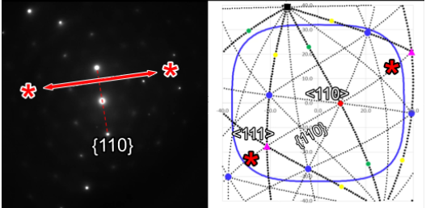
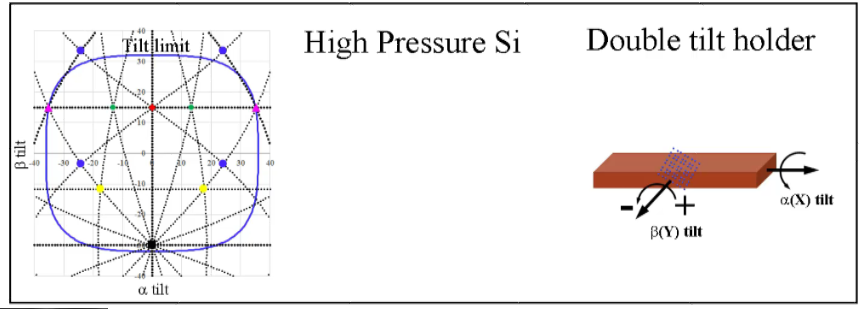

+++ {"part": "abstract"}

With the increasing diversity in material systems, ever-expanding number
of analysis techniques, and the large capital costs of next generation
instruments the ability to quickly and efficiently collect data in the
electron microscope has become paramount to successful data analysis.
Therefore, this research proposes a methodology of nanocartography that
combines predictive stage motion with crystallographic information to
provide microscopists with a sample map that can both reduce analysis
time and improve confidence in data collected. Having a road map of the
stage positions linked to microstructural (e.g., interfaces and growing
directions) and crystallographic orientation data (e.g., specific poles
and planes) provides microscopists with the ability to solve orientation
relationships, create oblique tilt series movies, and also solve complex
crystallographic unknowns at extremely small scales with minimal
information. Most importantly, it can convert any sample orientation
relationships across microscopes to increase optimization and
collaboration throughout the field.

+++

## Introduction

Prior to the invention of global positioning systems (GPS), humanity
relied mainly on accurate cartography to optimize navigation (Council,
1995). Navigation by cartography was not only confined to terrestrial
travel, but extraterrestrial travel as well through the knowledge of
celestial orbits of the moon and planets (Gehrz et al., 2007). Yet, even
the most detailed maps eventually became outdated and possibly misread
or misinterpreted depending on the level of spatial awareness of the
traveler. The advent of GPS in 1973 eventually brought about a
revolution among travelers for ease of use, but more importantly for the
confidence, it instilled in that no matter how complicated the route, a
step-by-step guide was provided. A similar approach is needed for the
nanoscopic world of electron microscopy. A guide that provides
microscopists the ability to record where they have been in a sample,
and to develop roadmaps for themselves and others to assist in future
analysis. Those positions could be converted between microscopes if and
when the sample needed to be re-analyzed. Just as a physical road map
need be turned and flipped to compare to a landmark, fiduciary marker,
or reference position, so too should electron microscopists have the
ability to flip and rotate positional data when moving a sample to a
different microscope.

Since the invention of electron microscopy (Mulvey, 1996, Knoll and
Ruska, 1932), not only did the physical observation of microstructures
become important (e.g., shape, size, and morphology), but so too did
relating the crystallographic knowledge to those microstructures. The
spatial resolution of transmission electron microscopes (TEM) opened an
entirely new world as compared to X-ray and spectroscopic techniques. It
lead to the discovery and confirmation of deoxyribonucleic acid (DNA) in
the 1950s (Watson and Crick, 1953), and is currently providing materials
researchers the ability to examine crystals atom-by-atom (Meyer et al.,
2008) as well as to move atoms one by one to create larger structures at
the atomic scale (Dyck et al., 2018). The push towards picometer
resolution a short 80 years after its introduction has been rivaled by
few technologies for volumetric analysis such as atom probe tomography
(Blavette et al., 1993, Cerezo et al., 1988). Yet, the ever-expanding
spectral, structural, and crystallographic techniques available in the
TEM still make it the most versatile and attractive analysis technique
for a wide range of research fields.

The ability to understand the crystallographic and microstructural
orientations of any region of interest within a TEM sample in relation
to the physical stage movements is crucial to extracting the most
concise and relevant information possible in the shortest amount of
time. The geometry and physics of extracting and understanding these
data have long been understood and published (Duden et al., 2009,
Klinger and Jäger, 2015, Liu, 1994, Liu, 1995, Qing, 1989, Qing et al.,
1989, Zhang et al., 2018). Programs such as Desktop Microscopist[^1],
CrysTBox, ALPABETA, CrystalMaker, JEMS, τompas, SPICA, and K-space
Navigator provided a variety of ways to understand crystallographic data
(Cautaerts et al., 2018, Klinger and Jäger, 2015, Duden et al., 2009,
Stadelmann, 1987, Palmer, 2015, De Graef and McHenry, 2012, Xie and
Zhang, 2020, Li, 2016). In the conclusion of Liu's calculations on the
prediction of cubic crystals a statement was made that, "If an interface
between the microscope and the computer is developed, an automated
on-line method can also be developed..." (Liu, 1994). Others have
utilized stage positions and knowledge of crystalline poles to address
grain orientations, and more importantly grain boundary misorientations
(Jeong et al., 2010, Liu, 1994, Liu, 1995). This research has been
widely available, but there is still not a concise, user-friendly manner
in which to fully utilize this knowledge for mapping out an entire
sample.

There is a need for increased speed and efficiency in electron
microscopy due to a wider field of materials being analyzed, an
increasing amount of analytical techniques being developed, higher
capital costs associated with purchasing newer instrumentation, and
decreased sources of funding (Maia Chagas, 2018). Current generation
spectrometers can be as costly as the base microscope itself. With the
revolution of aberration correction advancing resolution to the
picometer scale (Yankovich et al., 2014), the inclusion of a corrector,
whether image or probe, has increasingly commonplace on all new
purchases. This increased technology has added to the steep costs of
doing innovative microscopy. These factors have made it such that each
minute spent in any microscopy session is precious. It has also made
collaboration and user facilities an attractive option for researchers
who do not have the capability to perform higher end research at their
home institutions. All of this taken into consideration, the future of
electron microscopy will be geared towards doing smarter microscopy and
automation (Spurgeon et al., 2020), similar to what has been
accomplished in the field of X-ray crystallography (Abola et al., 2000).
The eventual progression into full automation presents the possibility
of much of the underlying mathematics and physics being overlooked as
microscopes will eventually perform much of the data collection.

Automation and machine learning, while first pioneered and developed in
biological microscopy, is steadily being developed for materials science
applications (Carter and Williams, 2019, Jansen et al., 2013). The
genesis of automated detection and tomographic techniques within the
framework of understanding biological materials was born out of a need
for observing microstructural information over longer length scales,
such as counting cells (Porter et al., 1945, Lidke and Lidke, 2012). The
complex nature of the electron interaction physics of material science
research such as crystallinity, defects, and variable Z contrast, makes
automation more difficult and most likely why it has slowed the adoption
and development in the field. This is not to mention the exceedingly
smaller length scales that become crucial to understanding any number of
atomic phenomena that control bulk materials properties.

As electron microscopy is a projection technique, there will always be a
conundrum in analyzing material properties in that the thinner the
sample becomes the more accurate the information collected (e.g.,
decreased multiple scattering); yet, the thinner the sample becomes the
less representative the information is of the entire bulk sample (e.g.,
only a thin slice of a three dimensional object is being observed).
Additionally, the thinner the sample the more questions of surface
effects dominating the analysis arise (Carter and Williams, 2019,
Findlay et al., 2010). Machine and smart learning algorithms require
more demanding analytical image analysis techniques within the realm of
materials science (Braidy et al., 2012, Jones et al., 2017, Jones et
al., 2015, Jansen et al., 2013). To be able to position a sample to
understand specific **g** vectors, contrast changes, and orientation
effects requires more math than simple edge detection or shape
recognition. Even when algorithms are developed to address this, the
nature of relevant nanoscopic information within a finite sample
thickness (e.g., even with a sample being 40-50 nm thick) may hinder
their widespread acceptance. Therefore, there is still a need for the
materials science microscopist to interact and guide the collection of
data, and as such, there needs to be an intermediary that provides
microscopists with tools to better analyze and understand their data.

More importantly, due to a more an ever-increasing reliance on metadata
and digital capture, there has been less concentration on dictation and
annotation of data. Electron microscopy is becoming more of a tool than
a science, and although there are many programs to process and analyze
data, there are few that serve as a digital notebook. While at first
seemingly counter intuitive, current research into the human memory
suggests that the brain is less likely to remember captured data than
what is observed (Soares and Storm, 2018). This should seem familiar to
any microscopist in discussing microscopy sessions with collaborators in
that they "saw" additional features not apparent in the recorded data.
There is a need to develop programs that act as a prediction tool, but
as well a digital notebook.

Therefore, it is essential to have more accurate and directed electron
microscopy to provide a pathway in alleviating the increased demand on
current and future instrumentation. While there are inroads being made
into automation and machine learning, there will be an unfortunate gap
before the technology becomes available and even fiscally tenable (Maia
Chagas, 2018). This paper provides a way to link together a long
database of crystallographic data and double tilt stage mechanics that
can be applied to any microscope, regardless of age or technological
advancement. The framework of this research is based upon many papers
and formulas of past electron microscopists, but it serves to combine
all these data as a different manner of thinking to make microscopy more
efficient and concise. This research will fully document how to best
utilize crystallographic and microstructural information in combination
with a double tilt stage to collect the most pertinent information, but
also provide a roadmap for future analysis or plan for analysis on a
different microscope. The protocol, which is being coined
nanocartography, provides insight on how to travel within any given
crystal system, quickly plot and solve the orientation of unknown
crystals with as little information as one diffracting plane, create
oblique tilt series, rapidly position interfaces on edge, relate
interfaces to adjacent crystallographic information, quickly understand
the tilt limits of each crystalline grain, and most importantly
translate any microstructural or crystallographic information collected
when reloading a sample or transferring the sample to a different
microscope. This goes beyond the broader description of
"nano-cartography" described in an editorial by Demming (Demming, 2015)
describing instrument agnostic analysis at the nanoscale to understand
materials systems.

The advent of digital capture (first with charge-coupled devices (CCDs),
and more recently with direct electron detection), has provided
microscopists with a double-edged sword in terms of data (Oxley et al.,
2020, Ophus, 2019). More data is always preferential, but it has
provided a false sense of information capture in the form of metadata.
The latent information that users typically believe is embedded within
each digital capture often means less meticulous note taking in the
belief all information is being transferred. The ability to capture
k-space, whether through diffraction or through the Ronchigram, affords
microscopists with an advantage in terms of not only knowing that the
data collected is correct (as say compared to oversaturation in film),
but more importantly the ability to digitally measure that information.

The basis of nanocartography is understanding the control and predictive
tilting of a double tilt stage in relation to the orientation and motion
of all crystal systems, in addition to the physical constructs within a
sample (such as grain boundaries and interfaces) and their relationship
to crystallographic orientations. The development of these formulations
have long been understood, but rarely, if ever, discussed with
relationship to one another (Cautaerts et al., 2018, De Graef and
McHenry, 2012, Duden et al., 2009, Hayashida et al., 2019, Hayashida and
Malac, 2016, Klinger and Jäger, 2015, Li, 2016, Liu, 1994, Liu, 1995,
Qing, 1989, Qing et al., 1989, Xie and Zhang, 2020, Moeck and Fraundorf,
2006). Unfortunately, the wide breadth of literature on this subject has
failed to yield a complete picture that provides clear methodologies for
understanding and controlling the motion of samples using a double tilt
stage in a transmission electron microscope (TEM). The need to connect
the theoretical and practical into a single document is long overdue,
and this work serves this purpose but as well expands upon methodologies
inherent to more experienced microscopists. These latent data collection
techniques are most often considered best practices within individual
labs but rarely published. Incorporation into the context of
nanocartography became exceedingly relevant.

The following publication is divided into three major sections followed
by discussion and conclusions. The first develops mathematical concepts
of nanocartography, illustrating how vector analysis, TEM stage
movement, and crystallography can be combined to accurately navigate
sample analysis. The second portion utilizes the derivations from
section one to develop practical derivations for nanocartography,
including the use of digital capture to more accurately navigate a
sample as well as identification of grain boundary type. Finally, the
third section explores practical applications of nanocartography; how to
correctly calibrate stage motion as well as apply derivations from
sections one and two. Taken in whole, this Element serves as a rich
summary of optimization of TEM data collection and analysis.

## Mathematics of Navigation and Orientation in Three Dimensions

In order to most accurately utilize the TEM for crystallographic
analysis it is first necessary to be able to express any crystal system
as a geometrical concept. This approach serves to deconvolute the motion
of a crystal as a solid object from the concepts of the crystal in
reciprocal space, diffraction, or the physics of the electron beam
interaction. These physics-based approaches are most often utilized in
teaching materials science analysis using the TEM, but this adds
additional complexity too early. By first treating any sample (which may
or may not contain crystallographic material) as a solid
three-dimensional object and how it can be manipulated using a double
tilt stage, the additional concepts of diffraction and other electron
beam interactions eventually becomes more intuitive.

Before any notion involving the addition of atomic positions to the
discussion of crystallography and materials science, a general treatment
of planes, plane normals, and other basic geometric constructs need be
introduced and understood. This is necessary for a variety of reasons,
most importantly of which is that it will provide a more solid
foundation for both tilting throughout crystallographic space, as well
as in general lay a solid groundwork for explaining Miller indices,
Bravais lattices, and other such constructs. The extent of this
discussion on geometry, while basic on some level is necessary to
further build upon the knowledge base of crystallographic analysis.

The simplest geometrical concept in crystallography is the cube due to
its high level of symmetry and uniformity. All three unit vectors
\[u,v,w\] can be oriented along the \[x,y,z\] axes, respectively, and
any combination of vectors can be constructed. The mathematics of a cube
are dependent upon each of the three axes being of equal length and
mutually orthogonal to one another. The angle between any two vectors
can be described by the dot product, and the normal of any two vectors
can be calculated through the cross product.

### Unit Vectors – Real Space Map

The ability to travel through any crystal system is dependent upon
understanding basic geometric principles of planes and directions. For
example, the angle between the two cubic vectors \[001\] and \[010\] is
90°, between the \[001\] and the \[011\] is 45°, and lastly between the
\[001\] and the \[112\] is 35.3°. These are all common low index (high
symmetry poles) within any number of cubic crystals, and the
understanding of how to move between these poles can be critical in
proper microstructural analysis. Unit vectors are the fundamental
descriptors of the cube and describe how to follow planes in the crystal
to arrive at another location in the crystal. In this sense, the unit
vectors function as the equivalent of roads on a map of a regularly laid
out dense urban area.

Since there are six other crystallographic families by which atoms can
be arranged, the importance of being able to travel between poles within
each system is paramount to performing highly accurate crystallographic
analysis. Similar vector notation can be used to describe any direction
(i.e., vector) within each system (e.g., the \[111\] of a monoclinic
crystal), yet the mathematical derivation of the angle between vectors
or calculation of normal vectors is not as straight forward as applying
the dot and cross-products due to either biases on the unit vectors or
unit vectors not being orthogonal (or sometimes both depending on the
crystal family).  provides a simple example illustrating
how a naïve analysis fails to accurately predict the measured angle
owing to the bias of one axis. By stacking two cubes on top of one
another to create a tetragonal unit cell, the z-axis can be described as
having a bias (in  is it biased by 2). In the schematic,
the coordinate system is labeled in terms of what unit cell is being
considered, either the biased cell or the cubic cell, and hence biased
vectors in the tetragonal reference (or native format) are listed as
\[0,0,1\] and \[1,1,1\], whereas in in the cubic reference they would be
\[0,0,1\] and \[1,1,2\]. Calculating the angle between these vectors in
both the biased and the cubic coordinates (through the dot product), it
can be shown that the answers differ by 19.4°, with the calculations for
the biased system being incorrect (as it will be shown later on in the
paper, 54.7° is a common angle in the cubic system because it is the
angle between the \[001\] and \[111\] poles). Only when the native
vectors are converted to the cubic form is the correct answer, 35.3º,
obtained. A demonstration of this conversion in a more complex,
hexagonal system is provide in ***Figure S1***.

:::{figure} ./images/image2.tiff
:name: fig1
Figure 1: Schematic illustrating how a bias on one of the
axes (e.g., a tetragonal system) does not provide the correct angle
between vectors. The bias of the z-axis being doubled incorrectly
predicts the angle between the vectors. Note the positions are being
listed in parenthesis and do not denote crystallographic planes.
:::

The importance of vector nomenclature as compared to the vector
calculations can be further elucidated by comparing a single crystal
system (e.g., hexagonal) where the ratio of the unit vectors are varied
(). Native vectors for hexagonal crystals with c/a ratios
of 2.72 and 1.63 are described in the identical manner owing to the fact
they are the same crystal system, but when converted to the cubic form
the vectors are now noticeably different. Since the vectors within the
basal plane (e.g., \[100\] and \[110\]) are not affected by the change
in c/a ratio, the angle between the vectors does not change, but
comparing the angle between the \[001\] and the \[111\] it can quickly
be demonstrated that in the cubic system the \[111\] vector becomes
\[0.2 0.3 1\] and \[0.3 0.5 1\] for the hexagonal crystals with c/a
ratios of 2.72 and 1.63, respectively. Performing the dot product on the
respective vectors illustrates how the angle between the \[001\] and
\[111\] vectors can change by \~10.4° with a change \~66.8% c/a ratio
(note that for ease of comparison to the cubic system, the three index
notation is used for the hexagonal system). The ability to derive a
conversion matrix for any given crystal system is necessary to perform
these operations.

:::{figure} ./images/image3.tiff
:name: fig2
Figure 2: Comparison of vector nomenclature in the native hexagonal
system as compared to the cubic formulation.
:::

In order to travel about any of the other seven crystal systems (e.g.,
between poles) is it necessary to understand how to convert the axial
and non-orthogonal biases into cubic/Cartesian form (note that for ease
of comparison in the field of materials science, the term cubic will be
utilized in the remainder of the paper). For the other orthogonal
systems, the only consideration is the length of the bias, whereas for
the remaining non-orthogonal systems there are angular dependencies on
the axes in addition to length bias. In the overwhelming majority of
materials science and electron microscopy textbooks, similar
calculations are performed and presented as conversion formulas for each
system. Again, these formulas are usually confined to describing angle
between planes, and do not explicitly describe how to calculate the
plane normals. This is typically performed because of the need to
calculate the angle between diffracting planes and overlooks how to
calculate the normals, which are needed to predict how to travel around
each crystal system. The foundation for deriving all relevant
crystallographic properties become available through the understanding
of the pure geometric conversion of each crystallographic system to the
cubic system. As an alternative formulation of this problem, these types
of crystallographic computations can be calculated through the use of
the metric tensor, as detailed by De Graef and McHenry (De Graef and
McHenry, 2012) . While both approaches are mathematically correct, this
work has chosen to preserve the intuitive sense of angles and distance
in the cubic system, albeit with the requirement of a conversion matrix
for non-cubic systems that will be described next.

The conversion of any non-cubic system (abc) to that of a cubic one
(xyz) uses a conversion matrix (M) . A schematic of illustrating
the two systems is shown in ***Figure 3*** along with the conversion
matrix with the full derivation of this conversion matrix is provided in
the Supplemental (Conversion to cubic in ***Figures S1*** and ***S2***).
Later, when discussing the microscope setup in more detail, the z-axis
will be chosen to align with the electron beam. Consequently, we have
chosen to align the c axis of the crystal that is to be converted with
the z-axis for conceptual simplicity. This is certainly not the only
choice, and the following derivations could be followed with a different
convention, such as the one used by International Tables of
Crystallography (Aroyo, 2016). However, the essence of the method is
unchanged regardless of the specific convention used.

:::{figure} ./images/image4.tiff
:name: fig3

Figure 3: Schematic illustrating how to convert any non-cubic
vector coordinate system into a cubic system and the conversion matrix
(M).
:::

The derivation of the conversion matrix , which includes the
angle δ , can be calculated from the principal axis angles
(α,β,γ). The conversion matrix operates by setting one axis in the
system to be converted equal to one axis in the cubic system (e.g., the
c axis is first set commensurate with the z-axis in ***Figure 3***).
This is then followed by setting a second axis in the system to be
converted and binding it within two of the axes in the cubic system
(e.g., the a axis is restricted to the xz plane). The a axis can then be
decomposed into the x and z components (i.e., there is no y component)
through sine and cosine functions of the angle β, respectively. Lastly,
the final axis of the system to be converted to the cubic system (in
this case b to y) must be decomposed into all three axes of the cubic
system (a full explanation is provided Supplemental). The introduction
of a third angle, delta (δ)  must be employed to account for the
less symmetric crystals such as the monoclinic and triclinic where the
angle γ is not 90°. The conversion of any crystallographic vector in any
crystal system can then be calculated by multiplying the vector by the
conversion matrix .

Taking into consideration the \[111\] vector in the tetragonal unit cell
as exhibited in , when converted to the cubic system it
can be described as a \[0.5 0.5 1\] (or \[112\]) vector, which is 35.3°
from the \[001\] in the tetragonal system (the \[001\] converted by  remains the \[001\]). These equations can then be utilized for any of
the seven crystal systems for which the angle between vectors (i.e.,
poles) can be calculated with the understanding that the vectors are
described in their native form but are calculated in the cubic form (an
example of a hexagonal system conversion if presented in ***Figure
S3***). As such, all the remaining operations will be performed on cubic
systems with the understanding that it can be generalized to any crystal
system using the appropriate conversion matrix, or it's inverse.

$$
\label{eq1}
\begin{matrix}
M = \ \begin{bmatrix}
a\sin\beta & b\sin\alpha\cos\delta & 0 \\
0 & b\sin\alpha\sin\delta & 0 \\
a\cos\beta & b\cos\alpha & c \\
\end{bmatrix} \\
\end{matrix}$$

$$\label{eq2}\begin{matrix}
\delta = \cos^{- 1}\left( \frac{\cos\gamma - \cos\alpha\cos\beta}{\sin\alpha\sin\beta} \right) \\
\end{matrix}$$

$$\label{eq3}\begin{matrix}
Converted\ Vector = M*\begin{bmatrix}
u \\
v \\
w \\
\end{bmatrix} = \begin{bmatrix}
ua\sin{\beta + vb\sin\alpha\cos\delta} \\
vb\sin\alpha\sin\delta \\
ua\cos{\beta + vb\cos\alpha} + wc \\
\end{bmatrix}\# \\
\end{matrix}$$

While it has been described as the ability to travel throughout a
crystal, a more elegant manner in which to describe these conversions is
to envision all possible vectors within a cube. The "movement" around
the system is the pathway between vectors. These pathways will
eventually be considered traces of planes, and hence how to travel along
these specific planes. The notion of predicting the location of all
poles is important because it will subsequently be demonstrated that
when considering electron beam interactions the structure factor will
simply act as a filter to determine which of these poles are ultimately
expressed for any given crystal.

### Stereographic Projections – Rotation Maps

The stereographic projection is most often utilized by microscopists to
navigate and understand crystalline sample orientations (***Figure
4***). As illustrated in ***Figure 4***a the stereographic projection is
a calculation of the relative location of all vectors for a given
crystal provided a specific normal orientation (e.g., the \[001\] in
***Figure 4***a). In the keeping with the context of this paper, the
utilization of the stereographic projection keeps with the notion of
first understanding the motion of the sample and crystal in real space
and does not consider reciprocal space (i.e., Kikuchi bands).

There are different conventions for stereographic projections, typically
whether the center of the sphere or the bottom of the sphere should be
located at the origin, but they all contain the same fundamental
information. Returning to the map analogy, this is analogous to
different map projections (e.g., Mercator vs. Robinson) (Lapon et al.,
2020). In this formulation, the sphere has a radius of 1 and is centered
at the origin. To compute the location of these poles, consider a cubic
crystal with one corner at the origin and \[100\] along the x-axis,
\[010\] along the y-axis, and \[001\] along the z-axis. The intersection
of the vector normal to a plane of atoms with the sphere and the top of
the sphere define a line, as seen in ***Figure 4***a. The intersection
of the line with the plane z = 0 defines the planar coordinates of the
projection. Mathematically, if a pole is at \[uvw\], then it is
normalized to have unit length  to find its intersection with
the unit sphere. When observed in two dimensions (***Figure 4***b) the
relative position of each vector and the trace between the vectors can
be derived .

$$\label{eq4}\begin{matrix}
\begin{bmatrix}
\frac{u}{\sqrt{u^{2} + v^{2} + w^{2}}} \\
\frac{v}{\sqrt{u^{2} + v^{2} + w^{2}}} \\
\frac{w}{\sqrt{u^{2} + v^{2} + w^{2}}} \\
\end{bmatrix} \\
\end{matrix}$$

The line connecting the top of the sphere \[0, 0, 1\] and this point
will intersect the z = 0 plane at

$$\label{eq5}\begin{matrix}
\begin{bmatrix}
\frac{u}{\sqrt{u^{2} + v^{2} + w^{2}} - w} \\
\frac{v}{\sqrt{u^{2} + v^{2} + w^{2}} - w} \\
\end{bmatrix} \\
\end{matrix}$$

:::{figure} ./images/image5.tiff
:name: fig4
Figure 4: Geometric stereographic projection (in the \[001\]
direction) in three dimensions (a) and the corresponding two-dimensional
stereographic projection (b).
:::

It is important to note that when describing non-cubic pole figures, the
native description of each pole is utilized such that when analyzing and
reporting data there is an objective reference. Equally important to
introduce here is the notion of the freedom of rotation within a pole
figure. The stereographic projection can be considered as viewing a cube
down a specific orientation and then determining how far and in which
direction to rotate the crystal to align to another pole. The use of
stereographic projections is useful when examining three-dimensional
ball and stick models in computer programs designed to visualize
orientations of crystals. Most programs will allow for the input of
specific vectors, and it is worth pointing out that when a non-cubic
system is visualized the poles/vectors are listed in a native coordinate
system, but the mathematics are calculated by converting to a cubic
system as shown above in Eqns. [%s](#eq1)-[%s](#eq3). In the electron microscope, the use
of a double tilt stage adds an additional conversion that must be
applied in order to travel throughout any crystal due to the limitation
of the degrees of freedom.

### Double Tilt Holder Coordinates – Tip/Tilt Map

As has been demonstrated by numerous other researchers, understanding
the utilization of a double tilt stage in the analysis of solid
materials and crystals is extremely important for accurate and reliable
data collection (Cautaerts et al., 2018, Liu, 1994, Liu, 1995, Qing,
1989, Qing et al., 1989). While this has been reported on numerous
occasions, the following derivation will be presented in a manner by
which to convert three-dimensional rotations in simple geometric
constructs to the double tilt stage and then demonstrate how this
relates to reciprocal space and the physics of electron beam
interactions. Given that different manufacturers utilize different
terminology, as a matter of convention, the tilts of a double tilt stage
will be denoted as α,β, and will be equivalent to X, Y tilts,
respectively.

While stereographic projections are useful, they do not directly
translate to the sample in the microscope due to the restrictions of the
tip/tilt stage on which the sample is mounted. To accurately describe
the position in terms of a double tilt holder, a tip/tilt map must be
derived. This map plots the poles and planes of the crystal in terms of
the tip and tilt coordinates of the double tilt holder and allows the
prediction of all allowable poles within a specific orientation of a
given sample. It should be noted that the derivations for converting
from a stereographic projection to a tip/tilt map is reversible, and
hence the tilt coordinates could and have been utilized overlaid on top
of stereographic projections.

The importance of the motion of the double tilt holder as compared to a
stereographic projection is the freedom of rotation considered for both.
***Figure 5*** provides the stereographic projection and tip/tilt map of
a cube in the \[001\] orientation. In a stereographic projection the
crystal can be rotated freely, hence oblique plane traces are straight
(when emanating from the origin), whereas in the double tilt holder
oblique plane traces will be curved (***Figure 5***). This curvature, as
will be illustrated in the subsequent derivations, is a result of the β
tilt axis changing as a function of the α tilt, and hence S-type curves
are generated in a tip/tilt map. A trace of a single plane in the
tip/tilt map (red line, ***Figure 5***b) has been overlaid on the
stereographic projection (***Figure 5***a) to illustrate the difference.
Additionally, when the position of three vector types (\<103\>, \<114\>,
and \<112\>) in the tip/tilt map are transposed onto a stereographic
projection, and it can be observed that the farther from the \[001\]
orientation the larger the misorientation (e.g., the \[114\] vectors are
located nearly in the same position, but the \[112\] are visibly
misoriented).

This is also the exact reason why obliquely oriented g-vectors collected
at high tilt angles in a double tilt stage (e.g., α,β:-25,-25) will
rotate slightly in plane with relation to those collected at α,β:0,0.
This is shown in the attached movie in ***Figure 5***c. Therefore, it is
necessary to be able to convert a stereographic projection to a tip/tilt
map for any given crystal system. This can be achieved through rotation
matrices.

:::{figure} ./images/image6.tiff
:name: fig5

Figure 5: Stereographic projection (a) versus a tip/tilt map (b) of
a cube oriented in the \[001\] orientation illustrating how the oblique
plane traces vary in path. A diffraction pattern collected along a {110}
g-vector (between red stars) in an FCC crystal (c) Movie showing the
tilt series along a {110} trace where the g-vector changes direction
correlating to the angle of the line in the tip/tilt map.
:::

### Rotation Matrices

While rudimentary, in terms of the overall development of the stage
motion the fundamental mathematical operation being utilized is the
rotation about a single axis. This rotation is typically described as a
rotation about any of the primary axes (x,y,z), but more generally, any
orientation can be described through successive rotations about these
three axes (Eqns. [%s](#eq6)-[%s](#eq8)). The rotation about any primary axis will be
defined by the right-hand rule so that rotation matrices about the x-,
y-, or z-axis through an angle θ are given by, respectively:

$$\label{eq6}\begin{matrix}
R_{\theta,x} = \begin{bmatrix}
1 & 0 & 0 \\
0 & \cos\theta & - \sin\theta \\
0 & \sin\theta & \cos\theta \\
\end{bmatrix} \\
\end{matrix}$$

$$\label{eq7}\begin{matrix}
R_{\theta,y} = \begin{bmatrix}
\cos\theta & 0 & \sin\theta \\
0 & 1 & 0 \\
 - \sin\theta & 0 & \cos\theta \\
\end{bmatrix} \\
\end{matrix}$$

$$\label{eq8}\begin{matrix}
R_{\theta,z} = \begin{bmatrix}
\cos\theta & - \sin\theta & 0 \\
\sin\theta & \cos\theta & 0 \\
0 & 0 & 1 \\
\end{bmatrix} \\
\end{matrix}$$

Note that for these rotation matrices they are defined by the angle of
rotation and the axis about which the rotation occurs. In addition to
rotations about a single axis (i.e., proper rotations), there are also
improper rotations (i.e., reflections about an axis) that describe
mirroring about a single axis (Eqns. [%s](#eq9)-[%s](#eq11)). These can be illustrated in
matrix form:

$$\label{eq9}\begin{matrix}
R_{- x} = \begin{bmatrix}
 - 1 & 0 & 0 \\
0 & 1 & 0 \\
0 & 0 & 1 \\
\end{bmatrix} \\
\end{matrix}$$

$$\label{eq10}\begin{matrix}
R_{- y} = \begin{bmatrix}
1 & 0 & 0 \\
0 & - 1 & 0 \\
0 & 0 & 1 \\
\end{bmatrix} \\
\end{matrix}$$

$$\label{eq11}\begin{matrix}
R_{- z} = \begin{bmatrix}
1 & 0 & 0 \\
0 & 1 & 0 \\
0 & 0 & - 1 \\
\end{bmatrix} \\
\end{matrix}$$

These are the *{u}`basic building blocks`* upon which more
general rotations can be built and will be referred to continuously when
performing matrix operations to rotate the crystal and orient the
sample. Whether rotating along a specific interface, tilting from pole
to pole, or re-loading a sample and converting prior tilt conditions,
these six formulae will be the basis set. In the following derivation of
the tip/tilt map the utilization of diffraction and crystallographic
terminology will be utilized but only as a frame of reference and not in
terms of the electron beam interaction (i.e., traces of planes and not g
vectors or Kikuchi bands).

In practice, the manner in which a microscopist interacts with a
crystalline sample is at the most basic level through diffraction spots
or Kikuchi lines. While the principle knowledge of what these optical
markers represent goes to a fundamental understanding of electron beam
interactions with samples, at the very core of electron microscopy as an
observational tool, the understanding of these as {u}`fiduciary markers` for roadmaps provides the basis for
nanocartography. That is to say, regardless of whether one understands
the physics of why a zone axis (ZA) appears, the observation and
acknowledgement of a zone axis as a combination of a series of
geometrically oriented Kikuchi lines (or order diffraction patterns) is
necessary to be utilized as a map.

These traces along with the knowledge of the double tilt stage can be
used to solve unknown crystals and also predict the motion of
interfaces. In the current context of deriving a tip/tilt map, the
knowledge of a specific pole type is assumed for the purpose of ease of
explanation. This assumption is made as an initial means to connect
vector motion to crystallographic analysis. For instance, as shown in
***Figure 6***a, the six fold symmetry of the \[111\] in an FCC steel is
presented along with a tilt position (e.g., α,β : 5,10) in which this
orientation was discovered in the microscope (note that the correct
nomenclature should be \<111\> as it is a description of the family of
poles, but for ease of explanation a single vector will be used).

This "known pole" provides the first bit of knowledge as to a global
position with respect to the remainder of the crystal. This could also
be a diffraction pattern of the \[111\] pole, but for ease of
understanding a convergent beam electron diffraction pattern (CBED) is
presented. The in plane orientation of the crystal is described by the
angle ($\varphi_c$) that can be used to describe the rotation of the crystal
about the known pole. As will be subsequently described, the angle $\varphi_c$
can be used to freely rotate the crystal (***Figure 6***b-d), or it can
be assigned as a specific fiducial marker (such as the (1-10) Kikuchi
line) with known relation to the calibration of the α tilt axis. The
tilt positions observed (e.g., α,β : 5,10) can then be used to mentally
envision the relationship of the found ZA to the tilt stage (***Figure
6***b, where the stage has been returned to α,β:0,0). This crystal
rotation can best be considered by illustrating a vector in a cube
(e.g., \[111\] in ***Figure 6***) in both the standard projection
(***Figure 6***c) and a projection normal to the vector (***Figure
6***d), and the $\varphi_c$ being the relative rotation by which the entire
cube rotates. Again, while the CBED pattern of the \[111\] is presented
it is only used to orient the practical aspect of the microscope to
developing a tip/tilt map. From these initial data, the tip/tilt map can
be derived as follows.

There are two orientations that will be considered: the orientation of
the crystal with respect to the probe, and the stage with respect to the
probe. The probe will be considered an objective frame of reference
oriented at \[001\]. The orientation of the sample can be described for
any crystallographic orientation within the sample, whether a single
grain or the orientation of two crystals across a boundary. ***Figure
6***b shows an observed pole (red and blue) for two grains, of which the
unit vectors for each crystal in black. The knowledge of the location of
the observed poles and the unit vectors will be important for obtaining
the most information from a sample (e.g., the local misorienation
between two grains).

In order to create a tip/tilt map, the known vector will be rotated
through a sequence of rotations to align it with the \[001\] probe
orientation, subsequently rotated with respect to the crystal
orientation ($\varphi_c$) using , and finally the stage will be tilted
from the probe position to the found conditions (observed tilts)
(***Figure 6***e-g). The known pole will be utilized to derive the
entire rotation matrix representing the crystal orientation, and
subsequently any other possible vector can then be plotted accordingly
through that matrix.

:::{figure} ./images/image8.png
:name: fig6

Figure 6: Schematic and movies illustrating crystal rotation around
a single vector/pole in relation to the stage tilt axes and their
relationship to the rotation matrices detailed in the text. a) Kikuchi
pattern of a \[111\] pole at 𝜶,:5,10. b) Crystallographic orientations
of given grains (G1, G2) and angle of rotation $\varphi_c$ about each pole. c
and d) Rotation about an arbitrary vector through a given angle $\varphi_c$ in
two different projections. e) Matrix rotation R~loading~ that describes
sample rotation (𝝴)about the beam normal \[001\], and vertical and
horizontal flips about the 𝜶 and 𝜷 axes, respectively. f)Matrix rotation
R~crystal~ about a given angle ($\varphi_c$). g) Matrix rotation R{sub}`stage`
describing the found pole back to the stage tilts. h and i) Movies
showing stage motion.
:::

The mathematical derivations of the full rotation matrix are divided
into three steps. The first step, $R_{loading}$, represents the
orientation of the sample with respect to the holder as it is inserted
into the microscope (***Figure 6***e). The second step, $R_{crystal}$,
aligns the mathematical description of the crystal with the one found in
the microscope (i.e., α,β of the known pole and rotation of the crystal
$\varphi_c$), but as shown in ***Figure 6***f it does not consider the tilt
conditions. The last step, $R_{stage}$, puts the pole at the location
corresponding to the known α,β coordinates observed (***Figure 6***g).
Taken together, the multiplication of these matrices yields an overall
rotation matrix, $R_{total} = R_{stage}R_{crystal}R_{loading}$ that
contains all the orientation information about the crystal as it is
situated in the microscope. Again, it is important to note that the only
necessary functions are combinations of the rotations provided in Eqns.
6-11.

One of the major advantages of these derivations with regards to
previous calculations on stage motion ((Cautaerts et al., 2018, Klinger
and Jäger, 2015, Liu, 1994, Liu, 1995, Qing, 1989, Qing et al., 1989))
is in the power of creating a sample map which can be utilized in
subsequent analyses whether on the same microscope or at other
institutions. This allows for rapid re-analysis of samples without
losing previous crystallographic orientation data. Three terms are
required that will allow the sample to be reloaded into any microscope
in any orientation and convert any previously recorded tilt coordinates
to the current sample loading. The application of these matrices account
for the sample being flipped in the holder either horizontally
($R_{horz}$ , ) or vertically ($R_{vert}$ , ) to the long
axis of the holder, and as well if the sample had been rotated in-plane
by any angle $\varepsilon$ ($R_{{position}_{\varepsilon,z}}$ , )
(***Figure 6***e).

The combination of these sample reloading matrices can be combined into
one matrix $R_{loading}$ as shown in . Note, the angle
$\varepsilon$ is measured and recorded through a global fiduciary marker
(e.g., the surface of a FIB lamella) during each analysis. In the
instance where there is no horizontal or vertical flip (i.e., the
initial analysis of the sample), then these matrices are be replaced
with the identity matrix (i.e., no rotation is applied).

$$\label{eq12}\begin{matrix}
R_{horz} = R_{- x}R_{- z} = \begin{bmatrix}
1 & 0 & 0 \\
0 & - 1 & 0 \\
0 & 0 & - 1 \\
\end{bmatrix} \\
\end{matrix}$$

$$\label{eq13}\begin{matrix}
R_{vert} = R_{- y}R_{- z} = \begin{bmatrix}
 - 1 & 0 & 0 \\
0 & 1 & 0 \\
0 & 0 & - 1 \\
\end{bmatrix} \\
\end{matrix}$$

$$\label{eq14}\begin{matrix}
R_{{position}_{\varepsilon,Z}} = \begin{bmatrix}
\cos\varepsilon & - \sin\varepsilon & 0 \\
\sin\varepsilon & \cos\varepsilon & 0 \\
0 & 0 & 1 \\
\end{bmatrix} \\
\end{matrix}$$

$$\label{eq15}\begin{matrix}
R_{loading} = \ R_{position}R_{horz}R_{vert} \\
\end{matrix}$$

Once the sample has been loaded into the microscope and a known pole has
been identified, the mathematical model of the orientation of the
crystal is matched to the orientation of the sample. The first step in
developing this correspondence is rotating a known vector (e.g., the
\[111\]) to the probe direction \[001\] through a rotation matrix
($R_{\widehat{r},\theta}$ ***Figure 6***f). It is important to note that
this is setting the orientation of the crystal to the probe, and thus
the tilt conditions of the stage are not considered. For ease of
explanation, the use of vector terminology instead of crystallographic
designations (such as ZA or crystal pole) will be utilized to describe
the motion of a crystal in a stage.

The rotation of this vector to the probe direction can be achieved
through a number of pathways (e.g., combination of rotation matrices),
but the most direct is a rotation about an arbitrary axis by an angle
(θ) (***Figure 6***f). As the vector will always be rotated to the
\[001\] direction to be aligned with the probe, the axis of rotation
will always lie in the xy plane and will take the form of \[uv0\]
because it is calculated through the cross-product of the known vector
and \[001\] (see ***Figure S4***). It should be noted that this is
special to this case, and a more general formulation needs to be derived
for a general operation. This will be subsequently utilized to describe
the trace of planes.

The known pole need first be normalized to create a unit vector. The dot
product is used to compute the angle required to move this unit vector
in the direction of the pole from its standard orientation (i.e., at
$\frac{1}{\sqrt{u^{2} + v^{2} + w^{2}}}(u,\ v,\ w)$ in Cartesian
coordinates):

$$\label{eq16}\begin{matrix}
\theta = \cos^{- 1}\left( \frac{w}{\sqrt{u^{2} + v^{2} + w^{2}}} \right) \\
\end{matrix}$$

The axis of rotation is determined from the cross product of the
normalized known pole and the beam direction:

$$\label{eq17}\begin{matrix}
\widehat{\mathbf{r}} = \left| \begin{matrix}
\widehat{\mathbf{x}} & \widehat{\mathbf{y}} & \widehat{\mathbf{z}} \\
0 & 0 & 1 \\
\frac{u}{\sqrt{u^{2} + v^{2} + w^{2}}} & \frac{v}{\sqrt{u^{2} + v^{2} + w^{2}}} & \frac{w}{\sqrt{u^{2} + v^{2} + w^{2}}} \\
\end{matrix} \right| = - \frac{v}{\sqrt{u^{2} + v^{2} + w^{2}}}\widehat{\mathbf{x}} + \frac{u}{\sqrt{u^{2} + v^{2} + w^{2}}}\widehat{\mathbf{y}} \\
\end{matrix}$$

For these specific axes of rotation that have no z-component (i.e., in
the derivation of tip/tilt maps), and the general result simplifies to
(where *r{sub}`x`* and *r{sub}`y`* are derived from , and θ from ):

$$\label{eq18}\begin{matrix}
R_{\widehat{\mathbf{r}},\theta} = \begin{bmatrix}
r_{x}^{2} + r_{y}^{2}\cos\theta & r_{x}r_{y}\left( 1 - \cos\theta \right) & r_{y}\sin\theta \\
r_{x}r_{y}\left( 1 - \cos\theta \right) & r_{y}^{2} + r_{x}^{2}\cos\theta & - r_{x}\sin\theta \\
 - r_{y}\sin\theta & r_{x}\sin\theta & \left( r_{x}^{2} + r_{y}^{2} \right)\cos\theta \\
\end{bmatrix} \\
\end{matrix}$$

The mathematical derivation of the rotation matrix
($R_{\widehat{r},\theta}$) of an angle $\theta$ about an arbitrary axis
is presented in full in the Supplemental (***Figures S4-S5***). As an
aside, it should be noted that with respect to crystallographic tip/tilt
maps, the rotation about an arbitrary axis is not necessary. Two
rotations (and subsequent inverse rotations) can be utilized that will
accomplish the same rotation, but in subsequent utilization of these
derivations for calculation of the local misorientation angle and axis
between two adjacent grains there will arise a misalignment depending on
the order of rotation. This is discussed in further detail in the
Supplemental section (***Figure S5***).

As previously described, in order to orient the crystal with respect to
the known pole (***Figure 6***a) an additional rotation is required.
Since the crystal has been rotated to the z-axis, the rotation of the
crystal through the angle $\varphi_{c}$ about the z-axis (,
$R_{\varphi_{c},z}$) will rotate the crystal about the known pole.
Combining the rotation of the known pole to, and about, the z-axis
provides the full definition of $R_{crystal}$.

$$\label{eq19}\begin{matrix}
R_{crystal} = R_{\varphi_{c,z}}R_{\widehat{\mathbf{r}},\theta} \\
\end{matrix}$$

Whereas the rotation of the known vector to the probe direction was
accomplished through a direct rotation from one position to another, the
majority of double tilt stages do not operate in this manner and are
performed through a two-step process with one axis beholden to the
other. As can be illustrated in ***Figure S4***, the order of rotation
in a two-step process can affect the outcome of the final position, and
hence order of tilt is a necessary consideration. The rotation of any
vector to the final tip/tilt location $\alpha$/$\beta$ is accomplished
by multiplication by $R_{\alpha,x}$ followed by $R_{\beta,y}$. This
combination is called the rotation matrix of the stage $R_{stage}$  where the tilt conditions for the known vector α,β are substituted
in to Eqns. [%s](#eq6) and [%s](#eq7), respectively.

$$\label{eq20}\begin{matrix}
R_{stage} = \ R_{\beta,y}R_{\alpha,x} \\
\end{matrix}$$

The order of these rotations is important in the sense that the tip/tilt
stage rotations are not interchangeable. Since the rotation of one
holder axis (α in this case) does not change the axis of rotation of the
second tilt (β), the first rotation is about the α axis. This allows the
use of an active rotation framework presented above without difficulty
where the axes are considered fixed. While a passive rotation
formulation would be logically equivalent, mixing the two would lead to
incorrect results. The most striking example of the fact that the order
of rotation matters is that the tip/tilt diagram is not symmetric in the
location of poles as previously illustrated in the stereographic
projection as compared to the tip/tilt map (***Figure 5***).

To summarize this set of operations, the action of all these rotations
in concert can be summarized in the total rotation matrix:

$$\label{eq21}\begin{matrix}
R_{total} = \ R_{stage}R_{crystal}R_{loading} \\
\end{matrix}$$

Finally, it is important to understand that this matrix operation
provides the Cartesian coordinates of the poles (i.e., a 3x1 matrix),
and hence these final values must be converted to $\alpha$/$\beta$
coordinates. An intuitive way to understand this conversion is to
consider the rotation of a vector from (0, 0, 1) to (X, Y, Z) in
Cartesian coordinates, where $X^{2} + Y^{2} + Z^{2} = 1$. This
conversion amounts to solving for the angles $\alpha$/$\beta$ that
satisfy:

$$\label{eq22}\begin{matrix}
\begin{bmatrix}
\cos\beta & 0 & \sin\beta \\
0 & 1 & 0 \\
 - \sin\beta & 0 & \cos\beta \\
\end{bmatrix}\ \begin{bmatrix}
1 & 0 & 0 \\
0 & \cos\alpha & - \sin\alpha \\
0 & \sin\alpha & \cos\alpha \\
\end{bmatrix}\begin{bmatrix}
0 \\
0 \\
1 \\
\end{bmatrix} = \begin{bmatrix}
X \\
Y \\
Z \\
\end{bmatrix} \\
\end{matrix}$$

After multiplying and solving the individual equations, the final tilt
angles are:

$$\label{eq23}\begin{matrix}
\alpha = \tan^{- 1}\left( - \frac{Y}{\sqrt{X^{2} + Z^{2}}} \right)\  \\
\end{matrix}$$

$$\label{eq24}\begin{matrix}
\beta = \tan^{- 1}\left( \frac{X}{Z} \right)\  \\
\end{matrix}$$

The X,Y,Z terms are not the vector describing the known vector or any
starting vectors, but the final converted vectors through $R_{total}$
(e.g., if the known vector was \[111\], XYZ would not be defined by
\[111\]). Note that these can be expressed in terms of other
trigonometric functions that are equivalent mathematically, but it is
most convenient to use the inverse tangent function in practice because
it accepts signed inputs for both its inputs which allows angles to
range anywhere from --π to π. This removes the requirement to adjust the
quadrant of $\alpha$/$\beta$ explicitly. Once $\alpha$/$\beta$ have been
computed for every pole of interest, then the poles can be plotted as a
function of $\alpha$/$\beta$ to create the tip/tilt diagram detailed
above. A demonstration of stage movement is shown in ***Figure***
***6*** h and i that shows simple sample tilt in beta (***Figure 6***h)
as well as with a representative BCC Si phase ball and stick model to
illustrate how the crystal would rotate with the stage (***Figure
6***i).

Examples of plotting of various poles and tilt conditions is shown in
for both cubic and hexagonal systems. Cubic vectors \[001\] and \[111\]
oriented at the (α,β:0,0) condition with a variety of other vectors are
shown (**Figure 7**a and b, respectively). The asymmetry of the double
tilt stage movement presented in ***Figure 5*** and again in ***Figure
7***a becomes apparent, with the \[112\] not being located at equal α,β
conditions when the (-110) is oriented 45° to the α tilt axis (it is
observed at (α,β:24.1,26.6)). This is due to the β tilt dependency on
the initial α tilt. Subsequent analysis of directions between poles will
elucidate this in greater detail.

The vectors presented in these representations are arbitrarily based on
what would represent lower index crystallographic poles, and as it were,
any vector could be plotted. The plot of the \[110\] (***Figure 7***c)
at tilts (α,β:10,20) is shown to illustrate how a discovered pole at a
non α,β:0,0 tilt condition would appear to provide a more representative
scenario of what would be observed in the microscope. In this
orientation the \<111\>, \<100\>, and \<112\> low index poles are in the
field of view. Additionally, the bounds of the tilt stage limits can be
overlaid upon these maps to further discriminate the allowable poles
within a specific grain.

In order to demonstrate how the conversion of non-cubic systems are
handled, hexagonal plots are presented (***Figure 7***d-e). These
figures illustrate a hexagonal system with a c/a ratio of 1.63 in both
the basal \[001\] and primary prism \[210\] orientations at tilts
(α,β:0,0). In the basal \[001\] orientation the \[111\] pyramidal poles
are plotted, and in the primary prism \[210\] the secondary prism
\[100\] are observed at (30,0) and (-30,0). As a demonstration of how
the vector projections change with a change in c/a ratio, the \[001\]
projection at (α,β:0,0) for a hexagonal system with a c/a ratio of 2.72
is presented in ***Figure 7***f. The elongation of the c axis draws the
\[111\] type vectors closer towards the (0,0) tilt position and as well
the \[1-11\] type vectors are now within the applicable 40° tilt range.
This change in c/a ratio can also be observed in .
Additionally, with the change in c/a ratio it is also noted that the
angle between the primary and secondary prism poles do not change
because they are orthogonal to the c axis, and hence are unaffected. The
reader is guided to the online code (insert inline documentation here)
to create basic tip/tilt maps for any system at their leisure.

Systems that are more complex could also be illustrated (see
Supplemental ***Figure S6*** for examples), but it should again be
mentioned that a) that while the vectors are described in their native
format, the math is done in a cubic form, and b) any vector possible may
be plotted because these are vector representations. The plots in
***Figure 7*** represent generic crystals/maps for the given crystal
system (i.e., cubic and hexagonal), and do not represent real crystals.
The presentation of these maps are solely meant to illustrate the tilt
parameters for solid objects in real space. This sets the basis for the
derivation of crystals in reciprocal space to explain the travel of
planes of atoms within a crystal.

:::{figure} ./images/image14.tiff
:name: fig7

Figure 7: Tip/Tilt plots of the cubic system with \[001\],\[111\] at
the α,β:0,0 (a and b, respectively) and the \[110\] at α,β:20,10 (c),
and the hexagonal unit cell (d-f) with c/a ratios of 1.63 (d,e) and 2.72
(f) with either the \[001\] (d,f) or \[100\] (e) at α,β:0,0
:::

### Calculation of Planes in a Tip Tilt Map

The development of a tip/tilt map for any given crystal system provided
a manner in which to predict the tilt motion of any possible vector
within each system. These tip/tilt maps are most relevant to
stereographic projections or poles figures that indicate the motion
between poles within a freely rotating system. In order to make a more
complete comparison, it is necessary to add a description of the travel
between poles. This will also facilitate the transition from real space
to reciprocal space when discussing crystallographic planes. The
understanding of the real space calculations is not only imperative for
crystallographic motion, but as will be demonstrated, the identical
formulations can be utilized to define the pathways of other physical
constructs, such as interfaces and free surfaces within the sample.

This discussion must be prefaced with the explicit understanding of
these motions with respect to crystallographic terminology as to not
further confound the already difficult task of differentiating real
space and reciprocal space. Kikuchi lines are a representation of
inelastic scattering that diffracts from crystallographic planes at the
Bragg angle, and while the derivation and presence of allowed
diffracting planes will be considered in subsequent sections, their
introduction here is used as a manner by which to suggest that just as
plotted poles can be represented as in both stereographic projections
and tip/tilt maps, so too can the travel between any of these poles be
calculated or mapped. Again, the presentation of these will be discussed
in simple geometric terms and then later elaborated upon in terms of
crystallography and electron beam interaction.

Concerning plotting actual Kikuchi lines as compared to plotting the
tilt coordinates between various poles, a standard convention must be
adopted. While Kikuchi lines are formed in pairs corresponding to both
the positive and negative g vectors, within the accuracy of any double
tilt stage given possible errors such as motor backlash and machining
tolerance it is more convenient to plot a single set of directions for
the trace of any given plane whose vector has been normalized (i.e., the
normal of the (222) can be described as \[111\]). This is not to say
that the mathematics could not be derived for the exact tilt coordinates
for each specific allowed plane for any crystal, but in terms of
practical analysis, the normalized vector for each family will be
considered. ***Figure S7*** illustrates a tilt map for an FCC austenitic
stainless steel (unit cell \~3.86 Å) oriented in the \[111\] orientation
with the {440} planes expressed, and a CBED pattern in the same
orientation. These Kikuchi bands represent a major plane that would be
expected to be oriented farther out within k-space, and still the tilt
angle is \~1°. Therefore, the proposed method is a conversion of a
stereographic projection into tip/tilt space more than it is a
conversion of a crystalline stereographic projection.

To plot the trace of any given crystallographic plane, especially for
non-cubic systems, the normal to the plane must first be calculated and
the subsequently converted to the cubic form. This formulation is
modulated by the crystal structure and structure factor that is
discussed in detail in the subsequent section. Only the cubic form will
be discussed herein since the description of the normal to the plane is
the same as the plane itself. The trace of the plane can be considered
as the plot of all possible vectors within the plane, and therefore a
rotation matrix with the plane normal substituting for the arbitrary
axis of rotation is necessary (see **Figure 8**). As will be shown, this
rotation matrix is nearly identical to the rotation about an arbitrary
axis ($R_{\widehat{r},\theta}$) derived in  with the caveat that
a more generic derivation can be developed that is not required to tilt
to the beam direction.

:::{figure} ./images/image15.tiff
:name: fig8

Figure 8: Schematic illustrating the derivation of traces of
vectors along a crystallographic plane (green arrows) given the plane
normal (red arrow). a) \[111\] vector and (111) plane. b) Plotting
vectors along the (111) plane rotating about the \[111\] vector.
:::

The rotation matrix can be calculated by first determining any normal
vector (green arrows ***Figure 8***b) to the plane normal (red arrow
***Figure 8***a,b), where this vector lies in the desired
crystallographic plane. This truly arbitrary rotation matrix is found by
evaluating  with the arbitrary axis of rotation being the plane
normal and the angle of rotation becoming the desired step size of the
line to be plotted. A set of vectors is created by applying the rotation
matrix to one of the poles repeatedly until it returns to its original
location (in the case of 1-degree steps this will yield 360 total
vectors). Because these vectors are in standard orientation, they must
be rotated as the poles were above through the multiplication of
$R_{tot}$ . This will yield the Cartesian vector sequence which
then is required to be converted to $\alpha$/$\beta$ coordinates using
Eqns. [%s](#eq22)-[%s](#eq24). Computing these sequences for various low index planes of
interest yields in each system the complete tip/tilt diagram that can be
seen in ***Figure 9***. The attached python module allows the reader to
create tip/tilt diagrams for generic cubic and hexagonal constructs.
Variation of crystal parameters, starting poles, tilt conditions, and
stage limits are allowable. Whereas the normals can be described by the
Miller indices in the cubic system, for the hexagonal planes the plane
normal first needed to be calculated, subsequently converted to cubic,
and then plotted. As has been previously mentioned (***Figure 5***), due
to the motion of the double tilt stage the traces of the planes can
exhibit S-curves and are not always straight. This motion is exactly how
the planes of atoms within the microscope behave across the entire tilt
space, and the *{u}`reason why g-vectors in diffraction patterns collected at different ZA can appear to rotate in relation to one another`*. The calculation of the vector normal, or
g-vector, to these hexagonal planes will be discussed in the next
section.

:::{figure} ./images/image16.tiff
:name: fig9

Figure 9: Tip/tilt maps of cubic and hexagonal crystals oriented at
with the \[001\] and \[001\](a and b, respectively) at the (α,β:0,0)
positions.
:::

These derivations combine many different aspects of previously published
research but have been presented in the manner of simple geometric
considerations for the purpose of deconvoluting the physical nature of
electron microscopy samples from the physics of electron beam
interaction. The ability to understand the motion of and samples within
a double tilt stage is imperative, *{u}`and`* then subsequently
being able to connect that knowledge to the physics of electron beam
interaction can elevate any research whether the crystal structure of
the desired sample is known, or more importantly *{u}`if it is not`*. As an example, the description of interface motion
can be modeled after the motion of the trace of crystallographic planes,
thus allowing for the microscopist to orient crystals and physical
objects such as grain boundaries or surfaces.

### Reciprocal Lattice Vectors – Reciprocal Space Maps

The study of nanoscale electron beam interactions with solid materials
(most importantly crystals) in the electron microscope has been a
hallmark of the technique and has drastically expanded any number of
scientific fields. The previous sections treated samples only as
geometric objects in order to more easily orient the reader as to how
vector and matrix mathematics can be utilized to travel through a
sample. This knowledge is extremely useful even when the material is
unknown. When crystalline orientations are known, this information can
then be mapped onto the strict geometrical derivations previously
discussed. While there are countless topics (over a century's worth of
research) surrounding electron beam interactions with crystals, this
paper will concentrate solely on the structure factor due to its role in
which planes of atoms (and hence poles) are exhibited for any given
crystal. It is beyond the scope of the work to go beyond this, and with
respects to the topic of nanocartography it would not be relevant.

With the considerations of any crystal as a simple geometric construct
or unit cell (e.g., a cube or hexagon), the introduction of the atomic
packing within these cells will dictate when a crystallographic plane
will be expressed via diffraction. By first illustrating how any
infinite number of planes or vectors can be plotted and manipulated, the
discussion of which planes can be observed for a given crystallographic
sample becomes clearer than first introducing reciprocal space and then
demonstrating how it can be manipulated through three-dimensional space.

The description of the travel between poles has been previously
demonstrated, and these derivations can also be considered to travel
along a specific plane within that body. In the derivation, the tilt
coordinates for every normal to a desired pole were calculated, hence
forming the directions along the plane. In order to relate these
derivations to electron beam diffraction it is necessary to convert the
crystal to reciprocal space and determine the normal of any plane.

It should be noted that this is slightly different than how this topic
is typically presented with the angle between planes being derived for
each crystallographic system in addition to the d-spacing within a
crystal (Carter et al., 1996). While this is important for the analysis
of diffraction patterns, it does not account for calculating the normal
for any plane within any crystal. It is well known (and is often the
basis of materials science education) that the description of the normal
to a plane of atoms in a cubic crystal is the same description as the
plane (i.e., \[uvw\] = (hkl)). While the mathematical analysis of the
angle between poles is straightforward, more often than not when the
discussion of non-cubic systems is broached the introduction of the
angle between planes is introduced without further explanation (e.g.,
hexagonal systems).

The conversion of any pole within any crystal was demonstrated in Eqns.
[%s](#eq1)-[%s](#eq3), but this was considered in the realm of real space.
Crystallographic analysis with regards to diffraction is always
considered in reciprocal space, and hence the derivation of the normal
to any crystallographic plane is necessary. The unit vectors in
reciprocal space must be derived by first considering the unit vectors
in real space (i.e., the \[100\], \[010\] and \[001\]) (Eqns. [%s](#eq25)-[%s](#eq27)).
For a cubic system this simply becomes \[a00\], \[0b0\], and \[00c\]
because the orthogonal nature of the crystal precludes any of the
trigonometric operators in the conversion matrix from being anything
other than 1 or 0. As shown in , introducing the unit cell
bias of a tetragonal system where a equals b but does not equal c, the
unit vectors are still the similar description as the cubic system
because of the orthogonality of α, β, and γ, save for the magnitude of
c. When these three angles are not mutually orthogonal, the length of
the unit vectors is a combination of the lengths of the unit cell and
angles describing the cell as calculated by the conversion matrix
 multiplied by the unit axes vectors:

$$\label{eq25}\begin{matrix}
M\begin{bmatrix}
1 \\
0 \\
0 \\
\end{bmatrix} = \widehat{a} = \begin{bmatrix}
a\sin\beta \\
0 \\
a\cos\beta \\
\end{bmatrix} \\
\end{matrix}$$

$$\label{eq26}\begin{matrix}
\ M\begin{bmatrix}
0 \\
1 \\
0 \\
\end{bmatrix} = \widehat{b} = \begin{bmatrix}
b\sin\alpha\cos\delta \\
b\sin\alpha\sin\delta \\
b\cos\alpha \\
\end{bmatrix} \\
\end{matrix}$$

$$\label{eq27}\begin{matrix}
M\begin{bmatrix}
0 \\
0 \\
1 \\
\end{bmatrix} = \widehat{c} = \begin{bmatrix}
0 \\
0 \\
c \\
\end{bmatrix} \\
\end{matrix}$$

Once the unit vectors in real space have been derived, the unit vectors
in reciprocal space are then formulated by crossing the opposite unit
vectors in real space and then dividing by the volume of the cell  to gain the lengths of the unit vectors in reciprocal space (Eqns.
[%s](#eq29)-[%s](#eq31)). The volume of any parallelepiped can be calculated by taking the
cross product of two of the unit vectors dotted by the third. In
condensed form it appears in .

$$\label{eq28}\begin{matrix}
V = (axb) \bullet c = abc\sqrt{1 - {\cos\alpha}^{2} - {\cos\beta}^{2} - {\cos\gamma}^{2} + 2\cos\alpha\cos\beta\cos\gamma} \\
\end{matrix}$$

$$\label{eq29}\begin{matrix}
\underline{a} = \frac{\widehat{b}\  \times \ \widehat{c}}{V} = \begin{bmatrix}
\frac{bc\sin\alpha\sin\delta}{V} \\
\frac{- bc\sin\alpha\cos\delta}{V} \\
0 \\
\end{bmatrix} \\
\end{matrix}$$

$$\label{eq30}\begin{matrix}
\underline{b} = \frac{\ \widehat{c}\  \times \widehat{a}}{V} = \begin{bmatrix}
0 \\
\frac{ac\sin\beta}{V} \\
0 \\
\end{bmatrix} \\
\end{matrix}$$

$$\label{eq31}\begin{matrix}
\underline{c} = \frac{\widehat{a}\  \times \ \widehat{b}}{V} = \begin{bmatrix}
\frac{- ab\cos\beta\sin\delta}{V} \\
\frac{ab(\sin\alpha\cos{\beta\cos{\delta - \sin\beta\cos{\alpha)}}}}{V} \\
\frac{ab\sin\alpha\sin\beta\sin\delta}{V} \\
\end{bmatrix} \\
\end{matrix}$$

The cubic unit cell can then be calculated by combining the reciprocal
unit vectors (Eqns. [%s](#eq29)-[%s](#eq31)) into a 3x3 matrix which can then be used to
calculate the g-vector  in the cubic form for any plane.
Derivation of the inverse of this matrix multiplied by a given native
normal will provide the plane associated with that pole. It should be
noted that while the native description of the plane of atoms (hkl)
(e.g., (111) tetragonal c/a =2) is utilized for this calculation, the
resultant g-vector is in cubic form. As previously noted, the cubic form
is necessary to plot planes of atoms in a tip/tilt map, as well
calculate the angle between planes  and determine the d-spacing
of plane (, the distance between any plane is then is the length
of the normal vector in cubic form). It should be stressed that when
plotting or representing the planes, the nomenclature for the {u}`native planes` are still used. The description of the native
normals can also be calculated for demonstration purposes (Eqns. 35 and
36) by multiplying the cubic description of the normal by the inverse of
the conversion matrix (M{sup}`-1`). The initial example provided in this
article () utilized a tetragonal cell with a c/a ratio of
2 to demonstrate the calculation of the angle between two vectors. A
similar schematic illustrated in ***Figure 10*** for a similar
tetragonal crystal where the plane normals for (111) and (212) planes
are shown both in their native and cubic forms. Whereas in (***Figure
1***) the \[111\] native normal was listed, it does not describe the
normal for the (111) plane. ***Figure 10*** illustrates that the native
normal for the (111) is actually the \[441\] (which converts to \[221\]
in the cubic form).

$$\label{eq32}\begin{matrix}
g_{(hkl)} = \begin{bmatrix}
\frac{hbc\sin\alpha\sin\delta - lab\cos\beta\sin\delta}{V} \\
\frac{- hbc\sin\alpha\cos{\delta + kac\sin{\beta + l(\sin\alpha\cos{\beta\cos{\delta - \sin\beta\cos{\alpha)}}}}}}{V} \\
\frac{lab\sin\alpha\sin\beta\sin\delta}{V} \\
\end{bmatrix} \\
\end{matrix}$$

$$\label{eq33}\begin{matrix}
\cos{\theta = \frac{g_{(hkl),1}*g_{(hkl),2}}{\left| g_{(hkl),1} \right|*\left| g_{(hkl),2} \right|}} \\
\end{matrix}$$

$$\label{eq34}\begin{matrix}
d_{hkl} = \frac{1}{\sqrt{{g_{(hkl)}}^{2}}} \\
\end{matrix}$$

$$\label{eq35}\begin{matrix}
g_{native(hkl)} = M^{- 1}*g_{(hkl)} \\
\end{matrix}$$

$$\label{eq36}\begin{matrix}
M^{- 1} = \begin{bmatrix}
\frac{1}{a\sin\beta} & \frac{- \cos\delta}{a\sin\beta\sin\delta} & 0 \\
0 & \frac{1}{b\sin\alpha\sin\delta} & 0 \\
\frac{- \cos\beta}{c\sin\beta} & \frac{\cos\beta\sin\alpha\cos\delta - \sin\beta\cos\alpha}{c\sin\alpha\sin\beta\sin\delta} & \frac{1}{c} \\
\end{bmatrix} \\
\end{matrix}$$

:::{figure} ./images/image17.tiff
:name: fig10

Figure 10: Schematic of two planes in a tetragonal crystal showing
the relationship of the plane normal in the native and cubic form.
:::

### Structure Factor – Tip/Tilt Filter

The organization of this research was designed to begin in real space,
define how to take any solid geometrical object such as a cube or
hexagonal prism, and then rotate that object. Next, these Cartesian
coordinates were converted to double tilt stage coordinates and it was
demonstrated how confining the degrees of freedom required a second set
of coordinates. The conversion of real space into reciprocal space was
then examined in order to best introduce the idea of how the description
of real crystals could be mapped on top of the tip/tilt calculations.
Just as the real space calculations considered any pole/vector normal
possible, so did the description of crystals in reciprocal space provide
any possible set of poles/planes/vectors based on the simple geometry of
the crystal. The last portion of this discussion goes further into
examining real crystals and how they interact with an electron beam,
more specifically the structure factor and how it acts as a simple
filtering function for the aforementioned calculations. That is to say,
all possible combinations of vectors, crystal systems, planes, and
normals were provided, and the structure factor provides a way to
determine which of all of those combinations are exhibited in any
crystal.

As noted prior, countless other electron beam interactions relate to
diffraction and scattering contrast that could be discussed. In the
context of this paper the structure factor is most relevant, and even
then only a cursory explanation will be provided to illustrate the power
of understanding the connections between the real space and reciprocal
space in regards to materials analysis. More detailed descriptions of
the physics of these interactions can be found in any number of electron
microscopy texts (Carter et al., 1996, De Graef and McHenry, 2012,
Thomas, 1962).

The structure factor as it pertains to this discussion is a means to
determine which planes of atoms within any given crystal will diffract.
In terms of diffraction and the TEM, tallying the combinations of
allowable diffracted planes can then be used to create a list of
allowable expressed poles. The use of these lists can then be utilized
to create tip/tilt maps by which to travel throughout any crystal given
provided recognition of specific planes and poles is possible (***Figure
11***).

:::{figure} ./images/image18.tiff
:name: fig11

Figure 11: Schematic showing the use of the structure factor as a
filter to determine which of the infinite number of vectors in real
space are expressed in reciprocal space (ZA).
:::

Whereas the conversion of crystal systems in real space into reciprocal
space considered all possible combinations within each structure, the
physics of real crystals are defined by the arrangement and packing of
any number of atoms within the unit cells of the 7 different crystal
systems. The complexity and variation of this packing is evidenced by
the 230 possible space groups within these systems, not to mention the
increased complexity of quasi-crystals and quasi-crystal approximants.
In order to distinguish which planes within each crystal will diffract,
the position and scattering power of each atom is considered. The
equation for the structure factor  is provided below for any
given plane of atoms described by (hkl), and depending on whether the
solution is 1 or 0 dictates whether or not the plane will diffract,
respectively. This can be further expanded to account for more complex
crystals with any number of atoms each at any position within the unit
cell. Note that since the atomic positions of each atom are used, there
need not be any conversion from non-cubic systems.

$$\label{eq37}\begin{matrix}
F_{hkl} = \sum_{j = 1}^{N}{\sum f_{j}}e^{\left\lbrack - 2\pi i\left( hx_{j} + ky_{j} + lz_{j} \right) \right\rbrack} \\
\end{matrix}$$

where f{sub}`j` is the scattering factor of the j-th atom, x{sub}`j`,y{sub}`j`, z{sub}`j`
are the atomic coordinates, and hkl defines a reciprocal lattice point
corresponding to real space planes defined by the Miller indices. After
a list of allowable planes is calculated, the trace of each of these
planes could be plotted in either a stereographic projection or tip/tilt
map, of which they would automatically intersect at the possible poles
expressed for each crystal. Moreover, a combination of allowable poles
could be derived by determining only those planes that satisfy the Weiss
Zone law . Depending on the definition of applicable poles
(i.e., which poles exhibited appreciable Bragg diffraction spots), the
positions of those poles could be calculated using  and plotted.

$$\label{eq38}\begin{matrix}
hu*kv*lw = 0\ given\ \lbrack uvw\rbrack\ and\ (hkl) \\
\end{matrix}$$

These tip/tilt maps of well-defined crystals are only a small part of
what can be accomplished utilizing the information contained herein.

## Practical Derivations of Nanocartography

The methodologies and protocols derived subsequently in this paper build
off the derivations in section 2, and serve to better interface
crystallographic and stage motion in a practical manner. Transmission
and scanning transmission electron microscopy (S/TEM) data presented in
this paper were collected on an aberration, C{sub}`s` corrected JEOL ARM200CF
and include diffraction, convergent beam electron diffraction (CBED),
bright field (BF), and STEM high angle annular darkfield (HAADF). The
data are generic examples used for demonstration purposes to elucidate
various protocols and will not be described further than identification
of the imaging mode and/or base crystal type.

### K-space Calibration, Small Angle Tilting

In the pursuit of analyzing beam sensitive samples or smaller volumes
within a polycrystalline field it is often necessary to have a guide by
which to be able to blindly drive the stage while either blanking the
beam, lowering the magnification, or defocusing the beam (in STEM) such
that the area of interest is not accumulating dose or is lost amongst a
field of other adjacent crystals. The approaches provided in later
sections presupposes that one has some knowledge of the crystal, but
often if the sample is only tilted some observable distance from a
desired ZA or plane of atoms, it is not necessary to understand the
overall orientation, just that a specific ZA is within a small tiling
angle. Therefore, once the location of the α and β axes have been
identified, it is conceivable to create a small angle tilt template such
that if a sample is, for example, less than 5˚ off a ZA, one can rapidly
calculate the tilt coordinates without further observation of the sample
past the initial collection of the current pattern.

This is important for beam sensitive samples and small samples within a
polycrystalline matrix where either the beam can destroy the sample or
the non-eucentricity of the stage translates the sample away from the
field of view during tilting. In order to calibrate a tilt map, one of
two methodologies can be utilized depending on level of programing
expertise (for example in Gatan Microscopy Suite).

Calibration of the digital capture of k-space is first necessary such
that a subsequent point and click on the computer screen to tilt any
desired pole/plane to the center position could be accomplished
(***Figure 12***). At any point within the double tilt stage the
immediate motion of the stage transverses in a linear fashion out to
\~7-10°, at which point due to the motion of the β tilt in relation to
the α any trace begins to rotate and nonlinear effects become
noticeable. Since most local digital fields of view illuminate \~5-6° of
tilt (\~90-100 mrad), the calibration will be considered linear. Only
the α need be considered, as the entire relationship of tip/tilt map can
be deduced from this measurement.

The calibration of the α tilt is required for the specific TEM approach
and should be performed with a crystalline sample with a ZA fiduciary
marker close to α,β: 0,0. The location of the probe (red dot/circle in
***Figure 12***) or transmitted beam should first be identified
digitally (i.e., the pixel location on the screen, x/y, should be
correlated with the center of the beam) and noted as the origin
(x{sub}`0`,y{sub}`0`). Next, the crystal can be tilted in the pure negative or
positive α direction \~4-5° (or to the edge of the field of view) such
that the digital position (x{sub}`ref`,y{sub}`ref`) can be calibrated to the tilt
(green dot/circle in ***Figure 12***). This position will be denoted as
the calibration, and a calibration vector can be produced by subtracting
the reference position from the origin. This vector, shown in ,
is normalized to produce a unit vector in the direction of α tilt. The
direction of β tilt is perpendicular to this, and the unit vector
$\widehat{y}$ is shown in .

$$\label{eq39}\overset{⃑}{x} = \begin{bmatrix}
x_{ref} - x_{0} \\
y_{ref} - y_{0} \\
\end{bmatrix}\ \ \overset{\ }{\Rightarrow}\widehat{x} = \frac{\overset{⃑}{x}}{\left| \overset{⃑}{x} \right|} = \frac{1}{\sqrt{\left( x_{ref} - x_{0} \right)^{2} + \left( y_{ref} - y_{0} \right)^{2}}}\begin{bmatrix}
x_{ref} - x_{0} \\
y_{ref} - y_{0} \\
\end{bmatrix}$$

$$\label{eq40}\widehat{y} = \frac{1}{\sqrt{\left( x_{ref} - x_{0} \right)^{2} + \left( y_{ref} - y_{0} \right)^{2}}}\begin{bmatrix}
{- (y}_{ref} - y_{0}) \\
x_{ref} - x_{0} \\
\end{bmatrix}$$

The tip/tilt coordinates for any position (x,y) in the field of view
(blue dot/circle in ***Figure 12***) can be calculated to align the
feature of interest (e.g., zone axis) with the probe by decomposing this
location into components along $\widehat{x}$ and $\widehat{y}$. The
decomposition must be solved for the amount along $\widehat{x}$
($c_{1}$) and the amount along $\widehat{y}$ ($c_{2}$) in .

$$\label{eq41}c_{1}\widehat{x} + c_{2}\widehat{y} = \ \begin{bmatrix}
x - x_{0} \\
y - y_{0} \\
\end{bmatrix}\overset{\ }{\Rightarrow}\frac{c_{1}}{\sqrt{\left( x_{ref} - x_{0} \right)^{2} + \left( y_{ref} - y_{0} \right)^{2}}}\begin{bmatrix}
x_{ref} - x_{0} \\
y_{ref} - y_{0} \\
\end{bmatrix} + \frac{c_{2}}{\sqrt{\left( x_{ref} - x_{0} \right)^{2} + \left( y_{ref} - y_{0} \right)^{2}}}\begin{bmatrix}
{- (y}_{ref} - y_{0}) \\
x_{ref} - x_{0} \\
\end{bmatrix} = \begin{bmatrix}
x - x_{0} \\
y - y_{0} \\
\end{bmatrix}$$

Solving this system of equations for the weights yields:

$$\label{eq42}c_{1} = \frac{\left( x - x_{0} \right)\left( x_{ref} - x_{0} \right) + \left( y - y_{0} \right)\left( y_{ref} - y_{0} \right)}{\sqrt{\left( x_{ref} - x_{0} \right)^{2} + \left( y_{ref} - y_{0} \right)^{2}}}$$

$$\label{eq43}c_{2} = \frac{\left( y - y_{0} \right)\left( x_{ref} - x_{0} \right) - \left( x - x_{0} \right)\left( y_{ref} - y_{0} \right)}{\sqrt{\left( x_{ref} - x_{0} \right)^{2} + \left( y_{ref} - y_{0} \right)^{2}}}$$

:::{figure} ./images/image19.tiff
:name: fig12

Figure 12: Calibration of digital capture for precise, small angle sample tilting.
:::

Once the weights are known, they are converted to tip/tilt coordinates
using a scaling factor that was derived from the initial α calibration
tilt divided by the length of the vector. The equation for scaling
factor is:

$$\label{eq44}Scaling\ Factor = \frac{\alpha}{\sqrt{\left( x_{ref} - x_{0} \right)^{2} + \left( y_{ref} - y_{0} \right)^{2}}}$$

Utilization of these formulae allows for precise small angle tilting
using CBED or a Ronchigram where there could be a high density of
additional Kikuchi lines from adjacent, smaller crystals. More
importantly, if the sample is beam sensitive only a single image capture
need be collected to predict how to tilt within the field of view in
k-space.

### Center-beam Darkfield Tilting

Precise off axis tilting of the electron probe using the condenser lens
deflector coil system has long been utilized to examine the location of
specific diffracted beams (center beam darkfield (Carter et al., 1996))
and also to perform techniques such as hollow cone diffraction (Kondo et
al., 1984) and precession electron diffraction (PED) ((Vincent and
Midgley, 1994, Midgley and Eggeman, 2015)). Tilting the beam can be
considered a conjugate of tilting the sample, and hence the use of
digital capture can be utilized to dictate the tilt of the beam.

If the same mathematical calculations are completed with the tilt
conditions replaced with condenser lens deflector outputs, the precise
beam deflections can be utilized (Eqns. [%s](#eq39)-[%s](#eq44)). The difference is that
the beam deflections are most often read as hexadecimal, and therefore
the calculations need to utilize the hexadecimal outputs instead of
stage tilt positions.

This technique can be utilized in a wide variety of methods to examine
darkfield tilting and is important for analysis of beam sensitive
samples. Once a single diffraction pattern is collected, the beam can be
blanked by appropriate methods, and the beam tilt conditions can be
performed by pointing and clicking on the viewing screen to obtain the
correct deflections (e.g., ***Figure 13***a where the (-1-31) spot is
deflected to the central beam). Similarly, when there is no visible
diffraction spot but there is a crystalline phase suspected (or possibly
a weak superlattice reflection), digital alignment can be performed
blindly (white circle in ***Figure 13***a). Additionally, the beam could
be deflected in a circular manner by which to explore all possible
g-vectors in k-space during a long, darkfield exposure (***Figure
13***b). This technique could then be utilized to program in all desired
g-vectors of a given crystal system at once and compare the resulting
image to a second set of deflections corresponding to a different
crystal (e.g., FCC versus BCC). It is beyond the scope of this paper to
go into more detail, but precise digital control of the beam deflectors
in TEM mode could be highly beneficial for a wide range of materials
analyses.

:::{figure} ./images/image20.tiff
:name: fig13

Figure 13: Example of digital capture darkfield tilting using a
diffraction pattern of an FCC crystal in the \[211\] orientation (a),
and a schematic illustrating a theoretical example of deflecting the
probe in a circular manner (b).
:::

### Image Montaging

Although not directly related to the stage tilt movement and additional
protocol that has been proven extremely productive in scanning electron
microscopy (SEM) is the notion of montaging images at a specific
magnification/resolution to create a larger image. The increased
resolution of the higher magnification maps provides for richer, more
meaningful data sets as compared to a single, low magnification overview
image. Although in principle an increased resolution could be used at
lower magnifications, there is a physical limit to the camera/detector
size that makes it prohibitive. Most often on the TEM montaging is
performed manually by the microscopist because a small number of maps
are required to cover an area of interest, and as well because of the
time prohibitive nature of limited scope availability. The ability to
automatically montage data has not been a necessary feature on most
microscopes, but with the coming age of automation, there will be a need
to perform overnight montaging of samples for data triaging in
subsequent sessions. As has been demonstrated throughout this work, the
ability to have a map or specific list of commands provides a sense of
direction for the microscopist. While a montage could be done manually,
gauging where the previous region of interest overlaps with the current
image, a table of stage tilts would be more beneficial to the user.
Given a desired distance, X, image dimension, Y, and necessary image
overlap (p, as a fraction) the number of maps necessary to create a
montaged image is given in . The table of stage positions can
then be calculated through  where the addition or subtraction of
the (X-Xp) or (Y-Yp) terms are a function of the numbering logic of the
stage and are added to the previous image coordinates (movie showing
montaging in ***Figure 14***). This of course takes into account the
fact that the sample is flat, and a Z term has not been introduced. This
could be addressed for highly titled samples by observing the height at
either end of the desired montage range and scaling each position
accordingly. This also does not consider the movement of backlash within
the stage, and is only meant as a starting point for creating montaged
images.

$$\label{eq45}N_{maps} = \ \frac{(X - pY)}{(1 - p)Y}$$

$$\label{eq46}{Image}_{N + 1} = X_{0} \pm (X - Xp),Y_{0} \pm (Y - Yp)$$

:::{figure} ./images/image21.png
:name: fig14

Figure 14: Movie illustrating montaging of MoO{sub}`3` particles on a carbon
film.
:::

### Pure Tilt Between Tip/Tilt Conditions

It is often necessary to calculate the angle between specific tip/tilt
conditions, as will be demonstrated later when solving unknown crystal
structures. The derivation for computing the angle between stage tilt
coordinates (α,β) is based off of the tip/tilt convention, where the
stage tilt is first rotated about the α tilt axis  and then
subsequently about the β tilt axis  to the to the beam normal
\[001\] . That is, given a normalized vector at any tip/tilt
position (α,β) can be rotated to the \[001\] position .

$$\label{eq47}R_{- \alpha,x} = \begin{bmatrix}
1 & 0 & 0 \\
0 & \cos\alpha & \sin\alpha \\
0 & {- sin}\alpha & \cos\alpha \\
\end{bmatrix}$$

$$\label{eq48}R_{- \beta,y} = \begin{bmatrix}
\cos\beta & 0 & {- sin}\beta \\
0 & 1 & 0 \\
\sin\beta & 0 & \cos\beta \\
\end{bmatrix}$$

$$\label{eq49}R_{\theta,total} = R_{- \beta,y}R_{- \alpha,x} = \begin{bmatrix}
\cos\beta & 0 & {- sin}\beta \\
{\sin\alpha\sin}\beta & \cos\alpha & \sin{\alpha\cos\beta} \\
\cos\alpha\sin\beta & {- sin}\beta & \cos{\alpha\cos\beta} \\
\end{bmatrix}$$

$$\label{eq50}R_{\theta,total}\begin{bmatrix}
0 \\
0 \\
1 \\
\end{bmatrix} = \begin{bmatrix}
{- sin}\beta\cos\alpha \\
\sin\alpha \\
\cos{\alpha\cos\beta} \\
\end{bmatrix}$$

This rotation can be performed for any two sets of tilt conditions,
$(\alpha_{1},\ \beta_{1})$ and $(\alpha_{2},\ \beta_{2})$, and therefore
the dot product between two vectors  will provide the angle
between the two tip/tilt conditions . It should be again be
noted that the order of rotation, α then β, is important, and reversal
of the order will provide erroneous results.

$$\label{eq51}\cos\theta = {{\sin{\beta_{1}\sin\beta_{2}}\cos}\alpha_{1}\cos\alpha_{2} + sin}\alpha_{1}\sin\alpha_{2} + \cos\alpha_{1}\cos\alpha_{2}\cos\beta_{1}\cos\beta_{2}$$

$$\label{eq52}\theta = \cos^{- 1}\left( \sin\alpha_{1}\sin\alpha_{2} + \cos\alpha_{1}\cos\alpha_{2}\cos\left( \beta_{1} - \beta_{2} \right) \right)$$

### Grain Boundary Misorientation

Possessing the crystallographic solution for two adjacent crystals
(***Figures 15***a and b) of the same crystal system provides additional
information, namely the grain boundary misorientation angle and axis of
rotation (Chesser et al., 2020). This ability to calculate and report
this additional sample descriptor can be a powerful tool where the only
additional analysis that must be performed is the calculation (i.e.,
only the two crystal orientations are necessary). There are a number of
methods by which to derive the local misorientation (Jeong et al., 2010,
Liu, 1994, Liu, 1995), but in all cases the crystal orientation of two
adjacent crystals are utilized to determine the directions of the unit
vectors (***Figure 15***c). The comparison of the unit vectors of each
crystal are used to calculate the misorientation angle about a shared
misorientation axis (\[uvw\]) through a misorientation matrix (***Figure
15***c). The first step in developing this matrix is to solve for the
location of each of the unit vectors in each crystal.

In ***Figure 15***, Crystals A (a) and B (b) are observed in a given
orientation, and the given tip/tilt positions of any three vectors
within each can be determined through the crystallographic solution
(e.g., Crystal A \[110\], \[111\] and \[201\], and Crystal B \[110\],
\[112\], and \[111\]). Note that the choice of these three is arbitrary,
but that they must be linearly independent and contain three distinct
directions (i.e., \[111\] and \[222\] would not be distinct directions).
These three vectors can be used to determine the location of their
respective unit vectors (***Figure 15***d).

:::{figure} ./images/image22.tiff
:name: fig15

Figure 15: Schematic illustrating how the local misorientation
between two crystals is formulated. a and b) Crystals A and B in a given
orientation. c) Misorientation angle and axis between the two crystals.
d) Conversion to primary axes coordinate system.
:::

The development of a misorientation matrix will describe the pure angle
required to rotate the unit vectors of Crystal A to align with the unit
vectors of Crystal B (***Figure 15***c) and the shared axis between the
two crystals about which this rotation can be accomplished. In Cartesian
space the orientation of the vectors can be utilized in developing this
matrix, but in the microscope the description of the vectors are defined
by the coordinates of the double tilt stage.

The three observed or known vectors for one crystal (e.g.,
\[u{sub}`A1`,v{sub}`A1`,w{sub}`A1`\]) are observed at a given tip/tilt position (e.g.,
α{sub}`A1`,β{sub}`A1`) (***Figure 15***d). These tip/tilt positions need to be
converted into Cartesian space similar to the operation performed in
Eqns. [%s](#eq47)-[%s](#eq52) during the development of the angle between tilt positions
(e.g., \[x{sub}`A1`,y{sub}`A1`,z{sub}`A1`\]). In order to derive the Cartesian vector
form of the unit vectors (\[100\], \[010\], \[001\]) for the crystal,
the tilt position vector in Cartesian form (\[x{sub}`A1`,y{sub}`A1`,z{sub}`A1`\]) is
first required to have the same magnitude as the crystallographic
vectors (\[u{sub}`A1`,v{sub}`A1`,w{sub}`A1`\]). This can be accomplished by multiplying
the tilt vector by the length of the crystallographic vector .

$$\label{eq53}{\overrightarrow{x}}_{A1} = \begin{bmatrix}
x_{A1} \\
y_{A1} \\
z_{A1} \\
\end{bmatrix} = \ \sqrt{u_{A1}^{2} + v_{A1}^{2} + w_{A1}^{2}}\begin{bmatrix}
{- sin}\beta_{A1}\cos\alpha_{A1} \\
\sin\alpha_{A1} \\
\cos{\alpha_{A1}\cos\beta_{A1}} \\
\end{bmatrix}$$

Similar expressions for the other two poles can be calculated, where the
subscript 1 has been replaced with either 2 or 3. It is necessary to
find three Cartesian vectors which add up to the three known vectors
given the linear combination weights determined by the crystallographic
poles.

$$\label{eq54}\overrightarrow{p}\  = \begin{bmatrix}
p_{Ax} \\
p_{Ay} \\
p_{Az} \\
\end{bmatrix}\sim\lbrack 100\rbrack$$

$$\label{eq55}\overrightarrow{q}\  = \begin{bmatrix}
q_{Ax} \\
q_{Ay} \\
q_{Az} \\
\end{bmatrix}\sim\lbrack 010\rbrack$$

$$\label{eq56}\overrightarrow{t}\  = \begin{bmatrix}
t_{Ax} \\
t_{Ay} \\
t_{Az} \\
\end{bmatrix}\sim\lbrack 001\rbrack$$

These three unknown Cartesian vectors are the unit vectors that describe
the orientation of the crystal. In the microscope, regardless of the
sample orientation (e.g., \[111\] at α,β:5,10) the location of the unit
vectors (i.e., \[001\],\[010\] and \[100\]) are calculated. These
vectors are subsequently utilized to describe how to translate from one
crystal orientation to another (e.g., \[100\] of Crystal A to \[100\] of
Crystal B). The linear combinations that connect these sets of vectors
are:

$$\label{eq57}u_{A1}\overrightarrow{p} + v_{A1}\overrightarrow{q} + w_{A1}\overrightarrow{t} = {\overrightarrow{x}}_{A1}$$

$$\label{eq58}u_{A2}\overrightarrow{p} + v_{A2}\overrightarrow{q} + w_{A2}\overrightarrow{t} = {\overrightarrow{x}}_{A2}$$

$$\label{eq59}u_{A3}\overrightarrow{p} + v_{A3}\overrightarrow{q} + w_{A3}\overrightarrow{t} = {\overrightarrow{x}}_{A3}$$

These equations can be solved for the components of the vectors
$\overrightarrow{p}$, $\overrightarrow{q},$ and $\overrightarrow{t}$
since there nine equations and nine unknowns. The details of how these
equations are rearranged are in the Supplemental, but after gathering
like terms, it is equivalent to the augmented matrix:

$$\label{eq60}\left\lbrack \begin{matrix}
u_{A1} & v_{A1} & w_{A1} \\
u_{A2} & v_{A2} & w_{A2} \\
u_{A3} & v_{A3} & w_{A3} \\
\end{matrix} \middle| \begin{matrix}
x_{A1} & y_{A1} & z_{A1} \\
x_{A2} & y_{A2} & z_{A2} \\
x_{A3} & y_{A3} & z_{A3} \\
\end{matrix} \right\rbrack$$

After row reducing this augmented matrix to reduced row echelon form:

$$\label{eq61}\left\lbrack \begin{matrix}
1 & 0 & 0 \\
0 & 1 & 0 \\
0 & 0 & 1 \\
\end{matrix} \middle| \begin{matrix}
p_{Ax} & p_{Ay} & p_{Az} \\
q_{Ax} & q_{Ay} & q_{Az} \\
t_{Ax} & t_{Ay} & t_{Az} \\
\end{matrix} \right\rbrack$$

The right-hand side of the row reduced matrix produces the elements of
the vectors $\overrightarrow{p}$, $\overrightarrow{q},$ and
$\overrightarrow{t}$ that give the axes of the crystal in Cartesian
vector form. The reason these three vectors are necessary is because
they give the rotation matrix that describes the orientation of the
crystal from the standard orientation where the crystallographic axes
(\[100\], \[010\], \[001\]) align with the coordinate axes
($\widehat{x},\ \widehat{y},\widehat{z}$). This standard orientation
alignment is the common feature that connects any crystal orientation to
another. The rotation matrix is found from the transpose of the
right-hand side of the row reduced augmented matrix. This can also be
described as the unit vector matrix in that it can be used to describe
the location of the unit vectors for a specific crystal.

$$\label{eq62}R_{A} = \begin{bmatrix}
p_{Ax} & q_{Ax} & t_{Ax} \\
p_{Ay} & q_{Ay} & t_{Ay} \\
p_{Az} & q_{Az} & t_{Az} \\
\end{bmatrix}$$

The previous rotation matrix was derived for Crystal A , but
the exact procedure applies to Crystal B without any modifications
beyond the subscript, and is denoted by:

$$\label{eq63}R_{B} = \begin{bmatrix}
p_{Bx} & q_{Bx} & t_{Bx} \\
p_{By} & q_{By} & t_{By} \\
p_{Bz} & q_{Bz} & t_{Bz} \\
\end{bmatrix}$$

Both of these rotation matrices convert from the standard orientation to
the current rotation of their respective crystal. To get from one
orientation to the other requires going from the current orientation
back to the standard orientation and then to other crystal orientation.
Mathematically, this is done by using the inverse of the rotation matrix
to get back to the standard orientation.

$$\label{eq64}M_{A \rightarrow B} = R_{B}R_{A}^{- 1}$$

$$\label{eq65}M_{B \rightarrow A} = R_{A}R_{B}^{- 1}$$

These two overall rotation matrices are the misorientation matrices that
describe the relative orientation of one crystal to another. Most
frequently, the desired information is how far apart two crystals are
misaligned and about which axis they must be rotated so that they would
become aligned. This is called the axis-angle representation of the
rotation matrix. If the general form a misorientation matrix is:

$$\label{eq66}M = \begin{bmatrix}
M_{11} & M_{12} & M_{13} \\
M_{21} & M_{22} & M_{23} \\
M_{31} & M_{32} & M_{33} \\
\end{bmatrix}$$

Then the axis-angle representation is, where θ{sub}`M` is the misorientation
angle and ${\overrightarrow{r}}_{M}$ is the misorientation axis:

$$\label{eq67}\theta_{M} = \cos^{- 1}\left( \frac{M_{11} + M_{22} + M_{33} - 1}{2} \right)$$

$$\label{eq68}{\overrightarrow{r}}_{M} = \begin{bmatrix}
\frac{M_{32} - M_{23}}{2\sin\theta_{M}} \\
\frac{M_{13} - M_{31}}{2\sin\theta_{M}} \\
\frac{M_{21} - M_{12}}{2\sin\theta_{M}} \\
\end{bmatrix}$$

It should be noted that in that the relative orientation solution the
adjacent crystals is important in the calculation of the misorientation
angles depending on the crystal system chosen. This is especially true
for higher symmetry systems (e.g., cubic) where redundant vector normals
allow accurate prediction of tilting from one pole to another, but the
relative orientations will become important when performing mathematical
calculations such as the misorientation angle. It is beyond the scope of
this paper to include a full discussion of all of the possible
symmetrical operators, but the reader must be aware of this when
utilizing stage tilts in the TEM to perform these calculations.

Lastly, in order to complete the full description of the grain boundary,
the interface must be further characterized to describe the orientation
of the plane of atoms with respect to the boundary and the adjacent
grain. To access this data, the physical orientation of the grain
boundary as a physical plane with respect to the stage is required. Once
the tip/tilt conditions are determined, then these coordinates can be
used to calculate the description of the plane normals.

### Interface/Boundary Tilting

The ability to correctly and accurately predict the motion of crystals
in an electron microscope using a double tilt stage is crucial to
collecting the optimal data over a wide range of fields of study. In
section 2, a full explanation of how to derive these calculations was
conducted; first the crystal was treated as a physical object and then
subsequently a physics based filter was applied through the structure
factor. The advantage of this approach is that the motion of
non-crystalline samples can be treated in the same way as the derivation
of directions for planes or tilts between poles as interfaces are
physical planes. Therefore, the ability to identify the orientation of
the long axis with respect to the α tilt axis can be predicted similar
to identifying the orientation of a plane of atoms.

As will be demonstrated in subsequent sections, this can be further
utilized in a variety of techniques from creating oblique tilt series to
rapid analysis of grain boundaries edge on. More importantly, prediction
of the interface movement allows for more accurate data collection as it
can also be related to adjacent crystalline material. For instance, if
an edge on boundary condition is determined, then the boundary can be
subsequently tilted along its long axis to any tilt condition that may
be favorable to the adjacent crystal, such as a pole or specific plane
of atoms. Additionally, when the interface is edge on, the adjacent
crystallographic normal(s) can be calculated if the crystallographic
solution of the crystal(s) has been measured.

The approach for predicting interface motion is similar to that of
calculating planes of atoms, except that for planes of atoms there is an
explicit normal previously defined by the plane of atoms in question.
For an interface, the starting tip/tilt conditions are the only
information available (e.g., α,β:-5,10 in ***Figure 16***) as well as
the measure of the long axis to the α tilt axis (e.g., θ in ***Figure
16*** of which the grain boundary is measured at \~75°). Note that the
sign of rotation of the boundary to the α tilt axis is reversed between
***Figure 16***a and b because of the sign convention of how the α tilt
axis is calibrated. The relationship of the current tilt conditions to
the fiduciary angle to the α axis is important because, as was
demonstrated in the section 2 for planes of atoms, in the double tilt
stage linear features will rotate when tilted to higher angles. That is
to say, θ in ***Figure 16***a will vary slightly based on the given α,β
tilt conditions.

:::{figure} ./images/image23.tiff
:name: fig16

Figure 16: Plotting tip/tilt coordinates for interface analysis. A
TEM (BF) image of a grain boundary is shown in with the angle to the α
tilt axis (θ) highlighted (a). The trace of the boundary on a tip/tilt
diagram (b) illustrates the angular movement (φ) normal to the boundary
conditions shown in (a).
:::

As there is no crystallographic information utilized, the current tilt
position (e.g., α,β: -5,10 in ***Figure 16***a and b) is required to be
converted into a Cartesian vector similar to what was performed in the
calculation of the misorientation matrix. In order to calculate the
vectors parallel and perpendicular to the direction of the interface
Eqns. [%s](#eq69) and [%s](#eq70) need be derived, respectively. These two vectors lie in
the xy plane and are determined solely by the angle θ.

$$\label{eq69}{\widehat{a}}_{parallel} = \begin{bmatrix}
{\ cos}\theta \\
{\ sin}\theta \\
0 \\
\end{bmatrix}$$

$$\label{eq70}{\widehat{b}}_{perpendicular} = \begin{bmatrix}
{- sin}\theta \\
\cos\theta \\
0 \\
\end{bmatrix}$$

Section 2 details a rotation about an arbitrary axis (see Supplemental),
and this will be used to rotate about both the vectors
${\widehat{a}}_{parallel}$ and ${\widehat{b}}_{perpendicular}$ . The general formula for rotation of angle $\varphi$ about an axis
of rotation $\widehat{u}$ (with length equal to one) is:

$$\label{eq71}\begin{matrix}
R_{\widehat{u},\varphi} = \begin{bmatrix}
u_{x}^{2} + \left( u_{y}^{2} + u_{z}^{2} \right)\cos\varphi & u_{x}u_{y}\left( 1 - \cos\varphi \right) - u_{z}\sin\varphi & u_{x}u_{z}\left( 1 - \cos\varphi \right) + u_{y}\sin\varphi \\
u_{x}u_{y}\left( 1 - \cos\varphi \right) + u_{z}\sin\varphi & u_{y}^{2} + \left( u_{x}^{2} + u_{z}^{2} \right)\cos\varphi & u_{y}u_{z}\left( 1 - \cos\varphi \right) - u_{x}\sin\varphi \\
u_{x}u_{z}\left( 1 - \cos\varphi \right) - u_{y}\sin\varphi & u_{y}u_{z}\left( 1 - \cos\varphi \right) + u_{x}\sin\varphi & u_{z}^{2} + \left( u_{x}^{2} + u_{y}^{2} \right)\cos\varphi \\
\end{bmatrix} \\
\end{matrix}$$

In the case where ${\widehat{a}}_{parallel}$ is the axis of rotation,
the tilt series is perpendicular to the interface. Conversely, in the
case where ${\widehat{b}}_{perpendicular}$is the axis of rotation, the
tilt series is parallel to the interface. In either case, the angle of
rotation ($\varphi$) determines how many steps will be in the tilt
series (***Figure 16***b). Typically for a full rotation
$\varphi = 1{^\circ}$, hence there will be 360 steps in the series
before returning to the original orientation. The simplified rotation
matrices are:

$$\label{eq72}\begin{matrix}
R_{\widehat{a},\varphi} = \begin{bmatrix}
\cos^{2}\theta + \sin^{2}\theta\cos\varphi & \cos\theta\sin\theta\left( 1 - \cos\varphi \right) & \sin\theta\sin\varphi \\
\cos\theta\sin\theta\left( 1 - \cos\varphi \right) & \sin^{2}\theta + \cos^{2}\theta\cos\varphi & - \cos\theta\sin\varphi \\
 - \sin\theta\sin\varphi & \cos\theta\sin\varphi & \left( \cos^{2}\theta + \sin^{2}\theta \right)\cos\varphi \\
\end{bmatrix} \\
\end{matrix}$$

$$\label{eq73}\begin{matrix}
R_{\widehat{b},\varphi} = \begin{bmatrix}
\sin^{2}\theta + \cos^{2}\theta\cos\varphi & - \sin\theta\cos\theta\left( 1 - \cos\varphi \right) & \cos\theta\sin\varphi \\
 - \sin\theta\cos\theta\left( 1 - \cos\varphi \right) & \cos^{2}\theta + \sin^{2}\theta\cos\varphi & \sin\theta\sin\varphi \\
 - \cos\theta\sin\varphi & - \sin\theta\sin\varphi & \left( \sin^{2}\theta + \cos^{2}\theta \right)\cos\varphi \\
\end{bmatrix} \\
\end{matrix}$$

As with all other tip/tilt conversions, the Cartesian vectors calculated
in Eqns. [%s](#eq72) and [%s](#eq73) need to be converted to tilts through Eqns. [%s](#eq74) and [%s](#eq75)
(note these are the same as Eqns. [%s](#eq23) and [%s](#eq24)). These derivations will
subsequently be utilized to create oblique tilt series and perform
precise interface orientation calculations.

$$\label{eq74}\alpha_{final} = \tan^{- 1}\left( - \frac{Y}{\sqrt{X^{2} + Z^{2}}} \right)$$

$$\label{eq75}\beta_{final} = \tan^{- 1}\left( \frac{X}{Z} \right)$$

### Calculating Interface Orientations/Rapid Grain Boundary Analysis

Before the advent of atom probe tomography (APT), TEM had long been the
most advanced technique for understanding materials properties at the
highest chemical resolution (Blavette et al., 1993, Carter et al.,
1996). Even with the ability to more precisely analyze interface
chemistry by APT, S/TEM still provides a manner by which to analyze
chemistry in addition to relating it to crystallography and other
microstructural features such as dislocations and defects. More
importantly, whereas the region of interest in APT is highly localized
and is dependent on precise sample preparation (i.e., it is possible
that only a small portion of an interface is captured within one tip),
S/TEM allows a more global perspective for any given sample. One sample
may contain tens of grain boundaries with lengths on the order of
micrometers, thereby allowing the user to probe and provide a more
representative analysis of the microstructure and microchemistry.

The ability to harness this much information for any given
microstructure/sample is predicated on the speed of analysis combined
with the correct orientation. In terms of interfaces, it is absolutely
necessary that a boundary be analyzed edge on in order to best assess
chemical gradients. For example, the depletion in sensitized stainless
steels due to irradiation can be measured (Simonen and Bruemmer, 1998)
and subsequently used to model the behavior of a material as a result of
various external stimuli (e.g., heating, irradiation, chemical
diffusion). Therefore, rapid and accurate alignment of interfaces on
edge (i.e., completely aligned with the electron beam direction) is
tantamount to performing the best possible analysis.

The utilization of a double tilt stage makes this entirely possible
based on a number of tilting techniques. First, each tilt axis can be
rocked independently in a positive and negative manner while the width
of the desired interface is minimized. This requires that the same
interface region be kept in the field of view during each tilting step.
If the boundary has any deviation along its long axis (e.g., grain
boundary curvature), determination of exactly when the boundary width is
minimized can be challenging. Even more difficult is the assessment of
the width of the boundary during tilting of the non-eucentric tilt axis
(β), as the sample location often drifts even in piezo controlled
stages. More importantly, as the length scale of the boundaries decrease
towards the sub micrometer level, tracking the exact position of the
boundary can be tedious and time consuming even on the eucentric tilt
axis (α). In order to minimize the difficulty of tilting on the
non-eucentric axis, a second method that can be employed is to measure
the rotation of the long axis of the interface to the α tilt axis,
remove the sample from the microscope, and then physically rotate the
sample to such that it can be tilted solely on the eucentric axis (i.e.,
the long axis of the boundary is physically aligned along the
non-eucentric axis so it can be tilted against the interface). The
problem with this method is the amount of time for each analysis and
lack of fidelity in physically rotating the sample. There do exist
double tilt rotate holders specifically for this type of alignment, but
they are most often not optimized for chemical analysis and are
typically not standard to most microscopes.

Using the tilt methodologies developed in previously, a grain boundary
in {u}`any orientation can be tilted on edge by collecting two tilt conditions` where an interface width is measured at each
tilt condition (provided reasonable assumptions of sample thickness and
tilt range of a given holder). When the boundary is tilted against its
long axis in a purely orthogonal manner in a known quantity (φ in
***Figure 16***b) the geometry of an inclined sample can be measured to
determine not only the necessary tilt conditions to be aligned on edge,
but as well provide a reasonable measure of the sample thickness
(***Figure 17***).

For any given interface, the projected width (***Figure 17***a, w{sub}`1`)
can be measured at the current tip/tilt conditions through the
difference in contrast where the interface intersects the top and bottom
of the foil. While initially unknown, the interface has an inclination
angle to the foil normal (***Figure 17***, θ{sub}`1`). The projected width
(w{sub}`1`) can be related to the interface length (IL) by the cosine of the
inclination angle (θ{sub}`1`, ), and the foil width (FW) can be
calculated by the sine of the inclination angle . Additionally,
while the directionality of the boundary (top left to bottom right, or
top right to bottom left) is inherently unknown, the manner in which the
calculations are performed make this orientation irrelevant.

$$\label{eq76}{\cos\left( \theta_{1} \right)}{= \ \frac{w_{1}}{IL}}$$

The angle of the interface's long axis to the α axis can be measured
(i.e., θ in ***Figure 16***a) and using Eqns. [%s](#eq30)-[%s](#eq35), the tilt conditions
for a pure orthogonal tilt normal to the boundary can be calculated
(***Figure 17***b and c, θ{sub}`2`). This angle is commensurate with φ in
***Figure 16***b, and these tilt conditions can be either positive or
negative (***Figure 17***b and c) based on the stage reference. For
example, at a starting condition of α,β:0,0 with the boundary at 45° to
the α axis and a tilt of 10° (θ{sub}`2` or φ) puts the tilt stage at
(α,β:-7.1, -7.1) or (α,β:7.1, 7.1).

At this tip/tilt condition, a second apparent grain boundary width
(w{sub}`2`) can be measured (***Figure 17***b). Depending on magnitude of
w{sub}`2` as compared to w{sub}`1`, and knowing the foil width (FW), Eqns. [%s](#eq77)-[%s](#eq79)
can be used to calculate the angle necessary to tilt the boundary edge
on, θ{sub}`3`, of which can be derived in the following manner.

Once tilted, the projected width of the boundary (w{sub}`2`) can be related
to the angle necessary to tilt the interface on edge (θ{sub}`3`) using
trigonometry.

$$\label{eq77}{\sin\left( \theta_{3} \right)}{= \ \frac{w_{2}}{IL}}$$

The interface length (*IL*) is initially unknown, but is constant
between tilts and can be found using the Pythagorean Theorem once the
initial width (w{sub}`1`) and the foil width (FW) are known.

$$\label{eq78}{IL = \ }{\sqrt{FW^{2} + w_{1}^{2}}}$$

Substituting this above yields the final equation for $\theta_{3}$:

$$\label{eq79}\theta_{3}{= \arcsin\left( \frac{w_{2}}{\sqrt{FW^{2} + w_{1}^{2}}} \right)}$$

In a double tilt stage the trace of a plane (or boundary in this
instance) physically rotates due to the S-curve, and therefore there are
two manners in which to calculate the final tilt conditions where the
interface will be oriented edge on. These calculations consider the
measure of the long axis of the boundary to the α tilt axis (θ in
***Figure 16***), and this angle will change depending on the current
tip/tilt conditions (i.e., in ***Figure 16*** θ at α,β:0,0 is 75°, but
at α,β:-10,30 it would be change by \~2° due to the S-curve). Therefore,
when performing the final tip/tilt calculations the choice of the
appropriate measure of θ is imperative. One can either re-measure the
angle of the boundary to the α tilt axis at the second tip/tilt
conditions, or utilize the starting tilt conditions (where w{sub}`1` was
measured) and the measure of the initial interface angle to the α tilt
axis. The pure tilt (whether θ{sub}`3` or the difference between θ{sub}`2` and
θ{sub}`3`) will depend on which conditions is chosen. Regardless, either can
be performed by using Eqns. [%s](#eq76)-[%s](#eq79) to tilt the sample in a positive or
negative fashion by θ{sub}`3`.

This can be visually demonstrated in ***Figure 18***a where a
theoretical grain boundary measured at 45° to the α tilt axis at
starting tilts α,β:0,0 is measured at 40 nm wide. A positive tilt of 25°
moves the stage to α,β:17.4,18.3 (along the black dotted line in
***Figure 18***a) where the boundary is measured to be 60 nm wide (an
increase of 20 nm), meaning the boundary needs to be tilted -35.4° from
the starting tilt conditions (α,β:0,0) to a final tilt condition of
α,β:-24.2,-26.7. Under these conditions, the sample thickness would be
\~56 nm thick. If the final, edge on, tilt calculations were performed
from the second tilt condition (α,β:17.4,18.3, red dotted line in
***Figure 18***a) without re-measuring the grain boundary angle to the α
tilt axis (which has rotated by \~2.5°) the final tilt conditions would
be (α,β:-26.1,25.0) which is \~2.4° from the correct position. While
still within the precision of most double tilt stages, it would not be
correct.

The initial input tilt (***Figure 17***, θ{sub}`2`) will be dictated by the
initial interface width due to the possibility of the tilting the sample
through the edge on condition, thereby invalidating the calculations.
The wider the initial boundary width, the more the initial tilt can be
applied. To fully account for the possibility of tilting through the
edge on condition, a third tilt and a third width, w{sub}`3` would be
necessary, but by assessing the approximate width of the sample (e.g.,
\~100 nm) and the initial interface projected width (w{sub}`1`) a protocol
can be developed by which to determine the initial normal tilt (θ{sub}`2`).

***Figure 18***b provides a calculated guide for applicable tilt angles
provided a starting apparent boundary width (w{sub}`1`) for a number of
approximate sample thicknesses as to not invalidate the calculations put
forward in Eqns. [%s](#eq76)-[%s](#eq79). In the theoretical example shown in ***Figure
18***a where the sample was on the order of \~56 nm thick and the
starting grain boundary width of 40 nm, from ***Figure 18***b the
starting tilt of 25° was appropriate. If the assumed starting thickness
of the sample was \~100 nm, 25° would not have guaranteed that this tilt
would not tilt past the edge on condition.

As illustrated in ***Figure 18***b, if the starting apparent interface
width is on the order of 10 nm, the boundary is nearly edge on already,
and a small angle calculation can be utilized (Eqns. [%s](#eq76)-[%s](#eq79)). Instead of
developing a tilt series, these equations can be utilized for small
angles (1-5°) to tilt a boundary or interface normal to its long
direction to close the apparent width of the boundary. The utilization
of this rapid interface calculation methodology allows for successive,
rapid analysis of any number of grain boundaries regardless of
orientation to one another. After one boundary has been tilted edge on,
an adjacent boundary width can be measured and then tilted edge on.

:::{figure} ./images/image24.tiff
:name: fig17

Figure 17: Schematics illustrating calculation of interface on edge
conditions and sample thickness. a) Sample in original tilt, b) sample
tilted negatively, and c) sample tilted positively.
:::

:::{figure} ./images/image25.tiff
:name: fig18

Figure 18: Tip/tilt map of a theoretical grain boundary tilted edge
on (a), and plot of normal tilt value versus initial projected interface
width (w{sub}`1`) for a number of sample thicknesses to gauge the applicable
normal tilt angle (θ{sub}`2`) without crossing over the edge on condition
(b).
:::

### Interface/Crystallographic Normals

Predicting and controlling the motion of crystals and interfaces is
important for grain boundary descriptions, determining growth directions
of oxides from surfaces, and orientations of facets. In describing the
relationship between two crystals, the first step is to determine the
misorientation angle and axis (Eqns. [%s](#eq67) and [%s](#eq68)). This data is
commensurate with what is collected in electron backscatter diffraction
(EBSD) in SEM, but TEM provides the advantage of further being able to
describe the grain boundary orientation *(Figure 19*). The inclination
of the grain boundary with respect to the stage, as shown in **Figure
19**a for grain 1 (G1), is a known variable and can be solved to orient
the grain boundary edge on (Eqns. [%s](#eq76)-[%s](#eq79)), as shown in **Figure 19**b.
Given these tilt conditions, the angle of the grain boundary to the α
axis (θ in **Figures 16**a and **19**b) and the crystallographic
solution of the two adjacent crystal(s), the crystallographic normals
and planes to the interface can be calculated (solid red arrow in
**Figure 19**b).

:::{figure} ./images/image26.tiff
:name: fig19

Figure 19: Schematic illustrating a grain boundary between two
grains (G1 and G2) in a standard orientation (a) and with the boundary
oriented edge on to the electron beam (b) shown in both cross-section
and plan views.
:::

As has been demonstrated through Eqns. [%s](#eq53)-[%s](#eq62), provided three known
vectors with specific α,β coordinates the unit vectors for the crystal
(i.e., \[001\]) can be derived, and therefore the vector describing any
tip/tilt position (α,β coordinates) within that crystal can be described
(e.g., the blue arrow/dot in ***Figure 19***b for G1 in the edge on
condition). This vector can be calculated by multiplying the rotation
matrix of the given α,β conditions (Eqns. [%s](#eq47) and [%s](#eq48)) by the unit vector
matrix  to form a rotation matrix at that specific α,β tilt
condition . This in effect rotates the unit vector at that
specific tilt condition to the beam direction \[001\], and as such
multiplying the inverse of this matrix $M_{\alpha\beta}^{-1}$ by the beam direction
will provide the vector at the given tilt conditions .

The unit vector matrix, which describes the location of the unit cell
axes, can be subsequently utilized to calculate the vector normal
orientation of either crystal (red solid arrow in the cross-section view
of ***Figure 24***b) since the grain boundary plane edge on is
commensurate with the crystallographic plane. That is to say, along the
interface the grain boundary can be envisioned to have a corresponding
plane of atoms in a specific orientation with relationship to the
adjacent grain. The vector normal  to the long axis can be
calculated (dashed line in the plan view of ***Figure 24***b) and
multiplied by the inverse of the tilt condition matrix, $M_{\alpha\beta}^{-1}$. This
vector describes the current tilt conditions where the grain boundary is
observed edge on . Instead of calculating the vector parallel
with the beam direction (\[001\]) the vector normal is substituted
(\[-sinθ,cosθ,0\], ). This can be corroborated using a generic
cubic crystal with the \[001\] positioned at α,β:0,0 and with the
\[100\] oriented along the α tilt axis (such as in ***Figure 7***a) and
by subsequently inputting any α,β coordinates the listed vector/pole/ZA
will be returned (e.g., α,β:24.1,26.6 will be the \[112\]).

$$\label{eq80}M_{\alpha,\beta} = R_{- \beta,y}R_{- \alpha,x}R_{A}$$

$$\label{eq81}{\overset{⃑}{u}}_{\alpha\beta} = M_{\alpha\beta}^{- 1}\ \begin{bmatrix}
0 \\
0 \\
1 \\
\end{bmatrix}$$

$$\label{eq82}{\overset{⃑}{u}}_{\alpha\beta,\theta\ normal} = M_{\alpha\beta}^{- 1}\ \begin{bmatrix}
{- sin}\theta \\
\cos\theta \\
0 \\
\end{bmatrix}$$

These calculations can be visually corroborated through a tip/tilt map
of a basic FCC crystal with the \[110\] pole plotted at α,β:5,10
(***Figure 20***) with an representative interface observed edge on at
α,β:5,10 with the long axis measured 45° to the α tilt axis (blue line).
Expansion of the crystallographic tip/tilt plot to ±90° indicates that
90° from the edge on condition (α,β:5,10), the \[001\] is observed (red
circle) at α,β:44.8,-85. Using , the angle between (α,β:5,10) and
(α,β:44.8,-85) is 90°. If the interface were oriented 135° to the α tilt
axis, the \[-110\] at (α,β:-44.8,-75) would be the vector describing the
normal to the interface.

:::{figure} ./images/image27.tiff
:name: fig20

Figure 20: Plotting of a basic FCC crystal where the
crystallographic solution is provided and the edge on condition is
observed at α,β: 0,0 with the interface long axis 45° to the α tilt axis
(a). The pole normal to the interface is demonstrated to be the \[001\]
at α,β: 44.8, -85 (b).
:::

The mathematics utilized in these derivations are in the cubic or
Cartesian form, and therefore these vectors need to be converted to the
native form (for non-cubic systems) through multiplication with the
inverse conversion matrix that was derived in the Eqns. [%s](#eq1)-[%s](#eq3). In order to
calculate the plane of atoms in the native form, the reciprocal lattice
matrix  must be utilized. Note that this is derived from Eqns.
28-31, where Eqns. [%s](#eq29)-[%s](#eq31) provide the reciprocal unit vectors and 
is the volume of the cell. The calculation of the native plane of atoms
can be derived by multiplying the vector normal  by the inverse
of the reciprocal lattice matrix .

$$\label{eq83}M_{reciprocal\ lattice} = \begin{bmatrix}
\frac{bc\sin\alpha\sin\delta}{V} & 0 & \frac{- ab\cos\beta\sin\delta}{V} \\
\frac{- bc\sin\alpha\cos\delta}{V} & \frac{ac\sin\beta}{V} & \frac{ab(\sin\alpha\cos{\beta\cos{\delta - \sin\beta\cos{\alpha)}}}}{V} \\
0 & 0 & \frac{ab\sin\alpha\sin\beta\sin\delta}{V} \\
\end{bmatrix}$$

$$\label{eq84}{\overset{⃑}{u}}_{interface\ normal} = {\overset{⃑}{u}}_{\alpha\beta,\theta\ normal}M_{reciprocal\ lattice}^{- 1}$$

### Tilt Series

As previously described, the derivation of tilt motion of interfaces
leads to a number of applications in the microscope. Small angle
calculations (either normal or parallel with the long axis of the
interface) have already been described, and expanding upon these
calculations provides a methodology to perform oblique tilt series.
While each are simple consequences of the interface motion, a brief
discussion of each is necessary to build upon more complex protocols.
Electron tomography has matured into a powerful tool for a wide variety
of fields, from biology to materials science (Hayashida et al., 2019,
Hayashida and Malac, 2016, Lidke and Lidke, 2012). The high tilt
requirement often provides limiting factors for technique including
special holders, larger pole pieces, and narrow sample geometries. When
performed correctly, tomography can be a useful tool to circumvent the
projection issues of TEM, but at the cost of losing the relationship
with respect to the rest of the sample. This is considering small,
needle shape regions of interest being utilized for tomographic analysis
similar to APT analysis.

Tilt series for TEM foils can also be performed along a single
orthogonal axis (whether it be α or β) using a double tilt stage, but
there are limitations to this approach. Depending on the orientation of
objects within the TEM foil, especially when they are oriented obliquely
to the stage axes, single axis tilt series may not provide a clear
picture. For instance, when a grain boundary decorated with precipitates
is tilted in a non-logical manner (i.e., not against its long axis) it
is difficult to observe the full distribution of precipitates or voids
on the boundary (Badwe et al., 2018) (***Figure 21***). Yet, when the
boundary is tilted against its long axis, the boundary moves in a
logical fashion, and the distribution can be readily observed. Equally,
if not more, important is the ability to create tilt series along
specific planes of atoms that can be beneficial to demonstrate
dislocation microstructures in three dimensions (Liu and Robertson,
2011, Hata et al., 2020, Yamasaki et al., 2015).

:::{figure} ./images/image28.png
:name: fig21

Figure 21: Tilt series collected across a Ag-Au grain boundary
exhibiting void evolution ahead of an stress corrosion cracking (SCC)
tip in the binary alloy (Badwe et al., 2018).
:::

Using both the interface calculations combined with the crystallographic
solution of any grain within the sample allows for rapid collection of
tilt series. The tilt series calculations are performed by adjusting the
tilt steps in the interface calculation (φ in ***Figure 16***b), and
most importantly since only small steps are being performed the lack of
eucentricity on the β is minimized.

The mathematical derivations (Eqns. [%s](#eq69)-[%s](#eq75)) for tilting along or against
the long axis of an interface at discrete angular steps regardless of
orientation (i.e., orthogonal or oblique to the major tilt axes)
provides the ability to correctly orient interfaces for spectral
analyses, and can also be utilized in combination with the solution of
adjacent crystals to create useful tilt series data.

### Kikuchi Bands and Diffraction Patterns

The ability to create tip/tilt maps of any crystal system is important
for nanocartography at any length scale. Given a known pole and in plane
orientation, microscopists can quickly and reproducibly tilt anywhere
within the stage tilt limits. In section 2 it was noted that tip/tilt
conjugates of crystalline stereographic projections (i.e., a
stereographic projection including Kikuchi bands) could also be produced
in a similar manner, except that the fidelity of such maps may not be
practical given the accuracy of many double tilt stages. That is to say,
only extremely small d-spacings would provide Kikuchi bands that could
be tilted between with precision. With advancing technology, there may
come a time when this could be possible, and therefore it will be
discussed herein. The derivation that allows Kikuchi lines to be plotted
can additionally be utilized to plot diffraction patterns as well.

Unlike a stereographic projection where free rotation is considered, the
axes of tip/tilt motion are beholden to one another in that the β axis
depends on the α rotation. Therefore, when plotting Kikuchi bands (which
can be considered mirror images of the plane) it is not appropriate to
calculate the scattering vector in order to map the Kikuchi band. The
reason being is that the traces of ± g-vectors will eventually converge
to a point, whereas the traces need be mirror images and not converge
(***Figure 22***a). Within the first \~40° the two maps appear similar,
but out past this point plotting the g-vectors will converge. This is
because the trace of the plane normal to the g-vector will inevitably
intersect the trace of the original point (since the g-vectors will be
multiples of the trace of the plane). In order to plot Kikuchi lines
correctly in a tip/tilt map (***Figure 22***b), g-vector calculations at
each point along the trace of the plane must be performed in the
following manner.

To be able to mirror the Kikuchi band, the specific orientation at the
given α,β needs to be rotated by the desired ± Bragg angle about an axis
 in the direction of the plane normal. In ***Figure 23*** the
trace of a (111) plane in a cubic system is illustrated. While the
remaining planes and poles are not shown, the crystal orientation is
commensurate with ***Figure 7***a where the \[001\] is plotted at
α,β:0,0, with the \[100\] aligned along the α tilt axis. At any given
point along this line a vector can be drawn that points directly to the
\[111\] pole (inset of ***Figure 23***a). Due to nature of the S-curve,
the directionality of the vector will change depending on the position
along the trace. As demonstrated in Eqns.80-82, the crystallographic
vector can be derived at every α,β condition along the trace (e.g., at
α,β:16.2,-33.1 the vector would be described as \[-0.52,-0.28, 0.80\]).
Given that a single Kikuchi line scatters at the Bragg angle and
**g**-vectors (diffraction spots) scatter at twice the Bragg angle, in
order to plot either, a rotation about an arbitrary axis normal to the
vector (, i.e., a vector along the trace of the plane as shown in
***Figure 23***b) and the plane normal at the desired angle (θ or 2θ)
must be performed.

The arbitrary vector can be calculated by taking the cross of the normal
to the trace of the plane (e.g., the \[111\]) and the vector describing
the trace of the plane (e.g., \[-0.52,-0.28, 0.80\]). Using  with
this vector as the rotation axis (e.g., \[0.62,-0.77,0.14\]) the vector
describing the trace of the plane (red circle in ***Figure 23***) can be
rotated about the desired multiple of plus or minus the Bragg angle
(green circles in ***Figure 23***c) to derive the position of the
Kikuchi band or diffraction spot (note the Bragg angle of 5º is
exaggerated for demonstration purposes). The trace of the Kikuchi line
will then be a line plotted through each point, hence mirroring the
trace of the plane.

:::{figure} ./images/image29.tiff
:name: fig22

Figure 22: Plotting Kikuchi lines as scattering vectors (a) as
compared to plotting the Bragg angle at each point of the trace of the
plane (b).
:::

:::{figure} ./images/image30.tiff
:name: fig23

Figure 23: Plots of a basic cubic crystal and the trace of the
(111) plane, and a Kikuchi bands at a Bragg angle of 5°.
:::

As Kickuchi bands represent dynamical diffraction from crystallographic
planes, so too can kinematical diffraction spots also be plotted in a
similar fashion, except that instead of plotting lines at the Bragg
angle, diffraction spots (±) could be plotted at twice the Bragg angle
at any given tilt position within tip/tilt map. The diffraction spots
will be dependent upon both the directionality of the plane normal  and the structure factor  as to whether the plane of atoms
is expressed. As demonstrated by Cautaerts et al., if the accuracy of a
double tilt stage is sufficient, tilting samples to a two beam condition
could be utilized in this manner (Cautaerts et al., 2018).

### Unknown Crystal Calculator

The development of crystalline stereographic projections, pole figures,
and pole figure tip/tilt maps for both general crystals (i.e., for basic
low index poles/planes and not derived from the structure factor) in
addition to specific crystals (e.g., where the structure factor has
filtered specific poles/planes) has been demonstrated to be a powerful
tool for studying crystalline materials using a double tilt stage (Duden
et al., 2009, Klinger and Jäger, 2015, Li, 2016, Liu, 1994, Liu, 1995,
Qing, 1989, Qing et al., 1989, Xie and Zhang, 2020). Yet, when the
crystal structure is unknown, especially for nanocrystalline materials,
these calculations are ineffective because the poles/planes discovered
can represent any particular crystal and many systems share similar
diffraction patterns among various poles/planes. Therefore, it is
necessary to develop a methodology to map unknown crystals using the
aforementioned protocols, specifically the interface calculator.

Just as the interface calculator was based off the prediction of planes
of atoms, so too can the inverse be applied for unknown crystals given
the knowledge of what diffraction patterns and Kikuchi bands represent.
Diffraction spots (g-vectors) and Kikuchi lines represent the
directionality of planes of atoms within a crystal, and therefore can be
treated as interfaces. The interface calculator was derived to predict
motion of the traces of interfaces, and therefore it can be extended to
unknowns. At first, the concept may seem trivial, but when extended to
tracing the motion of a single diffraction spot or Kikuchi band in
combination with the knowledge that planes of atoms intersect at
crystallographic poles, the complexity of the protocol becomes more
relevant (***Figure 24***). Regardless of whether the g-vector of a
plane is deduced from an atomic column image/fast Fourier transform
(***Figure 24***a) or a diffraction pattern (***Figure 24***b), the
trace of the plane of atoms can be calculated with relation to the
calibrated α tilt axis (given that the plane of atoms is normal to the
g-vector) and the tilt conditions at which the g-vector was observed.
Similarly, using CBED or Ronchigram mode where a Kikuchi pattern can be
collected (***Figure 24***c), the orientation of the trace of the plane
at the given tilt conditions can also be plotted.

:::{figure} ./images/image31.tiff
:name: fig24

Figure 24: Mapping crystallographic planes using (S)TEM images and
tilt conditions in a double tilt stage using either a) atomic columns,
b) diffraction patterns, c) Kikuchi lines.
:::

This technique can be utilized in a variety of manners to solve for
unknowns, from crystals on the order of tens of nanometers to single
crystals within a polycrystalline matrix. As a theoretical example,
given one g-vector at specific tip/tilt coordinates (red dot, α,β:5,10,
with the plane measured at 135° to the α tilt axis), the trace of that
plane of atoms within the tilt range of the stage can be calculated
(***Figure 25***). This would be similar to tracing a plane of atoms by
any of the three means in ***Figure 24***. By tilting along that
g-vector, additional g-vectors associated with that crystal will
eventually come into a diffracting condition (e.g., blue dot,
α,β:-19.7,-25.2). Note that as this is a theoretical example, a random
point along the line was chosen.

At these new tip/tilt coordinates the directions for any additional
planes can be traced, thereby creating a map of that specific crystal
(blue dot, ***Figure 25***b, 90° at α,β:-19.7,-25.2). Once two poles
have been identified and mapped (second pole, green dot, at
α,β:-13.3,-23.5), the specific directions for at least one additional
pole will be provided through the intersection of the trace of the
planes of the individual poles. Without ever having tilted to that
position with the stage (third pole, pink spot, α,β:22.9,15.7), the
knowledge that there is a pole present provides assurance to the
microscopist that additional poles can be quickly determined. As
illustrated in ***Figure 25***b, the weight of each trace can be scaled
according to the apparent indexing of the planes (i.e., low index planes
will appear darker due to multiple planes expressed due to the structure
factor). This can further be used as a fingerprinting technique for
analyzing unknowns. To illustrate how this would work in practice, a
movie highlighting the identification of an austenitic stainless steel
grain is shown in ***Figure 25***c.

Lastly, once a number of poles have been identified and planes traced,
additional crystallographic information can be garnered from the map.
For example, the pure tilt angles between poles can be calculated , poles not attainable in the tilt stage will be apparent, and
finally symmetry of the system can be observed and tested. If a mirror
plane is suspected, tilting to specific angles to either side of the
plane can be performed to observe whether identical diffraction patterns
are exhibited. The collection of this data can then be used to identify
a large number of poles within a sample to compare to crystallographic
mapping programs such as Crystal Maker (Palmer, 2015) or JEMS
(Stadelmann, 1987).

:::{figure} ./images/image32.tiff
:name: fig25

Figure 25: Unknown calculator illustrating how to tilt along
g-vectors or Kikuchi lines to build unknown crystal maps using a) a
single line, b) additional lines. c) The provided movie shows how this
works in practice.
:::

## Practical Applications of Nanocartography

### Calibration of the Double Tilt Stage

The premise of utilizing nanocartography for electron microscopic
analysis centers on the knowledge of the α and β axes of a double tilt
stage (note: as described in section 2, the α,β convention is equivalent
to X and Y tilt axes). A similar procedure can be performed for a single
tilt stage, but it precludes much of the information that can be
collected (i.e., the ability to tilt within a crystal and stage motion
are limited to one axis). The power of utilizing these techniques is
that once the spatial relation of the α and β tilt axes are known for a
specific microscope (note that the β can be simply deduced as orthogonal
to the α once it is determined), any information gathered from a sample
can be translated in any fashion for use on another microscope as long
as the tilt axes have been similarly calibrated. This information allows
any microscopist to perform routine pre-screening of data regardless of
time or peripherals on any microscope before either reanalyzing the
sample in the same microscope, or transferring it to a different
facility or scope with more advanced capabilities.

The simplest manner in which to calibrate the α axis in imaging modes is
through the use of a carbon contaminated sample. Once loaded, a region
of interest that appears to be relatively uniform and flat should be
selected. Carbon mounds on both the top and the bottom of the sample can
be produced by condensing the beam to a fine point over the region
(***Figure 26***). After a set amount of time, the probe can be
defocused to detect whether carbon mounds were produced. Once a
sufficient amount of cracked carbon has been deposited, an image at
α,β:0,0 can be collected for reference (***Figure 26***a). The sample
should then be tilted approximately both positive and negative 10˚ in
the α, at which tilt point images should be collected. From the three
images collected, the circular projection of the carbon mound at α,β:0,0
should become elliptical at both positive and negative α tilts. The long
axis of the elongation is the α tilt axis. For the β axis, one can
either draw a line orthogonal to the α or repeat the procedure of
starting at α,β:0,0 and tilting to positive and negative 10˚ in the β to
ensure the correct location of the axis. The calibration of the α axis
needs to be performed at tilt condition α,β:0,0, from which the
subsequent calibration across tilt space can be applied (e.g., at tilt
conditions farther from 0,0 the actual α will be some mathematical
rotation from the calibration at 0,0 depending on location).

:::{figure} ./images/image34.tiff
:name: fig26

Figure 26: TEM (BF) images showing carbon contamination (mounds)
deposited on a sample (a), followed by a pure α tilt to highlight
orientation of the α tilt axis (b). For all other tilt calculations in
TEM (BF) mode the angle to the α axis will be measured from this line.
:::

As previously demonstrated in section 3.1, the calibration of TEM
diffraction and STEM (Ronchigram) modes can be performed with any
crystalline sample, preferably one with larger, single crystals as the
calibration will be performed utilizing the position of diffraction
discs and Kikuchi lines emanating from a single source (***Figure
27***). In either TEM diffraction mode or Ronchigram mode, a grain
should be selected that is relatively close to a zone axis (ZA) when the
stage is at α,β:0,0. The grain should be uniformly flat and set at the
eucentric height. This procedure works best if a grain oriented close to
a higher index ZA grain is selected since the systematic reflections
intersecting at the ZA will provide a good fiduciary marker (too low an
index could skew the visibility of the center of the ZA). Using a large
condenser aperture (preferably in CBED mode if the microscope allows
it), the probe should be condensed to a point followed by subsequent
analysis in diffraction mode. A center fiduciary image can then be taken
with the oriented ZA as the nominal zero position (***Figure 27***a and
c). The sample should then be tilted approximately ±5˚ in the α at which
time an image should be taken (***Figure 27***b and d). From each image
collected a trace of the center of the ZA can be drawn, hence providing
a measure of the α tilt axis. As with the calibration of the TEM bright
field and STEM imaging conditions, the β tilt can be ascertained as
orthogonal to the α tilt axis, or the aforementioned protocol can be
repeated using the β tilt in place of the pure α tilts.

Depending on the sample thickness, the observation of the Kikuchi lines
intersecting at a high index ZA are the easiest to observe. The same
procedure can be used in parallel beam diffraction mode, except the
center of the ZA needs to be identified by tracing a circle intersecting
the Ewald sphere and determining the center of the circle to pinpoint
the ZA. This approach can be more difficult and is less favorable than
using Kikuchi lines. In diffraction mode the orientation of the α tilt
axis can corroborated by defocusing the diffraction pattern either over
or under focus (***Figure 27***e and f, respectively) to observe the
physical relation of the diffraction pattern to the sample.

Lastly, a large, relatively flat single crystal can be used to calibrate
the α tilt axis using two ZA and the methodology formulated to solve
unknown crystals. ***Figure 28*** illustrates selected area diffraction
(SAD) patterns of two ZA ((a)\<110\> and (b)\<112\>) of a CuNi alloy, of
which the details of the alloy are provided in subsequent sections and
in the Supplemental. The tilt coordinates of each of the found ZA is
shown in ***Figure 28***c. The angle necessary to connect these two ZA
will correspond to a specific g-vector in the diffraction pattern, in
this case the {111} vector connects the \<110\> and \<112\> and the
angle from the α tilt axis is 6°. Therefore, in the SAD patterns an
angle orthogonal to the measured angle in ***Figure 28***c (i.e., angle
+/- 90° due to the Kikuchi band being orthogonal to the g-vector) will
illustrate where a fiduciary marker for the α tilt axis can be measured
for all diffraction patterns. As the projection of the lattice planes
will rotate slightly at oblique angles, the use of the unknown
calculator will accurately account for the measuring and plotting traces
between ZA. This is the exact reasoning for why diffraction patterns
collected across the entire tilt stage require slight rotations by which
to keep the g-vectors aligned. The S-curves illustrated in section 2
represent the angles by which the planes rotate.

:::{figure} ./images/image35.tiff
:name: fig27

Figure 27: Calibration of the orientation of the α tilt axis in TEM
diffraction and STEM (Ronchigram mode) using a single crystalline
sample. CBED patterns (a-b) illustrate the crystal on zone (a) and
tilted \~2° in the α tilt (b). Ronchigram mode showing the crystal on
zone (c) and \~3° in the α tilt (d). Over (e) and under (f) focus images
of the central diffracted beam showing the orientation of the sample
with respect to the diffraction pattern.
:::

:::{figure} ./images/image36.tiff
:name: fig28

Figure 28: Calibration of the alpha tilt axis using a single,
locally flat sample. SAD patterns (a,b) were collected at various tilt
conditions and then plotted (c) to obtain an approximate measurement of
the α tilt axis.
:::

Once each mode is calibrated for the location of the tilt axes, it is
suggested that digital templates be created for future analysis by which
to overlay and measure data currently being collected. The most
important is the orientation of the α tilt axis because every
measurement moving forward in these protocols are measurements to this
axis. The β could similarly be used except that the default is to the α
because it is typically the most eucentric of the two axes. In order to
best be able to utilize these protocols, it is necessary to be able to
measure the radial angle between the α axis and a given fiduciary,
whether it be a diffraction spot, Kikuchi line, or interface. As noted
in section 3.1, these calibrations can be incorporated into an algorithm
utilizing digital capture in order to use the computer screen to perform
small angle tilting of the sample.

### Tilt Stage Limit

In order to understand the limitations of the tilt map produced for any
number of operations, it is necessary to calculate and map out the limit
of the stage motions. This can be achieved by assuming symmetry of the
stage motion and tilting to a set number of α tilts and then determining
the corresponding limit of the β tilt. When mapped on the JEOL ARM200CF
the standard double tilt holder has the shape of a "squircle" or
superellipse. The superellipse is defined by:

$$\label{eq85}\alpha = a\cos\theta^{\frac{2}{r}}$$

$$\label{eq86}\beta = b\sin{\theta^{\frac{2}{r}}}$$

Where α and β are the tilt stage readouts, a and b are the α and β tilt
limits, respectively, and r is a shape factor. ***Figure 29*** is a plot
illustrating stage limits of a =36 and b = 32 for a number of shape
factors with an r value of \~3.3 used a good description of the JEOL
double tilt holder for the ARM200CF. While these tilt limits can be
programmed as look up tables to curtail outputs (e.g., when plotting
specific crystals or for calculating tilt series calculations) the
ability to trace Kikuchi bands outside of the tilt limit can be
beneficial to understanding crystallographic data of an unknown sample.

:::{figure} ./images/image37.tiff
:name: fig29

Figure 29: Double tilt stage limits as calculated through a
squircle (superellipse) estimation using various r values.
:::

### Crystallographic Orientation

The calculations and derivations of formulae surrounding
crystallographic orientation using a double tilt stage have already been
presented, but a more practical discussion of how to apply these
techniques can be discussed. First, it is necessary to have a general
understanding the movement of the double tilt stage in comparison to a
pole figure or stereographic projection (see ***Figure 4***). Whereas
the planes of traces of atoms in a stereographic projection appear to
move in a straight or arced path, in the tilt map the planes move in an
S-curve fashion due to the α,β relationship. For instance, with a cubic
crystal positioned with the \[001\] at the α,β:0,0 tilt coordinates and
the \[100\] along the α or β orientation, the tilt conditions for the
\[111\] will be observed by first tilting alpha to 35.3° and then beta
to 45°, but the reverse order (beta to 35.3° and then alpha to 45°) will
not because of the dependency of the order to the stage motion.
Utilizing this allows orientation of any crystal using the following
protocols.

With experience and familiarity with a single system, microscopists can
eventually identify diffraction or Kikuchi patterns from memory, and
eventually identification of each plane within the diffraction pattern
becomes second nature. However, for inexperienced users identifying
these crystallographic waypoints can be a challenging if not daunting
experience. It should be noted that the work Xie et al. has automated
this in an open source manner (Xie and Zhang, 2020), but for
completeness the protocols will be provided here.

In order to optimize crystallographic solutions with regard to the
sample and stage, at least one known or identified pole must be
determined as a proposed starting point. The stereotypical, six-fold
symmetry of a \<111\> cubic crystal is presented at stage positions
α,β:10.9,5.0 (***Figure 30***). Depending on the level of confidence
with the found pole, the next step is to either tilt to a second known
pole somewhere within the tilt stage to set a second waypoint or to
follow orient to a known g-vector.

Since the preliminary calculations of the crystallographic solution are
based upon the first known pole (e.g., \<111\>) the remainder of the
crystal will rotate concentrically about that pole. Given the
crystallographic system has already been identified, the crystal can be
rotated about the first pole until a second proposed pole lines up with
the tilt conditions of the second pole. For instance if a second pole
were discovered at α,β:13.3,-14.8 the crystal could be rotated until the
\<112\> type pole would line up. Depending on the confidence of the user
in the identification of the two known poles and the symmetry of the
crystal system, a third and final pole could be identified on the map
and confirmed by tilting to that point (e.g., the \<110\> type at -16.6,
-17.3). For mapping and predictive tilting of the sample, the symmetry
of the given crystal system is not as important in setting this rotation
correction. When considering the orientation relationship between two
grains (i.e., misorientation angle) it is necessary that the
directionality of each adjacent grain be considered.

For more experienced microscopists, measuring the angle of a known plane
to the α tilt axis angle can be utilized in combination with the first
known pole. In ***Figure 30*** the {110} is measured \~20º to the α tilt
axis and can then be adjusted accordingly in the tilt map to get the
projection of the {110} correct. Again, depending upon the symmetry of
the crystal system, other poles can be located and tilted to in order to
confirm the orientation. Once enough poles have been identified to
satisfy the correct orientation, the crystallographic solution for that
crystal has been mapped and can be utilized for future tilt experiments
and the determination of vector normals to interfaces and adjacent
grains. This is extremely important for inexperienced users to gain
familiarity with a crystal system, as a large number of poles can be
quickly visited thereby building up experience with that crystal type.
For this reason alone, for less experienced users this is more
beneficial than an automated system of which it may be tempting to
blindly trust the output. Automation can be a powerful, but without a
proper understanding of the underlying principles, it can be improperly
used.

As shown in ***Figure 30***, the collection of a CBED or Kikuchi map
makes this exercise trivial because the measured angle to the α tilt
axis can be quickly, efficiently, and accurately measured. This does not
preclude microscopists without the ability to collect such pattern from
utilizing these methods. Once two known poles have been identified, the
tilt positions of the poles can be used to calibrate the
crystallographic solution similar to the aforementioned protocol. The
poles/planes of the entire crystal can then be traced and visited.

Mapping of crystals in this manner can be extremely useful in confirming
suspected crystals as well as rapid tilting for collecting diffraction
or atomic column images. Depending on the crystal, one pole may have a
unique projection of atomic planes that helps identify specific atomic
positions. For instance, in dislocation contrast imaging (DCI) the
\<110\> is a preferential pole in FCC materials to indicate a large
basis set of {111} planes (Zhu et al., 2018, Phillips et al., 2011, Sun
et al., 2019). Understanding the exact location of the \<110\> within a
specific crystal could suggest that the sample is too thick (i.e., a
large tilt condition) to achieve clear dislocation images. It would
allow a microscopist to then either find an additional crystal or tilt
to a less desirable pole. Lastly, when presented with opportunity to
utilize a crystallographic solution, microscopists could more
confidently confirm the specific crystal and avoid mis-identification by
rapidly tilting to multiple poles. This type of analysis would not only
be beneficial for assuaging scientific reviewers, but would again be
most beneficial to inexperienced users who are not accustomed to rapid
identification of specific poles through fingerprinting.

:::{figure} ./images/image38.tiff
:name: fig30

Figure 30: Determination of orientation of a known cubic crystal by
measuring angles with relationship to the α tilt axis using a Kikuchi
pattern (a) and plotting out the pattern with respect to the α tilt axis
(b).
:::

### Grain Boundary Characterization

The notion of crystals as physical objects using vectors was considered
in the development of the mathematics for orientating crystalline
material with the double tilt stage to more logically tie it to the
sample as a physical object. Microstructural analysis is highly
dependent upon objects that, while being often crystallographically
related, are not themselves crystalline. Objects such as grain
boundaries, surfaces, and interfaces are all important to microscopic
analysis, and as such, the description of their motion is of great
interest to microscopists. In section 3, an interface calculator was
derived which allows full control of finding a boundary on edge, and how
to tilt along the long axis of the boundary. This is discussed through a
variety of different techniques in these papers, and there are limitless
protocols for which having this control could be utilized.

One example of how this enables nanocartography is through the analysis
of nanocrystalline phases on a grain boundary. The difficulty of
nanocrystalline phase identification is often related to the size
limitation of selected area diffraction apertures. Once an aperture
becomes too small, it can start to influence the scattering of the
probe, thereby skewing the crystallographic information within the
sample (Thomas, 1962, Carter et al., 1996). With advanced
instrumentation, nanobeam analysis techniques were developed to overcome
this limitation, but they themselves suffer from being too site
specific. That is to say, in nanobeam mode it becomes difficult to
position the site-specific region with respect to the rest of the sample
given that the beam width is on the order to 10-50 nm. An appropriate
analogy is the use of the Ronchigram to align aberration probe corrected
beams because they are on the order of a fraction of an angstrom (and
hence cannot be observed on a physical detector). Having full control
and knowledge of not only the crystalline components of the sample but
as well, the control over orientation of interfaces can serve to
overcome much of these limitations.

Most often nanocrystalline phases on interfaces and boundaries are
crystallographically oriented to one of the adjacent crystalline phases,
and therefore knowing the orientation of the adjacent matrix will make
phase identification of the nanocrystalline phases more accessible
(Bhadeshia, 1987). Yet, if the interface is not oriented correctly
(i.e., not viewed edge on), parasitic reflections from an adjacent grain
could skew identification. Therefore, a protocol could be utilized by
which to first solve the crystal orientations of both crystals
(***Figure 31***), and then subsequently find the interface on edge
condition. In ***Figure 31*** (with the sample at α,β:0,0) the grain
boundary is observed \~10° from an edge on condition and 38° to the α
tilt axis. By overlaying the directions of the interface lines over top
of the crystalline solutions, a map of the optimum orientation for
crystallographic analysis could be achieved. There will be only one
tip/tilt position on the tilt directions normal to the interface where
the boundary would be oriented edge on (in this condition 10° from
α,β:0,0 is α,β:-6.1,-7.9), and once at that orientation the boundary
could then be tilted along the its long axis to keep the boundary edge
on (along the blue line). By tilting along the boundary in the edge on
condition to a position where either adjacent grain is near a low index
pole/ZA, selected area diffraction (SAD) could then be achieved without
parasitic reflections from either adjacent grain (e.g., G1 oriented to
\[121\] at α,β:17.4,-26.8, with no major pole present in G2). Any
systematic reflections (albeit weak due to the small volume of material)
could then be compared against the low index orientation of either
grain, and additionally since the orientation of the opposite grain
would already be known, any reflections from that grain could easily be
identified and temporarily ignored. Additionally, if a tilt condition
exists where both grains are preferentially oriented (e.g., α,β:-28.8,
11.9 where G1 is oriented to the \[12-1\] and G2 is on the \[110\]) when
the grain boundary is edge on, HAADF atomic column imaging can clearly
elucidate the boundary conditions.

:::{figure} ./images/image39.tiff
:name: fig31

Figure 31: Schematics illustrating a protocol for determining the
grain boundary physical orientation relationship to the adjacent
crystalline grains. At α,β:0,0 the boundary is \~10° from an edge on
condition with the boundary oriented 38° from the α tilt axis. The
crystallographic solution for both grains is presented with an overlay
of the tilt orientations for tilting the boundary along (blue) and
against (red) the long axis of the boundary.
:::

### Multiple Session Sample Analysis

While the impetus for developing nanocartography as a technique was to
rapidly and accurately perform tiling along known planes and between
known poles/ZA (similar to the impetus for the development of ALPHABETA
(Cautaerts et al., 2018)), it soon became more evident as to the real
power behind utilizing vector calculations. While any number of
publications have outlined the geometry and mathematics to navigate a
double tilt stage as well as various crystals, none have taken into
consideration the ability to re-orient the sample for additional
analyses. Through the inclusion of the $R_{stage}$ rotation matrix,
which utilizes improper rotations as reflections, sample analysis can be
done over multiple sessions on one microscope without losing the
previously mapped crystallographic or interface positioning. As
previously mentioned, this opens the ability to take full advantage of
smaller and smaller analysis windows in an era where crowd sourcing of
the instrument places microscope time at a premium.

More importantly, with the ability to map out samples it makes
collaborations between institutions more attractive. ***Figure 32***
illustrates how this might work between an institution such as Colorado
School of Mines (CSM) and Pacific Northwest National Laboratory (PNNL).
Regardless of what peripherals, detectors, or systems are on a single
microscope, the ability to measure the α tilt axis on a double tilt
stage, provides a manner to communicate the data collected from one
scope to another. The provided movie illustrates how diffraction
patterns would rotate with sample rotation in the cradle.

At CSM a sample could be loaded, and two fiduciary markers would be
logged. The first, a global fiduciary marker in relation to the holder
(which will later be accounted for in the rotation matrix as $R_{horz}$
and $R_{vert}$). Once loaded, a conspicuous local fiduciary marker on
the sample itself is also measured. Mapping of any of the crystals on
the sample surface could be performed, with each pole/ZA being logged.
The sample and sample map could subsequently be shipped to PNNL for
further analysis. This could be done for any reason; lack of a specific
technique, higher end instrumentation, or collaborative analysis. This
could save a great deal of time, money, and effort in requiring staff
from each institution to travel.

At PNNL, regardless of reason, the sample could be loaded in a
horizontally flipped orientation. The reason for a change in orientation
could vary from a simple mistake to a geometric necessity (e.g., a
double tilt holder which can only load the sample with the crescent
normal to the long axis of the stage to account for the position of EDS
detectors), but because the mathematics derived in this work, this can
be taken into account and the original crystallographic data can be
translated. The identical fiduciary marker initially recorded is
measured along with the horizontal flip of the sample, and the
conversion of the previously noted poles/ZA are quickly achieved. The
movie included in ***Figure 32*** demonstrates how diffraction patterns
would rotate commensurate with sample rotation in the cradle.

:::{figure} ./images/image40.tiff
:name: fig32

Figure 32: Collaborative sample analysis at multiple institutions
through predicative tilting and mapping and movie illustrating sample
rotation.
:::

## Discussion

The ability to accurately control the stage motion with respect to
crystallography has long been a desirable function in any microscopist's
toolbox. While Desktop Microscopist was one of the first programs to
accurately predict diffraction patterns and measure relative stage
positions given a specific crystallographic information, others have
done similar plotting programs for a variety of applications. ALPHABETA
a was designed to accurately determine two beam locations for proper
dislocation and microstructural analysis of stainless steels (Cautaerts
et al., 2018). A number of papers have detailed the study of either the
double tilt stage and/or its relation to crystallographic analysis, but
the overwhelming majority have approached it from an a priori standpoint
of having specific crystallographic information (Liu, 1994, Liu, 1995,
Qing et al., 1989, Qing, 1989, Cautaerts et al., 2018, Xie and Zhang,
2020). These approaches are applicable for navigating known crystals,
but the challenge for materials science is the unknown, especially at
the nanoscale. This necessitates an approach by which to consider not
only the stage motion for known crystals but unknown structures as well,
whether they be crystals or non-crystalline physical constructs
important to materials science (e.g., grain boundaries and interfaces).

The approaches detailed in this paper focus on breaking down the complex
nature of materials analysis using a double stage tilt mechanism into
distinct parts for ease of understanding and explanation; 1) a simple
vector analysis approach to explain the physical nature of a crystal as
opposed to defining it through diffraction, 2) the stage motion for
crystallographic vectors and for physical constructs such as interfaces
and boundaries, 3) the introduction of crystallographic analysis
converting the physical description of a crystal to reciprocal space,
and finally, 4) the use of the structure factor as a discrimination
filter to be applied on top of the physical description of the crystal
to illuminate the allowable planes/pole for a pre-defined crystal.

Taking each of these components as individual parts assists in
developing tools by which it becomes easier to create and develop maps
of the crystallographic orientations within a sample in addition to its
overall relationship to the sample. These tools can then be utilized in
a variety of manners to quickly and efficiently manipulate the sample,
and also plan for future analyses.

### Crystals as Physical Objects

In order to deconvolute what is often described as one of the more
difficult subjects in the conversion of materials science to electron
microscopy, namely crystallography in reciprocal space, the derivations
in this research focus on delineating the description of crystals as
real space objects from their description in k-space. These derivations
serve a dual function in that movement of a crystal in real space is
more intuitive than in reciprocal space, and it also assists in relating
the crystal to additional non-crystalline physical objects (e.g., grain
boundaries) and their motion using a double tilt stage. Much of the
published research regarding the use of a double tilt stage for TEM
analysis has focused solely on the motion of the stage, and very few
have combined it with its relation to crystals. As noted prior,
(Cautaerts et al., 2018), Cautaerts et al. approached the use of a
double tilt stage to calculate the motion of a cubic crystal for use in
determining the optimal tilt conditions for two beam analysis. While
this provided more information than simple stage motion, it still did
not fully concern all crystal types.

The explanation of both the description of vectors of non-cubic crystals
and their motion is often confusing to inexperienced microscopists along
with a larger portion of materials scientists. The understanding of low
index poles and vectors is typically the extent to which most curricula
extend. Even in many prominent electron microscopy textbooks, the
measurement of angles between planes is provided as a series of
equations confined to a given system. This further serves to shroud the
explanation of systems more complex than cubic.

By first showing the conversion of all systems to cubic and then
demonstrating that vectors are transformed in real space provides a
clearer, more manageable pathway towards more complex analysis in
reciprocal space.

### Stage motion of Crystallographic Vectors and Non-Crystallographic Structures

This research illustrates a logical method by which to convert all
crystallographic systems to a cubic system, and then demonstrate
systematically how the motion of any vector occurs through a double tilt
stage. Building upon these mathematical operations, the motion or
pathways between vectors could also then be calculated. Finally, using
similar mathematics of plotting planes of atoms, the motion of
non-crystalline physical objects such as grain boundaries, surfaces, or
matrix/precipitate interfaces could quickly be defined. The power and
flexibility of considering crystals and their motion in real space is
demonstrated when they could then be related back to
non-crystallographic objects within the sample.

Grain boundary and interface analysis are key components in assessing
the nanoscale properties of a material to further explain bulk
properties (e.g., micromechanical, thermoelectrical, electronic).
Therefore, correct orientation (i.e., on-edge) of grain boundaries for
chemical analysis becomes imperative for proper investigation. Equally
important, although often overlooked, is the crystallographic
relationship of crystals to these interfaces. This is often relegated to
more automatic detection/analysis approached such as EBSD in SEM because
of its ease of use (Wilkinson and Britton, 2012, Alam et al., 1954,
Venables and Harland, 1973, Harland et al., 1981). Unfortunately, the
deeper understanding of these programs more so than the general meaning
of inverse pole figures (IPFs) is taken for granted. Having a manner by
which to orient interfaces and then quickly relate their orientation to
adjacent crystallographic objects provides for more thorough analysis
opportunities during a session. Newer technologies such as precession
electron diffraction and 4-D STEM ((Ophus, 2019, Ghamarian et al.,
2014)) will speed up these analyses, but similar to EBSD, they lack the
ability to take into account the physical description of surrounding
non-crystalline objects such as grain boundaries.

Additionally, the ability to describe the full stage motion with respect
to these objects also provides a pathway to understand their
three-dimensional structure within the confines of the foil. To date,
electron tomography plus atom probe tomography provides the highest
three-dimensional spatial resolution (even considering a multitude of
artifacts) of materials within the spectrum of analytical materials
science analysis tools. For all of the advantages these techniques
provide, the major drawback is their extremely localized view of the
sample. This tradeoff can be detrimental to a more representative
analysis of the sample as a whole, but as well can be costly and time
consuming. Using the double tilt stage to tilt samples about any given
axis allows microscopists to tell a more complete story of the sample,
even within a 50-100 nm volume without having to remove the sample and
orient to a logical axis (e.g., α tilt). This motion, when combined with
the knowledge of the surrounding crystal, becomes even more important.

Lastly, having the orientation solution of any possible grain within a
sample allows for a number of discriminatory actions by a microscopist.
If the local orientation of any neighboring ZA or pole is mapped, it can
then be compared to the tilt stage limit. Depending on the desired
crystallographic orientation, it may not be possible to achieve said
orientation within that tilt range. As has been previously demonstrated,
with the location of a few zone axes, the coordinates of the principle
axes can be accurately calculated (Liu, 1995). The comparison of the
principle axes of two neighboring grains can then be utilized) to
calculate the location misorientation and the axis of misorientation
that then leads to grain boundary type. Again, future development of
scanning diffraction techniques will eventually automate this analysis,
but the basic knowledge and understanding of this technique will assist
in demystifying the often black box approach to their use.

### Crystallographic Analysis/Conversion to Reciprocal Space

The description and understanding of crystals as real space objects
defined by vectors and vector motion is the first step in developing a
more logical pathway for materials scientists and electron
microscopists. The additional step, which can then be finally utilized
to develop a mapping filter, is to describe crystals within reciprocal
space. The latent introduction to reciprocal space is often performed
through the preliminary description of Miller indices to describe planes
of atoms. This is typically accomplished through utilization of inverse
nomenclature, but then drawn as a real space object. This can lead to
confusion as to the crystallographic conversion to reciprocal space,
especially for non-cubic crystals where the normal to the plane (a real
space description) is the same as the Miller indices description
(reciprocal space). As previously noted, the motion of a crystal is
predicated on the real space description, but in electron microscopy
analysis, the majority of terminology deals with reciprocal space.
Therefore, decoupling these two explanations as first described in the
section above through vector math and then subsequently the conversion
to reciprocal space is necessary for better understanding.

This additional conversion takes advantage of the previous conversion of
non-cubic systems to cubic. In doing so, the normal to any plane can
quickly be calculated given that the descriptions of the normals and the
Miller indices are the same. Utilizing these normals to describe the
plane motion in a double tilt stage provides a full description of any
plane. Given the understanding of dislocation imaging along specific
planes, the ability to accurately map along the trace of a given plane
is imperative for accurate imaging of defects and other
crystallographically dependent structures with a sample.

### Structure Factor as a Filter

A priori knowledge of the allowable planes and poles within a given
crystal based on the atomic arrangement in a specific crystal system is
the most frequent approach for the analysis of crystals within the
microscope. Programs such as Desktop Microscopist and K-space Navigator
relied on this a priori knowledge of any given crystal to output
diffraction and stereographic projections of said crystal. While these
programs were extremely well written descriptions of crystallographic
motion and were imperative to the development of this research, their
use was confined to known crystals. This utilization of this
crystallographic knowledge was based upon the structure factor. By
deconvoluting each step and finishing with the structure factor, it can
be shown that the structure factor simply acts a filter to be placed
upon the results of the previous calculations.

Describing it in this fashion, the position and motion of all possible
vectors within a crystal (regardless of system) can be detailed. Similar
methodologies can be applied in the conversion of planes from reciprocal
space to real space to describe their motion in a double tilt stage. The
structure factor can be viewed as which of those planes, and as well
ZA/poles, are possible thereby dropping out a large fraction that need
to be plotted. Granted, as has been described herein, what is being
plotted is not diffraction or Kikuchi lines, but the pathways between
poles. Whether tilt stages will ever be developed that provide the
precision to accurately discriminate between the (200) or (400) Kikuchi
lines is beyond the scope of this paper, but similar methodologies could
be developed if and when this ever becomes reality. Even so, given the
tendency for local sample foiling and misorientations, even with the
most accurate stages this type of tilting may never be practical.

### General Applications of Nanocartography

Whereas previous research has been confined to crystallographic analysis
and through the motion of a double tilt stage, it will become evident
that only by decoupling real space and reciprocal space can strategies
for solving unknowns and mapping of samples as real space objects be
attained. This takes the extensive amount of previous research on this
subject into a new realm that changes the dynamic of how sample analysis
in the electron microscope is conducted. The limitations of quickly
performing single analyses are removed, and most importantly, it creates
a pathway by which rapid utilization of analytical tools at various
institutions for a single sample can be performed with ease.

The necessity to accurately and rapidly calculate crystallographic
orientations using computer-aided programming is an idea as old as the
personal computer itself. With the advent of crystallographic programs
to assist in understanding and comparing diffraction data to simulated
patterns, it has assisted microscopists in more precisely describing
samples. Programs such as Desktop Microscopist even provided the ability
to input stage conditions to further predict additional tilt protocols.
Unfortunately, due to the delayed data analysis due to film capture,
immediate reaction to these directions was difficult if not time
prohibitive. Additionally, many of these programs consider only a priori
knowledge of crystallographic samples. Much like current EBSD analysis
on modern SEMs, their analyses are beholden to input of candidate
crystals for optimal results. By considering crystals (and their motion)
as physical objects rather than through diffraction and reciprocal
space, it allowed and easier transition to considering the motion of
non-crystalline objects such as grain boundaries and interfaces. More
importantly, it opens the avenue to mapping samples that can then be
later scrutinized for planning of subsequent microscopic analysis or
even for others to rapidly repeat experiments.

Crystallographic analysis using TEM (diffraction) as well as STEM
(atomic column imaging) provides highly localized, site-specific
identification at the nanoscale of both known and unknown phases. Having
full control of the stage both in terms of guiding crystallographic
analysis and the orientation of non-crystallographic features can assist
in a more complete description of any sample analysis. Combining these
together then becomes the ultimate tool for microstructural sample
analysis. Describing the sample as a solid object, which can be
manipulated similar to crystallographic directionality, allows a greater
sense of flexibility. Accurate tilting of an interface or a surface to
an edge on condition can mean the difference between measuring a
diffusion profile of a few nanometers as compared to tens of nanometers.
Similarly, the ability to tilt a boundary or a structure along or
against a logical axis can elucidate a wide variety of latent
microstructures. Two such examples are accurate tilting a boundary in
combination with crystallographic knowledge of adjacent grains and rapid
development of tilt series.

Grain boundaries are an extremely important subject in all of materials
science analysis due their excess free energy that provides a wide array
of phenomena to occur within a microstructure. Rapid diffusion of
chromium in stainless steels provides the means for a thin protective
layer of chromia to form both on free surfaces and at crack tips to
arrest stress corrosion cracking (SCC) (Bruemmer et al., 2017, Olszta et
al., 2014). Gallium can decimate the structure of an aluminum body as it
quickly diffuses along grain boundaries, unzipping the entire structure
and leaving behind individual grains (Rajagopalan et al., 2014).
Therefore, the study of how elements diffuse and segregate along grain
boundaries is extremely valuable, especially at the nanoscale. At this
scale, phase analysis can be difficult because crystallographic
information from adjacent grains can obfuscate proper analysis of the
desired boundary phase. Given the crystallographic solution of each
adjacent grain in combination with the motion of the boundary to an
on-edge condition can assist in deduction of the unknown phase. With a
boundary edge on, tilting the boundary along the plane can be directed
to an adjacent ZA of either grain which might then provide for low index
planes to be expressed (Carter et al., 1996). More importantly,
understanding of parasitic reflections from adjacent grains can be used
to discriminate the possible orientation of the unknown phase to either
grain.

While the description of the precipitation along grain boundaries is
most relevant, understanding morphology and density can also be an
effective means in describing more global bulk properties. Whereas the
typical goal for most effective sample preparation techniques is to
achieve the thinnest possible sample, here it is posited that even
without extremely high accelerating voltages, preliminary analysis of
slightly thicker samples (100-200 nm) can be just as informative as to
the data garnered from subsequent thinning and high-resolution analysis.
Within the volume of a 100-200 nm thick sample the density and
distribution of grain boundary precipitates can provide a more
representative picture of the sample being analyzed. This can be
accomplished through simple logical tilt series that takes advantage of
having the ability to tilt against or along a given interface.
Tomography and APT will always be a more accurate description of the
three-dimensional volume, but they both suffer from being locally
destructive techniques in addition to only providing an extremely narrow
view of the sample volume. Creating rapid tilt series at any given step
size using the protocols, all interfaces within a sample, regardless of
orientation, may be transformed into a digital movie that allows for
more informative data presentation. Since the step sizes between tilts
are minimized for a more accurate description, non-eucentric tilting of
non-orthogonally oriented interfaces is not as drastic, which in turn
allows for quicker data collection. Lastly, while tilt series of
dislocations have been demonstrated in the literature (Liu and
Robertson, 2011, Hata et al., 2020, Yamasaki et al., 2015), if the tilt
map for any given crystal has been solved, tilt series directions for
any plane can quickly be calculated. Instead of following the trace of
the plane systematically, if the directions for the trace of the plane
are calculated it provides for easier data collection.

As with many of the subjects described herein, relating adjacent
crystals to one another is an important topic in material science
analysis and has been discussed in a variety of different manners. Qui
et al. demonstrated how knowledge of crystallographic poles of two cubic
crystals could assist in solving the local misorientation angle between
them (Liu, 1994, Liu, 1995), and Jeong et al. (Jeong et al., 2010)
attempted the use of a triangulation method in solving the same problem.
In section 2 it was demonstrated how one could the orientation of cubic
crystals be solved, but all crystal systems as well. The research herein
takes a similar approach to Qui to demonstrate how the calculation of
the unit vectors for any crystal can be calculated from the solution of
the crystal and then be compared to an adjacent crystal through a
misorientation matrix to achieve similar results (Qing, 1989). In the
derivation of these formulae an important distinction must be considered
in that the rotation about an arbitrary rotation axis to move a known
pole to the \[001\] beam orientation must be performed instead of two
successive rotations about the α and β axes. In solving the
crystallographic orientation of any crystal, the two procedures provide
identical results because the known vector is rotated to the \[001\]
position, but in comparing the location of the unit vectors of two
adjacent crystals the final misorientation angles does not yield a
unique solution. Tilting in the α then subsequently in the β will yield
a different result than first β then α (as shown the Supplemental
***Figure S4***). Additionally, through these calculations it has been
determined that the triangulation method is not sufficient in accurately
describing the local misorientation (Jeong et al., 2010). Vectors chosen
closest to the \[001\] beam direction will provide a differing result
than vectors farther away from the \[001\]. This is because the
triangulation method does not consider the dependency of the β tilt on
the first α tilt, and therefore errors can be compounded for vectors
farther from the \[001\] beam direction.

Finally, whereas the capture of data on film, either by diffraction or
imaging, was tedious or time consuming (and often erroneous), digital
capture has provided microscopists with the ability to optimize and
improve data collection. The improved accuracy can be utilized in two
distinct manners, first through the tilt of the stage through small
angles, and secondly by calibration of probe deflection. Observation of
a large field of view in k-space in larger crystals provides a sense of
ease because microscopists can immediately observe the motion of the
crystal much like traveling along an open highway. With the advent of
probe corrected instruments, the ability to observe even small volumes
in Ronchigram mode has allowed microscopists to observe small regions of
k-space down to the order to 10s of nanometers. Yet, the ability to tilt
within this small area can be difficult, and therefore being able to
directly provide directions through self-identified regions on a screen
(i.e., a mouse click) is highly desirable. The calculations provided in
this research expand upon the tilt motion of the stage in combination
with the calibration of k-space within digital capture. Conversely, dark
field imaging in TEM mode, a widely useful technique in its own right,
is dependent upon the microscopist's knowledge of accurately deflecting
the beam using condenser lens deflectors. Most often, this is performed
by eye, but calibrating the digital capture with respect to this
deflection allows for more difficult deflection protocols. For instance,
blind tilting can could be achieved by simply pointing to a region on
the screen and having the computer read out the necessary deflections.
Once a diffraction pattern is collected, the beam could be shuttered and
a complete array of deflections could be planned out without introducing
additional dose to the sample. Finally, even more complex schemes by
which the a darkfield map exploring the entire k-space of an FCC versus
BCC crystal could be programmed to best discriminate within a field of
suspected dissimilar phases. Digital manipulation and control of either
small stage tilts or beam deflections provides a clear advantage for
rapid and accurate data collection.

## Conclusions

The ability to precisely navigate nanoscopic volumes will become
increasingly important to the field of materials science and electron
microscopy. While there have been a number of researchers who have
developed methodologies to predict both the stage motion of a double
tilt stage and crystallographic motion and diffraction analysis, these
have all typically been approached from an a priori stance where the
crystallographic information is known. The research herein focuses on
the approach of stage motion and crystal analysis initially where the
crystal and sample are treated as physical objects with no regard for
the physics of diffraction. Consideration of the vector motion,
regardless of crystal type, and the structure factor as a filter to
determine allowable planes/poles provides a more logical approach to
mapping for both known crystalline solids as well as unknown phases.
Additionally, it provides a direct relation of the crystal motion to
physical constructs (such as grain boundaries) in the microscope.

With the rising cost of high-end microscopes and a push for nanoscale
research, the cost-sharing model of financing purchases amongst a wide
user base has put a premium on microscope time similar to that of a
beamline user facility. Currently, crowd sourcing of instrumentation has
become the norm due to a variety of reasons ranging from peripheral
detectors approaching the price of base microscopes to ever-expanding
service contracts. The more sources that pool financial resources, the
higher the demand for instrumentation time. To overcome this,
microscopists will be required to not only become faster and more
accurate, but as well optimize every protocol available. Coupled with
the increased ease of site-specific sample preparation of FIB and plasma
FIB technology where a large number of samples can be prepared from all
sample types, there has is a need to perform better and more efficient
microscopy in order to take full advantage of collaborations between
institutions. Nanocartography, mapping of TEM samples from the global
scale down to the atomic column level, is a path forward to provide all
researchers a manner to achieve optimal results and rapidly share
information.

The necessity of nanocartography will be imperative toward the
development of automated TEM. Regardless of how well automated image
analysis may become, the projection aspect of TEM analysis will still
require human directed analysis to a point. On the road to more
automated data, collection and analysis there must be a transition by
which microscopists are provided full control to map samples. More
importantly, the cost of instrumentation is an issue that will only
become more complicated with automated microscopy.

Mapping of samples and optimization of data collection for each sample
will be necessary for overcoming these challenges. Nanocartography is a
means by which to achieve this. Data from a preliminary session be
transferred to additional sessions, and samples can be shared between
instruments without each microscopist having to re-map the sample.
Preplanning of data analysis in between sessions could also assist in
targeting desired information.

## Acknowledgements

The authors acknowledge financial support the U.S. Department of Energy
(DOE) Office of Science, Basic Energy Sciences, Materials Sciences and
Engineering Division. The authors also thank Drs. Larry Thomas, Steven
Spurgeon, and Libor Kovarik for their fruitful discussions on electron
microscopy and crystallography. Additionally, Jacob Haag's contribution
of providing soundproofing and revisions are duly noted. PNNL is a
multiprogram national laboratory operated by Battelle for the U.S. DOE
under contract DEAC05-76RL01830.

## Declaration of Competing Interest

The authors declare that they have no known competing personal
relationships or financial interests that could have appeared to
influence the work in this paper.

## References

ABOLA, E., KUHN, P., EARNEST, T. & STEVENS, R. C. 2000. Automation of
X-ray crystallography. *Nature Structural Biology,* 7**,** 973-977.

ALAM, M. N., BLACKMAN, M. & PASHLEY, D. W. 1954. High-Angle Kikuchi
Patterns. *Proceedings of the Royal Society of London. Series A,
Mathematical and Physical Sciences,* 221**,** 224-242.

AROYO, M. I. 2016. International Tables for Crystallography.

BADWE, N., CHEN, X., SCHREIBER, D. K., OLSZTA, M. J., OVERMAN, N. R.,
KARASZ, E. K., TSE, A. Y., BRUEMMER, S. M. & SIERADZKI, K. 2018.
Decoupling the role of stress and corrosion in the intergranular
cracking of noble-metal alloys. *Nature Materials,* 17**,** 887-893.

BHADESHIA, H. K. D. H. 1987. *Worked examples in the geometry of
crystals,* London; Brookfield, VT, Institute of Metals.

BLAVETTE, D., DECONIHOUT, B., BOSTEL, A., SARRAU, J. M., BOUET, M. &
MENAND, A. 1993. The tomographic atom probe: A quantitative
three-dimensional nanoanalytical instrument on an atomic scale. *Review
of Scientific Instruments,* 64**,** 2911-2919.

BRAIDY, N., LE BOUAR, Y., LAZAR, S. & RICOLLEAU, C. 2012. Correcting
scanning instabilities from images of periodic structures.
*Ultramicroscopy,* 118**,** 67-76.

BRUEMMER, S. M., OLSZTA, M., TOLOCZKO, M. & SCHREIBER, D. K. 2017. Grain
Boundary Selective Oxidation and Intergranular Stress Corrosion Crack
Growth of High-Purity Nickel Binary Alloys in High-Temperature
Hydrogenated Water. *Corrosion Science,* 131.

CARTER, B. A., CARTER, D. B. W. C. B., WILLIAMS, D. B., WILLIAMS, D. B.
& CARTER, C. B. 1996. *Transmission Electron Microscopy: A Textbook for
Materials Science. Diffraction. II*, Springer.

CARTER, C. B. & WILLIAMS, D. B. 2019. Transmission Microscopy: Beginning
Automation. *Microscopy and Microanalysis,* 25**,** 2256-2257.

CAUTAERTS, N., DELVILLE, R. & SCHRYVERS, D. 2018. ALPHABETA: a dedicated
open‐source tool for calculating TEM stage tilt angles. *Journal of
Microscopy,* 273.

CEREZO, A., GODFREY, T. J. & SMITH, G. D. W. 1988. Application of a
position‐sensitive detector to atom probe microanalysis. *Review of
Scientific Instruments,* 59**,** 862-866.

CHESSER, I., FRANCIS, T., DE GRAEF, M. & HOLM, E. A. 2020. Learning the
grain boundary manifold: tools for visualizing and fitting grain
boundary properties. *Acta Materialia*.

COUNCIL, N. R. 1995. *The Global Positioning System: A Shared National
Asset,* Washington, DC, The National Academies Press.

DE GRAEF, M. & MCHENRY, M. E. 2012. Structure of Materials an
Introduction to Crystallography, Diffraction and Symmetry.

DEMMING, A. 2015. Nano-cartography: knowing where to look.
*Nanotechnology,* 26**,** 250201.

DUDEN, T., RADMILOVIC, V., SCHMID, A. & DAHMEN, U. 2009. K-space
Navigation for Accurate High-angle Tilting and Control of the TEAM
Sample Stage. *Microscopy and Microanalysis,* 15**,** 1228-1229.

DYCK, O., KIM, S., JIMENEZ-IZAL, E., ALEXANDROVA, A., KALININ, S. &
JESSE, S. 2018. Building Structures Atom by Atom via Electron Beam
Manipulation. *Small,* 14**,** 1801771.

FINDLAY, S. D., SHIBATA, N., SAWADA, H., OKUNISHI, E., KONDO, Y. &
IKUHARA, Y. 2010. Dynamics of annular bright field imaging in scanning
transmission electron microscopy. *Ultramicroscopy,* 110**,** 903-923.

GEHRZ, R. D., ROELLIG, T. L., WERNER, M. W., FAZIO, G. G., HOUCK, J. R.,
LOW, F. J., RIEKE, G. H., SOIFER, B. T., LEVINE, D. A. & ROMANA, E. A.
2007. The NASA Spitzer Space Telescope. *Review of Scientific
Instruments,* 78**,** 011302.

GHAMARIAN, I., LIU, Y., SAMIMI, P. & COLLINS, P. C. 2014. Development
and application of a novel precession electron diffraction technique to
quantify and map deformation structures in highly deformed
materials---as applied to ultrafine-grained titanium. *Acta Materialia,*
79**,** 203-215.

HARLAND, C. J., AKHTER, P. & VENABLES, J. A. 1981. Accurate
microcrystallography at high spatial resolution using electron
back-scattering patterns in a field emission gun scanning electron
microscope. *Journal of Physics E: Scientific Instruments,* 14**,**
175-182.

HATA, S., FURUKAWA, H., GONDO, T., HIRAKAMI, D., HORII, N., IKEDA,
K.-I., KAWAMOTO, K., KIMURA, K., MATSUMURA, S., MITSUHARA, M., MIYAZAKI,
H., MIYAZAKI, S., MURAYAMA, M. M., NAKASHIMA, H., SAITO, H., SAKAMOTO,
M. & YAMASAKI, S. 2020. Electron tomography imaging methods with
diffraction contrast for materials research. *Microscopy*.

HAYASHIDA, M., CUI, K., HOMENIUK, D., PHENGCHAT, R., BLACKBURN, A. M. &
MALAC, M. 2019. Parameters affecting the accuracy of nanoparticle shape
and size measurement in 3D. *Micron,* 123**,** 102680.

HAYASHIDA, M. & MALAC, M. 2016. Practical electron tomography guide:
Recent progress and future opportunities. *Micron,* 91**,** 49-74.

JANSEN, J., OTTEN, M. T. & ZANDBERGEN, H. W. 2013. Towards automatic
alignment of a crystalline sample in an electron microscope along a zone
axis. *Ultramicroscopy,* 125**,** 59-65.

JEONG, H. W., SEO, S. M., HONG, H. U. & YOO, Y. S. 2010.
Characterization of the parameters relating adjacent grains using
transmission electron microscopy. *Journal of Applied Crystallography,*
43**,** 1495-1501.

JONES, L., WENNER, S., NORD, M., NINIVE, P. H., LØVVIK, O. M.,
HOLMESTAD, R. & NELLIST, P. D. 2017. Optimising multi-frame ADF-STEM for
high-precision atomic-resolution strain mapping. *Ultramicroscopy,*
179**,** 57-62.

JONES, L., YANG, H., PENNYCOOK, T. J., MARSHALL, M. S. J., VAN AERT, S.,
BROWNING, N. D., CASTELL, M. R. & NELLIST, P. D. 2015. Smart Align---a
new tool for robust non-rigid registration of scanning microscope data.
*Advanced Structural and Chemical Imaging,* 1**,** 8.

KLINGER, M. & JÄGER, A. 2015. Crystallographic Tool Box (CrysTBox):
automated tools for transmission electron microscopists and
crystallographers. *Journal of applied crystallography,* 48**,**
2012-2018.

KNOLL, M. & RUSKA, E. 1932. Das Elektronenmikroskop. *Zeitschrift für
Physik,* 78**,** 318-339.

KONDO, Y., ITO, T. & HARADA, Y. 1984. New Electron Diffraction
Techniques Using Electronic Hollow-Cone Illumination. *Japanese Journal
of Applied Physics,* 23**,** L178-L180.

LAPON, L., DE MAEYER, P., DE WIT, B., DUPONT, L., VANHAEREN, N. & OOMS,
K. 2020. The Influence of Web Maps and Education on Adolescents'
Global-scale Cognitive Map. *The Cartographic Journal***,** 1-14.

LI, X.-Z. 2016. SPICA: stereographic projection for interactive
crystallographic analysis. *Journal of Applied Crystallography,* 49**,**
1818-1826.

LIDKE, D. S. & LIDKE, K. A. 2012. Advances in high-resolution imaging --
techniques for three-dimensional imaging of cellular structures.
*Journal of Cell Science,* 125**,** 2571.

LIU, G. S. & ROBERTSON, I. M. 2011. Three-dimensional visualization of
dislocation-precipitate interactions in a Al--4Mg--0.3Sc alloy using
weak-beam dark-field electron tomography. *Journal of Materials
Research,* 26**,** 514-522.

LIU, Q. 1994. A simple method for determining orientation and
misorientation of the cubic crystal specimen. *Journal of Applied
Crystallography,* 27**,** 755-761.

LIU, Q. 1995. A simple and rapid method for determining orientations and
misorientations of crystalline specimens in TEM. *Ultramicroscopy,*
60**,** 81-89.

MAIA CHAGAS, A. 2018. Haves and have nots must find a better way: The
case for open scientific hardware. *PLOS Biology,* 16**,** e3000014.

MEYER, J. C., GIRIT, C. O., CROMMIE, M. F. & ZETTL, A. 2008. Imaging and
dynamics of light atoms and molecules on graphene. *Nature,* 454**,**
319-322.

MIDGLEY, P. & EGGEMAN, A. 2015. Precession electron diffraction - A
topical review. *IUCrJ,* 2**,** 126-36.

MOECK, P. & FRAUNDORF, P. 2006. Transmission Electron Goniometry and its
Relation to Electron Tomography for Materials Science Apoplications.
*arXiv: Materials Science*.

MULVEY, T. 1996. Ernst Ruska (1906--1988), Designer Extraordinaire of
the Electron Microscope: A Memoir. *Advances in Imaging and Electron
Physics - ADV IMAG ELECTRON PHYS,* 95**,** 2-62.

OLSZTA, M., SCHREIBER, D. K. & BRUEMMER, S. M. 2014. High-resolution
characterizations of film formation and localized corrosion in alloy 690
exposed to PWR primary water. *NACE - International Corrosion Conference
Series*.

OPHUS, C. 2019. Four-Dimensional Scanning Transmission Electron
Microscopy (4D-STEM): From Scanning Nanodiffraction to Ptychography and
Beyond. *Microscopy and Microanalysis,* 25**,** 563-582.

OXLEY, M., YIN, J., BORODINOV, N., SOMNATH, S., ZIATDINOV, M., LUPINI,
A., JESSE, S., VASUDEVAN, R. & KALININ, S. 2020. *Deep learning of
interface structures from the 4D STEM data: cation intermixing vs.
roughening*.

PALMER, D. 2015. Visualization and analysis of crystal structures using
CrystalMaker software. *Zeitschrift für Kristallographie - Crystalline
Materials,* 230.

PHILLIPS, P. J., BRANDES, M. C., MILLS, M. J. & DE GRAEF, M. 2011.
Diffraction contrast STEM of dislocations: Imaging and simulations.
*Ultramicroscopy,* 111**,** 1483-1487.

PORTER, K. R., CLAUDE, A. & FULLAM, E. F. 1945. A study of tissue
culture cells by electron microscopy: methods and preliminary
observations. *The Journal of experimental medicine,* 81**,** 233-246.

QING, L. 1989. An equation to determine the practical tilt angle of a
double-tilt specimen holder and its application to transmission electron
microscopy. *Micron and Microscopica Acta,* 20**,** 261-264.

QING, L., QING-CHANG, M. & BANDE, H. 1989. Calculation of tilt angles
for crystal specimen orientation adjustment using double-tilt and
tilt-rotate holders. *Micron and Microscopica Acta,* 20**,** 255-259.

RAJAGOPALAN, M., BHATIA, M. A., TSCHOPP, M. A., SROLOVITZ, D. J. &
SOLANKI, K. N. 2014. Atomic-scale analysis of liquid-gallium
embrittlement of aluminum grain boundaries. *Acta Materialia,* 73**,**
312-325.

SIMONEN, E. P. & BRUEMMER, S. M. 1998. Radiation effects on
environmental cracking of stainless steels. *JOM,* 50**,** 52-55.

SOARES, J. S. & STORM, B. C. 2018. Forget in a Flash: A Further
Investigation of the Photo-Taking-Impairment Effect. *Journal of Applied
Research in Memory and Cognition,* 7**,** 154-160.

SPURGEON, S. R., OPHUS, C., JONES, L., PETFORD-LONG, A., KALININ, S. V.,
OLSZTA, M. J., DUNIN-BORKOWSKI, R. E., SALMON, N., HATTAR, K., YANG,
W.-C. D., SHARMA, R., DU, Y., CHIARAMONTI, A., ZHENG, H., BUCK, E. C.,
KOVARIK, L., PENN, R. L., LI, D., ZHANG, X., MURAYAMA, M. & TAHERI, M.
L. 2020. Towards data-driven next-generation transmission electron
microscopy. *Nature Materials*.

STADELMANN, P. A. 1987. EMS - a software package for electron
diffraction analysis and HREM image simulation in materials science.
*Ultramicroscopy,* 21**,** 131-145.

SUN, C., MÜLLER, E., MEFFERT, M. & GERTHSEN, D. 2019. Analysis of
crystal defects by scanning transmission electron microscopy (STEM) in a
modern scanning electron microscope. *Advanced Structural and Chemical
Imaging,* 5**,** 1.

THOMAS, G. 1962. *Transmission electron microscopy of metals*, Wiley.

VENABLES, J. A. & HARLAND, C. J. 1973. Electron back-scattering
patterns---A new technique for obtaining crystallographic information in
the scanning electron microscope. *The Philosophical Magazine: A Journal
of Theoretical Experimental and Applied Physics,* 27**,** 1193-1200.

VINCENT, R. & MIDGLEY, P. A. 1994. Double conical beam-rocking system
for measurement of integrated electron diffraction intensities.
*Ultramicroscopy,* 53**,** 271-282.

WATSON, J. D. & CRICK, F. H. C. 1953. Molecular Structure of Nucleic
Acids: A Structure for Deoxyribose Nucleic Acid. *Nature,* 171**,**
737-738.

WILKINSON, A. J. & BRITTON, T. B. 2012. Strains, planes, and EBSD in
materials science. *Materials Today,* 15**,** 366-376.

XIE, R.-X. & ZHANG, W.-Z. 2020. \[tau\]ompas: a free and integrated tool
for online crystallographic analysis in transmission electron
microscopy. *Journal of Applied Crystallography,* 53.

YAMASAKI, S., MITSUHARA, M., IKEDA, K., HATA, S. & NAKASHIMA, H. 2015.
3D visualization of dislocation arrangement using scanning electron
microscope serial sectioning method. *Scripta Materialia,* 101**,**
80-83.

YANKOVICH, A. B., BERKELS, B., DAHMEN, W., BINEV, P., SANCHEZ, S. I.,
BRADLEY, S. A., LI, A., SZLUFARSKA, I. & VOYLES, P. M. 2014.
Picometre-precision analysis of scanning transmission electron
microscopy images of platinum nanocatalysts. *Nature Communications,*
5**,** 4155.

ZHANG, D., ZHU, Y., LIU, L., YING, X., HSIUNG, C.-E., SOUGRAT, R., LI,
K. & HAN, Y. 2018. Atomic-resolution transmission electron microscopy of
electron beam--sensitive crystalline materials. 359**,** 675-679.

ZHU, Y., OPHUS, C., TOLOCZKO, M. B. & EDWARDS, D. J. 2018. Towards
bend-contour-free dislocation imaging via diffraction contrast STEM.
*Ultramicroscopy,* 193**,** 12-23.

[^1]: Desktop Microscopist is a trademark of Desktop Microscopist
